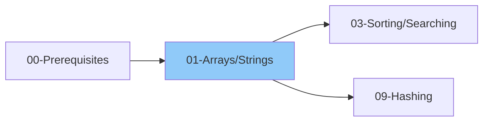

# 01 - Arrays & Strings

> The most fundamental data structures
>
> 📚 *Includes Grokking Patterns: #2 Two Pointers, #4 Sliding Window, #32 Prefix Sum*
>
> ⚠️ *AlgoMonster: VERY HIGH ROI - Most interview questions involve arrays*
>
> ⏱️ *Estimated: 2-3 weeks*

---

## 1. Arrays

### 1.1 Array Basics
- [ ] What is an Array?
- [ ] Memory representation (contiguous)
- [ ] Indexing (0-based vs 1-based)
- [ ] Static vs Dynamic arrays
- [ ] Declaration & initialization

### 1.2 Basic Operations
- [ ] Access - O(1)
- [ ] Search - O(n)
- [ ] Insertion - O(n)
- [ ] Deletion - O(n)
- [ ] Update - O(1)

### 1.3 Array Traversal
- [ ] Forward traversal
- [ ] Backward traversal
- [ ] Using index vs using element

### 1.4 Common Array Techniques

> **Key Patterns:** Striver's A2Z DSA Sheet has "Sliding Window & Two Pointer" as a dedicated section with 12 problems. Master these patterns!

- [ ] Two Pointer technique
  - Same direction
  - Opposite direction
- [ ] Sliding Window technique
  - Fixed size window
  - Variable size window
- [ ] Prefix Sum
- [ ] Suffix Sum
- [ ] Kadane's Algorithm (Max Subarray Sum)
- [ ] Dutch National Flag (3-way partitioning)

### 1.5 Array Problems by Pattern

#### Two Pointers
- [ ] Two Sum (sorted array)
- [ ] Three Sum
- [ ] Container with Most Water
- [ ] Remove Duplicates from Sorted Array
- [ ] Move Zeroes
- [ ] Reverse Array
- [ ] Palindrome Check

#### Sliding Window
- [ ] Maximum Sum Subarray of Size K
- [ ] Longest Substring Without Repeating Characters
- [ ] Minimum Window Substring
- [ ] Longest Subarray with Sum K

#### Prefix Sum (Grokking Pattern #32)

> 💡 *Use for: range sum queries, subarray sum problems, cumulative calculations*

- [ ] Range Sum Query
- [ ] Subarray Sum Equals K
- [ ] Product of Array Except Self
- [ ] Find Middle Index in Array
- [ ] Continuous Subarray Sum
- [ ] Binary Subarrays With Sum

#### Kadane's Algorithm
- [ ] Maximum Subarray
- [ ] Maximum Product Subarray
- [ ] Circular Subarray Sum

### 1.6 2D Arrays (Matrices)

> **Important:** Many platforms (GeeksforGeeks, Striver's A2Z) treat Matrix/Grid as a separate topic. Master this thoroughly!

- [ ] Declaration & initialization
- [ ] Row-major vs Column-major order
- [ ] Traversal patterns
  - Row-wise
  - Column-wise
  - Diagonal
  - Spiral
  - Boundary
- [ ] Matrix rotation (90°, 180°)
- [ ] Matrix transpose
- [ ] Search in sorted matrix

---

## 2. Strings

### 2.1 String Basics
- [ ] What is a String?
- [ ] Strings as character arrays
- [ ] Immutability (Python, Java) vs Mutability (JS, C++)
- [ ] String indexing & slicing
- [ ] String length

### 2.2 String Operations
- [ ] Concatenation
- [ ] Comparison
- [ ] Substring extraction
- [ ] Character access
- [ ] Case conversion (upper, lower)

### 2.3 Common String Methods

#### Python
- [ ] split(), join()
- [ ] strip(), replace()
- [ ] find(), index()
- [ ] startswith(), endswith()
- [ ] isalpha(), isdigit(), isalnum()
- [ ] ord(), chr()

#### JavaScript
- [ ] split(), join()
- [ ] trim(), replace()
- [ ] indexOf(), includes()
- [ ] startsWith(), endsWith()
- [ ] charCodeAt(), String.fromCharCode()
- [ ] substring(), slice()

### 2.4 String Techniques
- [ ] Two Pointers on Strings
- [ ] Sliding Window on Strings
- [ ] Frequency counting (HashMap)
- [ ] String reversal
- [ ] Palindrome checking
- [ ] Anagram checking

### 2.5 String Pattern Matching
- [ ] Brute Force - O(n*m)
- [ ] KMP Algorithm - O(n+m)
- [ ] Rabin-Karp Algorithm - O(n+m) average
- [ ] Z-Algorithm

### 2.6 String Problems by Category

#### Basic
- [ ] Reverse a String
- [ ] Check Palindrome
- [ ] Valid Anagram
- [ ] First Unique Character

#### Intermediate
- [ ] Longest Common Prefix
- [ ] Group Anagrams
- [ ] String to Integer (atoi)
- [ ] Count and Say
- [ ] Longest Palindromic Substring

#### Advanced
- [ ] Minimum Window Substring
- [ ] Longest Substring Without Repeating Characters
- [ ] Edit Distance (DP - covered later)
- [ ] Regular Expression Matching

---

## 3. Hashing (with Arrays & Strings)

### 3.1 Hash Map / Hash Table
- [ ] What is Hashing?
- [ ] Hash function
- [ ] Collision handling
- [ ] Time complexity: O(1) average

### 3.2 Hash Map in Languages
- [ ] Python: dict, defaultdict, Counter
- [ ] JavaScript: Object, Map, Set

### 3.3 Common Hashing Patterns
- [ ] Frequency counting
- [ ] Two Sum (unsorted - O(n))
- [ ] Finding duplicates
- [ ] First non-repeating element
- [ ] Subarray with given sum

---

## 4. Interview Focus

### 4.1 Things to Look Out For
- [ ] Off-by-one errors in loops and indices
- [ ] Empty array or string edge case
- [ ] Single element input
- [ ] Integer overflow when summing
- [ ] Modifying array while iterating

### 4.2 Corner Cases to Consider
- [ ] Empty input ([], "")
- [ ] Single element array or character
- [ ] All elements same
- [ ] Already sorted / reverse sorted
- [ ] Negative numbers
- [ ] Duplicate elements
- [ ] Very large input size

### 4.3 Common Mistakes
- [ ] Not handling empty input
- [ ] Index out of bounds
- [ ] Wrong loop termination condition
- [ ] Not considering negative numbers
- [ ] String immutability (Python/Java) - creates new string each concat

### 4.4 Pattern Recognition Guide
| If you see... | Think about... |
|--------------|----------------|
| Sorted array | Two pointers, Binary search |
| Subarray/substring | Sliding window, Prefix sum |
| Pairs/triplets | Two pointers, Hash map |
| Contiguous elements | Sliding window |
| Maximum/minimum subarray | Kadane's algorithm |
|" O(1) lookup needed "| Hash map |

---

## 📚 Learning Resources

### Videos
- [NeetCode - Arrays & Hashing Playlist](https://www.youtube.com/@NeetCode) - Comprehensive array problem walkthroughs
- [NeetCode - Two Pointers Playlist](https://www.youtube.com/@NeetCodeIO) - Two pointer pattern explanations
- [Striver (take U forward) - Arrays Series](https://www.youtube.com/@takeUforward) - Complete array problems for interviews
- [Striver - Sliding Window & Two Pointer](https://www.youtube.com/@takeUforward) - Pattern-based approach
- [Abdul Bari - Arrays Fundamentals](https://www.youtube.com/@abdul_bari) - Clear conceptual explanations
- [freeCodeCamp - Data Structures Full Course](https://www.youtube.com/@freecodecamp) - Beginner-friendly introduction

### Articles
- [Two Pointers Pattern - Tech Interview Handbook](https://www.techinterviewhandbook.org/algorithms/array/)
- [Sliding Window Technique - GeeksforGeeks](https://www.geeksforgeeks.org/window-sliding-technique/)
- [Prefix Sum Array - GeeksforGeeks](https://www.geeksforgeeks.org/prefix-sum-array-implementation-applications-competitive-programming/)
- [Kadane's Algorithm - GeeksforGeeks](https://www.geeksforgeeks.org/largest-sum-contiguous-subarray/)
- [Arrays in Python - Programiz](https://www.programiz.com/python-programming/array)
- [Arrays in JavaScript - Programiz](https://www.programiz.com/javascript/array)

---

## 5. Practice Problems

### 5.1 Array Problems

| Problem | Platform | Difficulty | Pattern |
|---------|----------|------------|---------|
| Two Sum | [LeetCode #1](https://leetcode.com/problems/two-sum/) | 🟢 Easy | Hash Map |
| Best Time to Buy and Sell Stock | [LeetCode #121](https://leetcode.com/problems/best-time-to-buy-and-sell-stock/) | 🟢 Easy | Kadane's / Sliding Window |
| Contains Duplicate | [LeetCode #217](https://leetcode.com/problems/contains-duplicate/) | 🟢 Easy | Hash Set |
| Product of Array Except Self | [LeetCode #238](https://leetcode.com/problems/product-of-array-except-self/) | 🟡 Medium | Prefix/Suffix |
| Maximum Subarray | [LeetCode #53](https://leetcode.com/problems/maximum-subarray/) | 🟡 Medium | Kadane's Algorithm |
| Maximum Product Subarray | [LeetCode #152](https://leetcode.com/problems/maximum-product-subarray/) | 🟡 Medium | DP / Kadane's Variant |
| Find Minimum in Rotated Sorted Array | [LeetCode #153](https://leetcode.com/problems/find-minimum-in-rotated-sorted-array/) | 🟡 Medium | Binary Search |
| Search in Rotated Sorted Array | [LeetCode #33](https://leetcode.com/problems/search-in-rotated-sorted-array/) | 🟡 Medium | Binary Search |
| 3Sum | [LeetCode #15](https://leetcode.com/problems/3sum/) | 🟡 Medium | Two Pointers |
| Container With Most Water | [LeetCode #11](https://leetcode.com/problems/container-with-most-water/) | 🟡 Medium | Two Pointers |
| Trapping Rain Water | [LeetCode #42](https://leetcode.com/problems/trapping-rain-water/) | 🔴 Hard | Two Pointers / Stack |
| Merge Intervals | [LeetCode #56](https://leetcode.com/problems/merge-intervals/) | 🟡 Medium | Intervals |
| Insert Interval | [LeetCode #57](https://leetcode.com/problems/insert-interval/) | 🟡 Medium | Intervals |
| Non-overlapping Intervals | [LeetCode #435](https://leetcode.com/problems/non-overlapping-intervals/) | 🟡 Medium | Greedy / Intervals |
| Subarray Sum Equals K | [LeetCode #560](https://leetcode.com/problems/subarray-sum-equals-k/) | 🟡 Medium | Prefix Sum + Hash Map |

### 5.2 String Problems

| Problem | Platform | Difficulty | Pattern |
|---------|----------|------------|---------|
| Valid Anagram | [LeetCode #242](https://leetcode.com/problems/valid-anagram/) | 🟢 Easy | Hash Map / Sorting |
| Valid Palindrome | [LeetCode #125](https://leetcode.com/problems/valid-palindrome/) | 🟢 Easy | Two Pointers |
| Longest Substring Without Repeating Characters | [LeetCode #3](https://leetcode.com/problems/longest-substring-without-repeating-characters/) | 🟡 Medium | Sliding Window |
| Longest Repeating Character Replacement | [LeetCode #424](https://leetcode.com/problems/longest-repeating-character-replacement/) | 🟡 Medium | Sliding Window |
| Minimum Window Substring | [LeetCode #76](https://leetcode.com/problems/minimum-window-substring/) | 🔴 Hard | Sliding Window |
| Group Anagrams | [LeetCode #49](https://leetcode.com/problems/group-anagrams/) | 🟡 Medium | Hash Map + Sorting |
| Longest Palindromic Substring | [LeetCode #5](https://leetcode.com/problems/longest-palindromic-substring/) | 🟡 Medium | Expand from Center / DP |
| Palindromic Substrings | [LeetCode #647](https://leetcode.com/problems/palindromic-substrings/) | 🟡 Medium | Expand from Center |
| Encode and Decode Strings | [LeetCode #271](https://leetcode.com/problems/encode-and-decode-strings/) | 🟡 Medium | String Manipulation |
| Valid Parentheses | [LeetCode #20](https://leetcode.com/problems/valid-parentheses/) | 🟢 Easy | Stack |
| Longest Common Prefix | [LeetCode #14](https://leetcode.com/problems/longest-common-prefix/) | 🟢 Easy | String Matching |
| String to Integer (atoi) | [LeetCode #8](https://leetcode.com/problems/string-to-integer-atoi/) | 🟡 Medium | String Parsing |

### 5.3 Two Pointers Problems

| Problem | Platform | Difficulty | Pattern |
|---------|----------|------------|---------|
| Remove Duplicates from Sorted Array | [LeetCode #26](https://leetcode.com/problems/remove-duplicates-from-sorted-array/) | 🟢 Easy | Two Pointers |
| Move Zeroes | [LeetCode #283](https://leetcode.com/problems/move-zeroes/) | 🟢 Easy | Two Pointers |
| Sort Colors | [LeetCode #75](https://leetcode.com/problems/sort-colors/) | 🟡 Medium | Dutch National Flag |
| 4Sum | [LeetCode #18](https://leetcode.com/problems/4sum/) | 🟡 Medium | Two Pointers |
| Squares of a Sorted Array | [LeetCode #977](https://leetcode.com/problems/squares-of-a-sorted-array/) | 🟢 Easy | Two Pointers |

> 📊 **Total: 32 Problems** | 🟢 Easy: 9 | 🟡 Medium: 20 | 🔴 Hard: 3

---

## Checklist Summary

| Topic | Status |
|-------|--------|
| Array Basics | ⬜ |
| Array Operations | ⬜ |
| Two Pointer Technique | ⬜ |
| Sliding Window Technique | ⬜ |
| Prefix Sum | ⬜ |
| Kadane's Algorithm | ⬜ |
| 2D Arrays | ⬜ |
| String Basics | ⬜ |
| String Methods | ⬜ |
| String Techniques | ⬜ |
| Pattern Matching | ⬜ |
| Hashing Basics | ⬜ |
| **Interview Edge Cases** | ⬜ |
| **Essential Problems (20)** | ⬜ |

---

**Previous:** [00-Prerequisites.md](../00-Prerequisites/00-Prerequisites.md)  
**Next:** [02-Recursion-Backtracking.md](../02-Recursion-Backtracking/02-Recursion-Backtracking.md)
