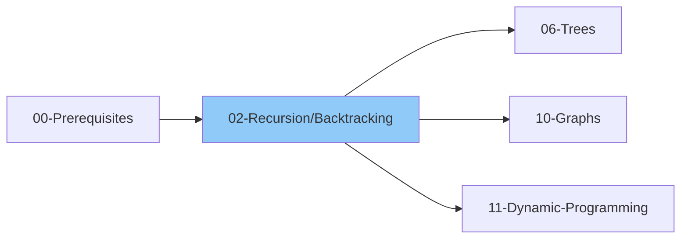

# 02 - Recursion & Backtracking

> The art of solving problems by breaking them into smaller subproblems
>
> 📚 *Includes Grokking Patterns: #18 Subsets, #27 Backtracking*
>
> ⏱️ *Estimated: 2-3 weeks*

---

## 1. Recursion

### 1.1 Recursion Basics
- [ ] What is Recursion?
- [ ] Base case vs Recursive case
- [ ] How recursion works (call stack)
- [ ] Stack overflow
- [ ] Recursion vs Iteration

### 1.2 Recursion Patterns
- [ ] Linear recursion (one recursive call)
- [ ] Binary recursion (two recursive calls)
- [ ] Multiple recursion (more than two calls)
- [ ] Tail recursion
- [ ] Head recursion

### 1.3 Recursion Thinking Process
- [ ] Identify the base case
- [ ] Trust the recursive call (leap of faith)
- [ ] Identify what current level should do
- [ ] Combine results

### 1.4 Basic Recursion Problems
- [ ] Factorial
- [ ] Fibonacci
- [ ] Sum of N numbers
- [ ] Power of a number (x^n)
- [ ] Print numbers 1 to N
- [ ] Print numbers N to 1
- [ ] Check if array is sorted
- [ ] Linear search using recursion
- [ ] Binary search using recursion

### 1.5 Intermediate Recursion Problems
- [ ] Reverse a string
- [ ] Check palindrome
- [ ] Sum of digits
- [ ] Count digits
- [ ] GCD using recursion (Euclidean)
- [ ] Tower of Hanoi
- [ ] Print all subsequences
- [ ] Print all subsets

### 1.6 Recursion on Arrays
- [ ] Find maximum in array
- [ ] Find minimum in array
- [ ] Sum of array elements
- [ ] Check if element exists
- [ ] First index of element
- [ ] Last index of element
- [ ] Print array using recursion
- [ ] Reverse array using recursion

### 1.7 Recursion on Strings
- [ ] Print string characters
- [ ] Reverse string
- [ ] Check palindrome
- [ ] Remove character from string
- [ ] Replace character in string
- [ ] Move all 'x' to end

---

## 2. Backtracking

### 2.1 Backtracking Basics
- [ ] What is Backtracking?
- [ ] Backtracking vs Brute Force
- [ ] When to use Backtracking?
- [ ] Backtracking template

### 2.2 Backtracking Template
- [ ] Understand the general backtracking pattern:
  - Check if current state is a valid solution
  - If valid, record/output the solution
  - For each possible next choice:
    - Check if choice is valid
    - Make the choice (place)
    - Recurse to next state
    - Undo the choice (backtrack)

### 2.3 Backtracking on Strings
- [ ] Generate all subsets (Power Set)
- [ ] Generate all subsequences
- [ ] Generate all permutations
- [ ] Generate all permutations with duplicates
- [ ] Letter combinations of phone number
- [ ] Generate parentheses
- [ ] Palindrome partitioning

### 2.4 Backtracking on Arrays
- [ ] Subsets (unique elements)
- [ ] Subsets II (with duplicates)
- [ ] Combination Sum
- [ ] Combination Sum II
- [ ] Combination Sum III
- [ ] Permutations
- [ ] Permutations II (with duplicates)

### 2.5 Backtracking on Matrices/Grids
- [ ] Rat in a Maze
- [ ] N-Queens Problem
- [ ] Sudoku Solver
- [ ] Word Search
- [ ] Unique Paths (all paths)
- [ ] Knight's Tour

### 2.6 Classic Backtracking Problems
- [ ] N-Queens
- [ ] Sudoku Solver
- [ ] Word Search
- [ ] Subset Sum
- [ ] M-Coloring Problem
- [ ] Hamiltonian Path
- [ ] Generate IP Addresses
- [ ] Word Break (backtracking approach)

---

## 3. Divide and Conquer

### 3.1 Divide and Conquer Basics
- [ ] What is Divide and Conquer?
- [ ] Three steps: Divide, Conquer, Combine
- [ ] D&C vs Recursion vs DP
- [ ] Time complexity analysis (Master Theorem)

### 3.2 Classic D&C Problems
- [ ] Merge Sort
- [ ] Quick Sort
- [ ] Binary Search
- [ ] Find Maximum and Minimum
- [ ] Power (x^n) - O(log n)
- [ ] Count Inversions
- [ ] Closest Pair of Points
- [ ] Strassen's Matrix Multiplication

---

## 4. Recursion Optimization

### 4.1 Memoization (Top-Down DP)
- [ ] What is Memoization?
- [ ] Overlapping subproblems
- [ ] Fibonacci with memoization
- [ ] When to use memoization

### 4.2 Tail Recursion
- [ ] What is Tail Recursion?
- [ ] Converting to tail recursion
- [ ] Tail call optimization

---

## Thinking Framework

### When to use Recursion?
1. Problem can be broken into smaller similar subproblems
2. There's a clear base case
3. Tree/Graph traversal
4. Divide and Conquer scenarios

### When to use Backtracking?
1. Finding all possible solutions
2. Constraint satisfaction problems
3. Optimization problems with constraints
4. Combinatorial problems (permutations, combinations)

---

## 5. Interview Focus

### 5.1 Things to Look Out For
- [ ] Always define base case first
- [ ] Trust the recursion (leap of faith)
- [ ] Watch for stack overflow on deep recursion
- [ ] Consider iterative solution if simpler
- [ ] Remember to backtrack (undo changes)

### 5.2 Corner Cases
- [ ] Empty input ([], "")
- [ ] Single element
- [ ] All elements same
- [ ] Duplicate elements in permutation/combination problems
- [ ] N = 0 case

### 5.3 Common Mistakes
- [ ] Missing base case (infinite recursion)
- [ ] Wrong base case condition
- [ ] Forgetting to backtrack
- [ ] Not handling duplicates properly
- [ ] Off-by-one errors in indices
- [ ] Modifying input without restoring

### 5.4 Backtracking vs DP
| Backtracking | Dynamic Programming |
|--------------|--------------------|
| Find ALL solutions | Find OPTIMAL solution |
| Explores all paths | Stores subproblem results |
| Prunes invalid paths | No pruning |
| Usually exponential time | Polynomial time |

### 5.5 Key Patterns to Recognize
- [ ] Subset pattern (include/exclude current element)
- [ ] Permutation pattern (use visited array or swap)
- [ ] Combination pattern (use start index, no revisit)
- [ ] Grid pattern (explore all 4 directions)

---

## 📚 Learning Resources

### Videos
- [NeetCode - Backtracking Playlist](https://www.youtube.com/@NeetCode) - Subsets, permutations, and combinations explained
- [Striver (take U forward) - Recursion Series](https://www.youtube.com/@takeUforward) - Complete recursion from basics to advanced
- [Striver - Backtracking Problems](https://www.youtube.com/@takeUforward) - N-Queens, Sudoku Solver, and more
- [Abdul Bari - Recursion Fundamentals](https://www.youtube.com/@abdul_bari) - Clear step-by-step recursion explanations
- [freeCodeCamp - Recursion in Programming](https://www.youtube.com/@freecodecamp) - Full tutorial with examples

### Articles
- [Recursion - GeeksforGeeks](https://www.geeksforgeeks.org/introduction-to-recursion-data-structure-and-algorithm-tutorials/)
- [Backtracking Algorithm - GeeksforGeeks](https://www.geeksforgeeks.org/backtracking-algorithms/)
- [Subsets & Combinations - Tech Interview Handbook](https://www.techinterviewhandbook.org/algorithms/recursion/)
- [Recursion Basics - Programiz](https://www.programiz.com/python-programming/recursion)
- [N-Queens Problem - GeeksforGeeks](https://www.geeksforgeeks.org/n-queen-problem-backtracking-3/)
- [Generate All Permutations - GeeksforGeeks](https://www.geeksforgeeks.org/write-a-c-program-to-print-all-permutations-of-a-given-string/)

---

## 6. Essential Problems

### 6.1 Basic Recursion

| Problem | Platform | Difficulty | Pattern |
|---------|----------|------------|--------|
| [Factorial](https://leetcode.com/problems/factorial-trailing-zeroes/) | LeetCode | 🟡 Medium | Basic Recursion |
| [Fibonacci Number](https://leetcode.com/problems/fibonacci-number/) | LeetCode | 🟢 Easy | Basic Recursion |
| [Power of Two](https://leetcode.com/problems/power-of-two/) | LeetCode | 🟢 Easy | Basic Recursion |
| [Pow(x, n)](https://leetcode.com/problems/powx-n/) | LeetCode | 🟡 Medium | Divide & Conquer |
| [Climbing Stairs](https://leetcode.com/problems/climbing-stairs/) | LeetCode | 🟢 Easy | Basic Recursion |
| [Reverse String](https://leetcode.com/problems/reverse-string/) | LeetCode | 🟢 Easy | Basic Recursion |

### 6.2 Subsets, Permutations & Combinations

| Problem | Platform | Difficulty | Pattern |
|---------|----------|------------|--------|
| [Subsets](https://leetcode.com/problems/subsets/) | LeetCode | 🟡 Medium | Subsets Pattern |
| [Subsets II](https://leetcode.com/problems/subsets-ii/) | LeetCode | 🟡 Medium | Subsets + Duplicates |
| [Permutations](https://leetcode.com/problems/permutations/) | LeetCode | 🟡 Medium | Permutation Pattern |
| [Permutations II](https://leetcode.com/problems/permutations-ii/) | LeetCode | 🟡 Medium | Permutation + Duplicates |
| [Combinations](https://leetcode.com/problems/combinations/) | LeetCode | 🟡 Medium | Combination Pattern |
| [Combination Sum](https://leetcode.com/problems/combination-sum/) | LeetCode | 🟡 Medium | Backtracking |
| [Combination Sum II](https://leetcode.com/problems/combination-sum-ii/) | LeetCode | 🟡 Medium | Backtracking + Duplicates |
| [Combination Sum III](https://leetcode.com/problems/combination-sum-iii/) | LeetCode | 🟡 Medium | Backtracking |

### 6.3 Classic Backtracking

| Problem | Platform | Difficulty | Pattern |
|---------|----------|------------|--------|
| [Letter Combinations of a Phone Number](https://leetcode.com/problems/letter-combinations-of-a-phone-number/) | LeetCode | 🟡 Medium | Backtracking |
| [Generate Parentheses](https://leetcode.com/problems/generate-parentheses/) | LeetCode | 🟡 Medium | Backtracking |
| [Palindrome Partitioning](https://leetcode.com/problems/palindrome-partitioning/) | LeetCode | 🟡 Medium | Backtracking |
| [Word Search](https://leetcode.com/problems/word-search/) | LeetCode | 🟡 Medium | Grid Backtracking |
| [N-Queens](https://leetcode.com/problems/n-queens/) | LeetCode | 🔴 Hard | Backtracking |
| [N-Queens II](https://leetcode.com/problems/n-queens-ii/) | LeetCode | 🔴 Hard | Backtracking |
| [Sudoku Solver](https://leetcode.com/problems/sudoku-solver/) | LeetCode | 🔴 Hard | Backtracking |
| [Restore IP Addresses](https://leetcode.com/problems/restore-ip-addresses/) | LeetCode | 🟡 Medium | Backtracking |
| [Word Search II](https://leetcode.com/problems/word-search-ii/) | LeetCode | 🔴 Hard | Backtracking + Trie |

---

## Checklist Summary

| Topic | Status |
|-------|--------|
| Recursion Basics | ⬜ |
| Recursion Patterns | ⬜ |
| Basic Recursion Problems | ⬜ |
| Intermediate Recursion | ⬜ |
| Recursion on Arrays | ⬜ |
| Recursion on Strings | ⬜ |
| Backtracking Basics | ⬜ |
| Backtracking on Strings | ⬜ |
| Backtracking on Arrays | ⬜ |
| Backtracking on Grids | ⬜ |
| Classic Backtracking | ⬜ |
| Divide and Conquer | ⬜ |
| Memoization | ⬜ |
| **Interview Edge Cases** | ⬜ |
| **Essential Problems (11)** | ⬜ |

---

**Previous:** [01-Arrays-Strings.md](../01-Arrays-Strings/01-Arrays-Strings.md)  
**Next:** [03-Sorting-Searching.md](./03-Sorting-Searching.md)
