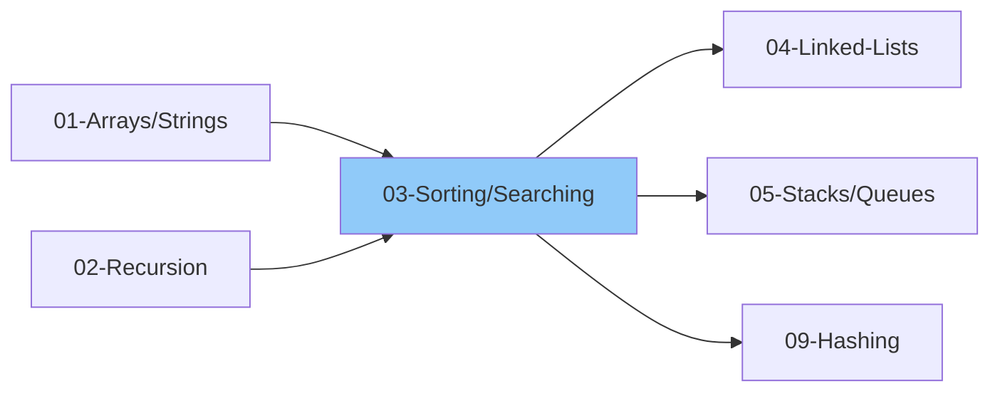

# 03 - Sorting & Searching

> Essential algorithms for organizing and finding data
>
> ✅ *Time complexities verified against: BigOCheatSheet.com*
>
> ⏱️ *Estimated: 2 weeks*

---

## 1. Sorting Algorithms

### 1.1 Sorting Basics
- [ ] What is Sorting?
- [ ] Stable vs Unstable sorting
- [ ] In-place vs Out-of-place sorting
- [ ] Comparison vs Non-comparison sorting
- [ ] Adaptive vs Non-adaptive sorting

### 1.2 Basic Sorting Algorithms - O(n²)

#### Bubble Sort
- [ ] Algorithm understanding
- [ ] Implementation
- [ ] Time: O(n²) | Space: O(1)
- [ ] Stable: Yes
- [ ] Optimization: Early termination

#### Selection Sort
- [ ] Algorithm understanding
- [ ] Implementation
- [ ] Time: O(n²) | Space: O(1)
- [ ] Stable: No
- [ ] When to use

#### Insertion Sort
- [ ] Algorithm understanding
- [ ] Implementation
- [ ] Time: O(n²) | Space: O(1)
- [ ] Stable: Yes
- [ ] Best for nearly sorted arrays

### 1.3 Efficient Sorting Algorithms - O(n log n)

#### Merge Sort
- [ ] Divide and Conquer approach
- [ ] Algorithm understanding
- [ ] Implementation (recursive)
- [ ] Time: O(n log n) | Space: O(n)
- [ ] Stable: Yes
- [ ] Merge two sorted arrays

#### Quick Sort
- [ ] Divide and Conquer approach
- [ ] Algorithm understanding
- [ ] Partition logic
- [ ] Pivot selection strategies
  - First element
  - Last element
  - Random element
  - Median of three
- [ ] Implementation
- [ ] Time: O(n log n) avg, O(n²) worst | Space: O(log n)
- [ ] Stable: No

#### Heap Sort
- [ ] Heap data structure prerequisite
- [ ] Algorithm understanding
- [ ] Heapify process
- [ ] Implementation
- [ ] Time: O(n log n) | Space: O(1)
- [ ] Stable: No

### 1.4 Linear Time Sorting - O(n)

#### Counting Sort
- [ ] When to use (limited range integers)
- [ ] Algorithm understanding
- [ ] Implementation
- [ ] Time: O(n + k) | Space: O(k)
- [ ] Stable: Yes

#### Radix Sort
- [ ] When to use (integers, strings)
- [ ] LSD vs MSD approach
- [ ] Algorithm understanding
- [ ] Implementation
- [ ] Time: O(d * (n + k)) | Space: O(n + k)
- [ ] Stable: Yes

#### Bucket Sort
- [ ] When to use (uniform distribution)
- [ ] Algorithm understanding
- [ ] Implementation
- [ ] Time: O(n + k) avg | Space: O(n)
- [ ] Stable: Depends on inner sort

### 1.5 Sorting Comparison Table

| Algorithm | Time (Best) | Time (Avg) | Time (Worst) | Space | Stable |
|-----------|-------------|------------|--------------|-------|--------|
| Bubble |" O(n) "| O(n²) |" O(n²) "| O(1) | Yes |
| Selection |" O(n²) "| O(n²) |" O(n²) "| O(1) | No |
| Insertion |" O(n) "| O(n²) |" O(n²) "| O(1) | Yes |
| Merge |" O(n log n) "| O(n log n) |" O(n log n) "| O(n) | Yes |
| Quick |" O(n log n) "| O(n log n) |" O(n²) "| O(log n) | No |
| Heap |" O(n log n) "| O(n log n) |" O(n log n) "| O(1) | No |
| Counting |" O(n + k) "| O(n + k) |" O(n + k) "| O(k) | Yes |
| Radix |" O(nk) "| O(nk) |" O(nk) "| O(n + k) | Yes |
| Timsort |" O(n) "| O(n log n) |" O(n log n) "| O(n) | Yes |
| Shell |" O(n log n) "| O(n(log n)²) |" O(n(log n)²) "| O(1) | No |

> **Note:** Python uses Timsort (hybrid of Merge + Insertion Sort). JavaScript V8 uses Timsort for arrays.

### 1.6 Sorting Problems
- [ ] Sort an array (implement all algorithms)
- [ ] Sort Colors (Dutch National Flag)
- [ ] Merge Sorted Array
- [ ] Sort List (Linked List)
- [ ] Largest Number
- [ ] Meeting Rooms
- [ ] Merge Intervals
- [ ] Insert Interval
- [ ] Custom Sort String

### 1.7 Cyclic Sort Pattern (Grokking Pattern #5)

> 💡 *Use when: numbers in range [1, n] or [0, n], finding missing/duplicate numbers*

- [ ] Cyclic Sort concept (place each number at its correct index)
- [ ] Find the Missing Number
- [ ] Find All Missing Numbers
- [ ] Find the Duplicate Number
- [ ] Find All Duplicates in Array
- [ ] Find Corrupt Pair (one missing, one duplicate)
- [ ] Find First Missing Positive

---

## 2. Searching Algorithms

### 2.1 Linear Search
- [ ] Algorithm understanding
- [ ] Implementation
- [ ] Time: O(n) | Space: O(1)
- [ ] When to use

### 2.2 Binary Search

#### Basics
- [ ] Prerequisites (sorted array)
- [ ] Algorithm understanding
- [ ] Iterative implementation
- [ ] Recursive implementation
- [ ] Time: O(log n) | Space: O(1) or O(log n)

#### Binary Search Variations
- [ ] Find exact element
- [ ] Find first occurrence
- [ ] Find last occurrence
- [ ] Find lower bound (≥ target)
- [ ] Find upper bound (> target)
- [ ] Count occurrences
- [ ] Search Insert Position

### 2.3 Binary Search on Answer
- [ ] Concept understanding
- [ ] When to use (min/max optimization)
- [ ] Template for "minimum value that satisfies condition"
- [ ] Template for "maximum value that satisfies condition"

### 2.4 Binary Search Problems

#### Basic
- [ ] Binary Search
- [ ] Search Insert Position
- [ ] First and Last Position
- [ ] Count of Element in Sorted Array
- [ ] Sqrt(x)
- [ ] Valid Perfect Square

#### Rotated Sorted Array
- [ ] Find Minimum in Rotated Sorted Array
- [ ] Find Minimum in Rotated Sorted Array II (duplicates)
- [ ] Search in Rotated Sorted Array
- [ ] Search in Rotated Sorted Array II (duplicates)
- [ ] Find Rotation Count

#### Binary Search on Answer
- [ ] Koko Eating Bananas
- [ ] Minimum Days to Make M Bouquets
- [ ] Capacity to Ship Packages
- [ ] Split Array Largest Sum
- [ ] Aggressive Cows
- [ ] Allocate Books
- [ ] Painter's Partition

#### 2D Matrix Search
- [ ] Search a 2D Matrix (sorted rows & cols)
- [ ] Search a 2D Matrix II (row & col sorted)
- [ ] Row with Maximum 1s
- [ ] Median in Row-wise Sorted Matrix

#### Advanced Binary Search
- [ ] Find Peak Element
- [ ] Find in Mountain Array
- [ ] Median of Two Sorted Arrays
- [ ] Kth Element of Two Sorted Arrays

---

## 3. Two Pointers (Searching Technique)

### 3.1 Two Pointers Patterns
- [ ] Opposite direction (start & end)
- [ ] Same direction (slow & fast)
- [ ] Fixed distance apart

### 3.2 Two Pointer Problems
- [ ] Two Sum II (sorted)
- [ ] Three Sum
- [ ] Four Sum
- [ ] Container with Most Water
- [ ] Trapping Rain Water
- [ ] Remove Duplicates from Sorted Array
- [ ] Move Zeroes
- [ ] Sort Colors

---

## 4. Ternary Search

### 4.1 Ternary Search Basics
- [ ] When to use (unimodal functions)
- [ ] Algorithm understanding
- [ ] Finding maximum/minimum in unimodal
- [ ] Time: O(log₃ n)

---

## Thinking Framework

### Which Sorting to Use?
- **Small array (n < 50)**: Insertion Sort
- **Nearly sorted**: Insertion Sort
- **Memory constraint**: Heap Sort / Quick Sort
- **Stability required**: Merge Sort
- **Limited range integers**: Counting Sort
- **General purpose**: Quick Sort / Merge Sort

### When to Use Binary Search?
1. Sorted array
2. Monotonic function
3. Finding min/max with constraint
4. Answer lies in a range

---

## 3. Interview Focus

### 3.1 Things to Look Out For
- [ ] Binary search requires SORTED array (or monotonic condition)
- [ ] Be careful with mid calculation to avoid overflow
- [ ] Watch for infinite loops (wrong termination condition)
- [ ] Know when to use left < right vs left <= right
- [ ] Understand which bound to return (lower vs upper)

### 3.2 Corner Cases
- [ ] Empty array
- [ ] Single element array
- [ ] Target not in array
- [ ] Target at beginning or end
- [ ] All elements same
- [ ] Duplicates present
- [ ] Array with only two elements

### 3.3 Common Mistakes
- [ ] Off-by-one errors in bounds
- [ ] Wrong mid calculation: use mid = left + (right - left) // 2
- [ ] Infinite loop due to wrong boundary update
- [ ] Not handling edge cases (empty, single element)
- [ ] Choosing wrong binary search template

### 3.4 Binary Search Templates
| Template | Condition | Use Case |
|----------|-----------|----------|
| Exact match | left <= right | Find specific element |
| Left bound | left < right | First occurrence, lower bound |
| Right bound | left < right | Last occurrence, upper bound |
| Search on answer | left < right | Min/max optimization |

### 3.5 When to Use Binary Search on Answer
- [ ] "Minimum X such that condition is satisfied"
- [ ] "Maximum X such that condition is satisfied"
- [ ] Answer lies in a known range [lo, hi]
- [ ] Can verify if a value works in O(n) or less

---

## 📚 Learning Resources

### Videos
- [NeetCode - Binary Search Playlist](https://www.youtube.com/@NeetCode) - All binary search patterns and variations
- [Striver (take U forward) - Sorting Algorithms](https://www.youtube.com/@takeUforward) - Complete sorting tutorial
- [Striver - Binary Search Series](https://www.youtube.com/@takeUforward) - Binary search on answers, 2D matrices
- [Abdul Bari - Sorting Algorithms](https://www.youtube.com/@abdul_bari) - Visual explanations of all sorting algorithms
- [Abdul Bari - Binary Search](https://www.youtube.com/@abdul_bari) - Clear binary search fundamentals
- [freeCodeCamp - Sorting Algorithms Explained](https://www.youtube.com/@freecodecamp) - Comprehensive sorting course

### Articles
- [Sorting Algorithms - GeeksforGeeks](https://www.geeksforgeeks.org/sorting-algorithms/)
- [Binary Search - GeeksforGeeks](https://www.geeksforgeeks.org/binary-search/)
- [Binary Search Patterns - Tech Interview Handbook](https://www.techinterviewhandbook.org/algorithms/binary-search/)
- [Merge Sort - Programiz](https://www.programiz.com/dsa/merge-sort)
- [Quick Sort - Programiz](https://www.programiz.com/dsa/quick-sort)
- [Binary Search Variations - GeeksforGeeks](https://www.geeksforgeeks.org/variants-of-binary-search/)

---

## 4. Essential Problems

### 4.1 Sorting Problems

| Problem | Platform | Difficulty | Pattern |
|---------|----------|------------|--------|
| [Sort Colors](https://leetcode.com/problems/sort-colors/) | LeetCode | 🟡 Medium | Dutch National Flag |
| [Merge Sorted Array](https://leetcode.com/problems/merge-sorted-array/) | LeetCode | 🟢 Easy | Two Pointers |
| [Sort List](https://leetcode.com/problems/sort-list/) | LeetCode | 🟡 Medium | Merge Sort |
| [Largest Number](https://leetcode.com/problems/largest-number/) | LeetCode | 🟡 Medium | Custom Sort |
| [Kth Largest Element in an Array](https://leetcode.com/problems/kth-largest-element-in-an-array/) | LeetCode | 🟡 Medium | Quick Select |
| [Merge Intervals](https://leetcode.com/problems/merge-intervals/) | LeetCode | 🟡 Medium | Sorting |
| [Insert Interval](https://leetcode.com/problems/insert-interval/) | LeetCode | 🟡 Medium | Sorting |

### 4.2 Binary Search Basics

| Problem | Platform | Difficulty | Pattern |
|---------|----------|------------|--------|
| [Binary Search](https://leetcode.com/problems/binary-search/) | LeetCode | 🟢 Easy | Classic Binary Search |
| [Search Insert Position](https://leetcode.com/problems/search-insert-position/) | LeetCode | 🟢 Easy | Binary Search |
| [Find First and Last Position](https://leetcode.com/problems/find-first-and-last-position-of-element-in-sorted-array/) | LeetCode | 🟡 Medium | Binary Search Bounds |
| [Sqrt(x)](https://leetcode.com/problems/sqrtx/) | LeetCode | 🟢 Easy | Binary Search |
| [Find Peak Element](https://leetcode.com/problems/find-peak-element/) | LeetCode | 🟡 Medium | Binary Search |

### 4.3 Rotated Array & Advanced

| Problem | Platform | Difficulty | Pattern |
|---------|----------|------------|--------|
| [Search in Rotated Sorted Array](https://leetcode.com/problems/search-in-rotated-sorted-array/) | LeetCode | 🟡 Medium | Modified Binary Search |
| [Search in Rotated Sorted Array II](https://leetcode.com/problems/search-in-rotated-sorted-array-ii/) | LeetCode | 🟡 Medium | Binary Search + Duplicates |
| [Find Minimum in Rotated Sorted Array](https://leetcode.com/problems/find-minimum-in-rotated-sorted-array/) | LeetCode | 🟡 Medium | Binary Search |
| [Search a 2D Matrix](https://leetcode.com/problems/search-a-2d-matrix/) | LeetCode | 🟡 Medium | 2D Binary Search |
| [Search a 2D Matrix II](https://leetcode.com/problems/search-a-2d-matrix-ii/) | LeetCode | 🟡 Medium | Binary Search / Staircase |
| [Median of Two Sorted Arrays](https://leetcode.com/problems/median-of-two-sorted-arrays/) | LeetCode | 🔴 Hard | Binary Search |

### 4.4 Binary Search on Answer

| Problem | Platform | Difficulty | Pattern |
|---------|----------|------------|--------|
| [Koko Eating Bananas](https://leetcode.com/problems/koko-eating-bananas/) | LeetCode | 🟡 Medium | Binary Search on Answer |
| [Capacity To Ship Packages](https://leetcode.com/problems/capacity-to-ship-packages-within-d-days/) | LeetCode | 🟡 Medium | Binary Search on Answer |
| [Split Array Largest Sum](https://leetcode.com/problems/split-array-largest-sum/) | LeetCode | 🔴 Hard | Binary Search on Answer |
| [Time Based Key-Value Store](https://leetcode.com/problems/time-based-key-value-store/) | LeetCode | 🟡 Medium | Binary Search |

---

## Checklist Summary

| Topic | Status |
|-------|--------|
| Basic Sorting (Bubble, Selection, Insertion) | ⬜ |
| Merge Sort | ⬜ |
| Quick Sort | ⬜ |
| Heap Sort | ⬜ |
| Linear Time Sorting | ⬜ |
| Linear Search | ⬜ |
| Binary Search Basics | ⬜ |
| Binary Search Variations | ⬜ |
| Binary Search on Answer | ⬜ |
| 2D Matrix Search | ⬜ |
| Two Pointers | ⬜ |
| **Interview Edge Cases** | ⬜ |
| **Essential Problems (9)** | ⬜ |

---

**Previous:** [02-Recursion-Backtracking.md](../02-Recursion-Backtracking/02-Recursion-Backtracking.md)  
**Next:** [04-Linked-Lists.md](./04-Linked-Lists.md)
