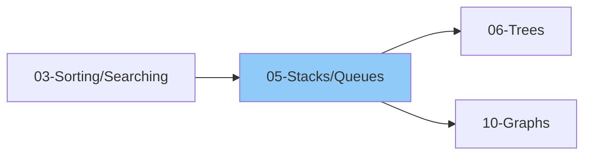

# 05 - Stacks & Queues

> Linear data structures with restricted access patterns
>
> 📚 *Includes Grokking Patterns: #9 Stacks, #10 Monotonic Stack*
>
> ⚠️ *Monotonic Stack is HIGH frequency for "next greater/smaller" problems*
>
> ⏱️ *Estimated: 1-2 weeks*

---

## 1. Stack

### 1.1 Stack Basics
- [ ] What is a Stack?
- [ ] LIFO (Last In, First Out) principle
- [ ] Real-world analogies (plates, books, undo)
- [ ] Stack vs Array

### 1.2 Stack Operations
- [ ] push(element) - O(1)
- [ ] pop() - O(1)
- [ ] peek() / top() - O(1)
- [ ] isEmpty() - O(1)
- [ ] size() - O(1)

### 1.3 Stack Implementation
- [ ] Using Array (fixed size)
- [ ] Using Dynamic Array
- [ ] Using Linked List
- [ ] Built-in: Python list, JS array

### 1.4 Stack Applications
- [ ] Function call stack
- [ ] Undo/Redo operations
- [ ] Browser back button
- [ ] Expression evaluation
- [ ] Syntax parsing
- [ ] Backtracking algorithms

---

## 2. Stack Problems by Category

### 2.1 Basic Stack Problems
- [ ] Implement stack using array
- [ ] Implement stack using linked list
- [ ] Reverse a string using stack
- [ ] Check balanced parentheses
- [ ] Valid Parentheses (multiple types)
- [ ] Reverse a stack using recursion
- [ ] Sort a stack using recursion

### 2.2 Expression Evaluation
- [ ] Infix to Postfix conversion
- [ ] Infix to Prefix conversion
- [ ] Postfix evaluation
- [ ] Prefix evaluation
- [ ] Evaluate Reverse Polish Notation
- [ ] Basic Calculator
- [ ] Basic Calculator II

### 2.3 Monotonic Stack
- [ ] What is Monotonic Stack?
- [ ] Monotonically Increasing Stack
- [ ] Monotonically Decreasing Stack
- [ ] When to use Monotonic Stack

#### Monotonic Stack Problems
- [ ] Next Greater Element I
- [ ] Next Greater Element II (circular)
- [ ] Next Smaller Element
- [ ] Previous Greater Element
- [ ] Previous Smaller Element
- [ ] Daily Temperatures
- [ ] Stock Span Problem
- [ ] Largest Rectangle in Histogram
- [ ] Maximal Rectangle
- [ ] Trapping Rain Water (stack approach)
- [ ] Remove K Digits
- [ ] Sum of Subarray Minimums

### 2.4 Design Problems
- [ ] Min Stack (O(1) getMin)
- [ ] Max Stack
- [ ] Implement Queue using Stacks
- [ ] Design a Stack with Increment Operation

### 2.5 Other Stack Problems
- [ ] Decode String
- [ ] Remove All Adjacent Duplicates
- [ ] Remove All Adjacent Duplicates II
- [ ] Asteroid Collision
- [ ] Simplify Path
- [ ] Score of Parentheses
- [ ] Longest Valid Parentheses
- [ ] 132 Pattern

---

## 3. Queue

### 3.1 Queue Basics
- [ ] What is a Queue?
- [ ] FIFO (First In, First Out) principle
- [ ] Real-world analogies (line, ticket counter)
- [ ] Queue vs Stack

### 3.2 Queue Operations
- [ ] enqueue(element) - O(1)
- [ ] dequeue() - O(1)
- [ ] front() / peek() - O(1)
- [ ] rear() - O(1)
- [ ] isEmpty() - O(1)
- [ ] size() - O(1)

### 3.3 Queue Implementation
- [ ] Using Array (circular)
- [ ] Using Linked List
- [ ] Built-in: Python collections.deque, JS array

### 3.4 Queue Applications
- [ ] BFS (Breadth-First Search)
- [ ] CPU scheduling
- [ ] Print queue
- [ ] Message queues
- [ ] Level order traversal

---

## 4. Types of Queues

### 4.1 Simple Queue
- [ ] Basic implementation
- [ ] Limitations

### 4.2 Circular Queue
- [ ] Why circular?
- [ ] Front and rear pointers
- [ ] Implementation
- [ ] Full vs Empty condition

### 4.3 Double-Ended Queue (Deque)
- [ ] What is Deque?
- [ ] Operations from both ends
- [ ] insertFront(), insertRear()
- [ ] deleteFront(), deleteRear()
- [ ] Implementation
- [ ] Python: collections.deque
- [ ] Use cases

### 4.4 Priority Queue
- [ ] What is Priority Queue?
- [ ] Difference from normal queue
- [ ] Implementation using Heap
- [ ] Covered in detail in Heaps topic

---

## 5. Queue Problems by Category

### 5.1 Basic Queue Problems
- [ ] Implement Queue using Array
- [ ] Implement Queue using Linked List
- [ ] Implement Circular Queue
- [ ] Implement Stack using Queues
- [ ] Reverse a Queue
- [ ] Reverse first K elements

### 5.2 Sliding Window Maximum (Deque)
- [ ] Sliding Window Maximum
- [ ] Sliding Window Minimum
- [ ] Longest Continuous Subarray with Absolute Diff

### 5.3 Design Problems
- [ ] Design Circular Queue
- [ ] Design Circular Deque
- [ ] Design Front Middle Back Queue
- [ ] Design Hit Counter

### 5.4 BFS Queue Problems
- [ ] Number of Islands
- [ ] Rotting Oranges
- [ ] Walls and Gates
- [ ] Shortest Path in Binary Matrix
- [ ] (More in Graphs section)

### 5.5 Other Queue Problems
- [ ] First Unique Character in a Stream
- [ ] Moving Average from Data Stream
- [ ] Task Scheduler
- [ ] Gas Station

---

## 6. Monotonic Deque

### 6.1 Concept
- [ ] Maintaining monotonic property
- [ ] Insert from rear
- [ ] Remove from both ends
- [ ] Time: O(n) for all elements

### 6.2 Problems
- [ ] Sliding Window Maximum
- [ ] Shortest Subarray with Sum at Least K
- [ ] Constrained Subsequence Sum
- [ ] Jump Game VI

---

## Comparison Table

| Feature | Stack | Queue | Deque |
|---------|-------|-------|-------|
| Order | LIFO | FIFO | Both |
| Insert | Top only | Rear only | Both ends |
| Remove | Top only | Front only | Both ends |
| Use case | DFS, Undo | BFS, Scheduling | Sliding window |

---

## Thinking Framework

### When to use Stack?
1. Matching pairs (parentheses, tags)
2. Reversing things
3. Backtracking
4. DFS
5. Nearest greater/smaller element

### When to use Queue?
1. BFS
2. Level order processing
3. Scheduling (FIFO order)
4. Sliding window problems (deque)

### Monotonic Stack Pattern
1. Finding next/previous greater/smaller
2. Histogram problems
3. Stock span type problems

---

## 7. Interview Focus

### 7.1 Things to Look Out For
- [ ] Check for empty stack/queue before pop/peek
- [ ] Monotonic stack for "next greater/smaller" pattern
- [ ] Use deque for sliding window problems
- [ ] Stack is LIFO, Queue is FIFO - know when to use which
- [ ] BFS uses queue, DFS uses stack

### 7.2 Corner Cases
- [ ] Empty stack/queue operations
- [ ] Single element
- [ ] Unbalanced parentheses
- [ ] All same elements (for monotonic stack)
- [ ] Window size = 1 or = array length

### 7.3 Common Mistakes
- [ ] Pop from empty stack
- [ ] Wrong order of operations
- [ ] Not handling all types of brackets
- [ ] Forgetting to push after processing
- [ ] Wrong monotonic order (increasing vs decreasing)

### 7.4 Pattern Recognition
| If you see... | Think about... |
|--------------|----------------|
| Matching pairs | Stack |
| Reversing order | Stack |
| Next greater/smaller | Monotonic stack |
| Expression evaluation | Stack |
| Level-order processing | Queue |
| Sliding window max/min | Monotonic deque |
| BFS traversal | Queue |

---

## 📚 Learning Resources

### Videos
- [NeetCode - Stack Playlist](https://www.youtube.com/@NeetCode) - Stack problems and monotonic stack patterns
- [Striver (take U forward) - Stack & Queue Series](https://www.youtube.com/@takeUforward) - Complete stack/queue for interviews
- [Striver - Monotonic Stack Problems](https://www.youtube.com/@takeUforward) - Next greater element, histogram problems
- [Abdul Bari - Stack Fundamentals](https://www.youtube.com/@abdul_bari) - Clear conceptual explanations
- [freeCodeCamp - Stacks and Queues](https://www.youtube.com/@freecodecamp) - Data structures tutorial

### Articles
- [Stack Data Structure - GeeksforGeeks](https://www.geeksforgeeks.org/stack-data-structure/)
- [Queue Data Structure - GeeksforGeeks](https://www.geeksforgeeks.org/queue-data-structure/)
- [Monotonic Stack - GeeksforGeeks](https://www.geeksforgeeks.org/introduction-to-monotonic-stack-data-structure-and-algorithm-tutorials/)
- [Stack - Tech Interview Handbook](https://www.techinterviewhandbook.org/algorithms/stack/)
- [Stack Basics - Programiz](https://www.programiz.com/dsa/stack)
- [Queue Basics - Programiz](https://www.programiz.com/dsa/queue)
- [Next Greater Element - GeeksforGeeks](https://www.geeksforgeeks.org/next-greater-element/)

---

## 8. Essential Problems

### 8.1 Basic Stack Problems

| Problem | Platform | Difficulty | Pattern |
|---------|----------|------------|--------|
| [Valid Parentheses](https://leetcode.com/problems/valid-parentheses/) | LeetCode | 🟢 Easy | Stack Matching |
| [Min Stack](https://leetcode.com/problems/min-stack/) | LeetCode | 🟡 Medium | Design |
| [Max Stack](https://leetcode.com/problems/max-stack/) | LeetCode | 🔴 Hard | Design |
| [Evaluate Reverse Polish Notation](https://leetcode.com/problems/evaluate-reverse-polish-notation/) | LeetCode | 🟡 Medium | Stack Evaluation |
| [Basic Calculator](https://leetcode.com/problems/basic-calculator/) | LeetCode | 🔴 Hard | Stack |
| [Basic Calculator II](https://leetcode.com/problems/basic-calculator-ii/) | LeetCode | 🟡 Medium | Stack |

### 8.2 Monotonic Stack Problems

| Problem | Platform | Difficulty | Pattern |
|---------|----------|------------|--------|
| [Daily Temperatures](https://leetcode.com/problems/daily-temperatures/) | LeetCode | 🟡 Medium | Monotonic Stack |
| [Next Greater Element I](https://leetcode.com/problems/next-greater-element-i/) | LeetCode | 🟢 Easy | Monotonic Stack |
| [Next Greater Element II](https://leetcode.com/problems/next-greater-element-ii/) | LeetCode | 🟡 Medium | Circular Monotonic Stack |
| [Largest Rectangle in Histogram](https://leetcode.com/problems/largest-rectangle-in-histogram/) | LeetCode | 🔴 Hard | Monotonic Stack |
| [Maximal Rectangle](https://leetcode.com/problems/maximal-rectangle/) | LeetCode | 🔴 Hard | Monotonic Stack |
| [Trapping Rain Water](https://leetcode.com/problems/trapping-rain-water/) | LeetCode | 🔴 Hard | Monotonic Stack / DP |
| [Remove K Digits](https://leetcode.com/problems/remove-k-digits/) | LeetCode | 🟡 Medium | Monotonic Stack |

### 8.3 String & Parsing

| Problem | Platform | Difficulty | Pattern |
|---------|----------|------------|--------|
| [Decode String](https://leetcode.com/problems/decode-string/) | LeetCode | 🟡 Medium | Stack |
| [Asteroid Collision](https://leetcode.com/problems/asteroid-collision/) | LeetCode | 🟡 Medium | Stack Simulation |
| [Simplify Path](https://leetcode.com/problems/simplify-path/) | LeetCode | 🟡 Medium | Stack |

### 8.4 Queue & Sliding Window

| Problem | Platform | Difficulty | Pattern |
|---------|----------|------------|--------|
| [Implement Queue using Stacks](https://leetcode.com/problems/implement-queue-using-stacks/) | LeetCode | 🟢 Easy | Design |
| [Sliding Window Maximum](https://leetcode.com/problems/sliding-window-maximum/) | LeetCode | 🔴 Hard | Monotonic Deque |

---

## Checklist Summary

| Topic | Status |
|-------|--------|
| Stack Basics | ⬜ |
| Stack Implementation | ⬜ |
| Basic Stack Problems | ⬜ |
| Expression Evaluation | ⬜ |
| Monotonic Stack | ⬜ |
| Queue Basics | ⬜ |
| Queue Implementation | ⬜ |
| Circular Queue | ⬜ |
| Deque | ⬜ |
| Queue Problems | ⬜ |
| Monotonic Deque | ⬜ |
| **Interview Edge Cases** | ⬜ |
| **Essential Problems (10)** | ⬜ |

---

**Previous:** [04-Linked-Lists.md](./04-Linked-Lists.md)  
**Next:** [06-Trees.md](./06-Trees.md)
