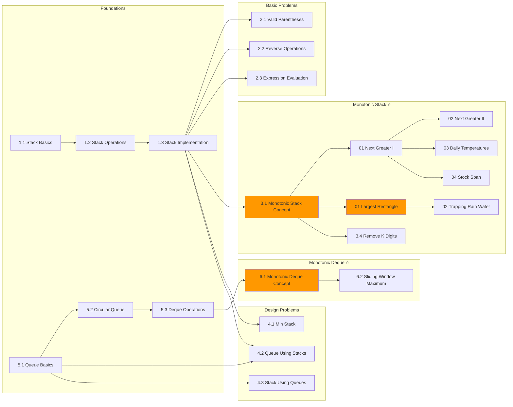

# EXECUTION-CHECKLIST: Unit 5 - Stacks & Queues

> ⚠️ **CRITICAL:** Follow this checklist IN ORDER. Do not skip steps.
> Check off each item ONLY after completion. Do not proceed to next item until current is done.
> 
> **ALL 16 template sections are MANDATORY for EVERY file. NO EXCEPTIONS.**

---

## 📊 Unit Overview

| Metric | Value |
|--------|-------|
| **Grokking Patterns** | #7 Stacks, #8 Monotonic Stack, #32 Monotonic Queue |
| **Priority** | ⭐⭐⭐⭐⭐ (Monotonic Stack is HIGH frequency) |
| **LeetCode Problems** | 20+ problems from `data/problems.json` |
| **Resources** | 8+ from `data/resources.json` |
| **Estimated Time** | 1-2 weeks |
| **Total Files** | 22 content files |

---

## 🎯 ROI-Based Priority

| Pattern | Interview % | Priority | Focus |
|---------|-------------|----------|-------|
| **Monotonic Stack** | ~15% | ⭐⭐⭐⭐⭐ | Next greater/smaller, histogram problems |
| **Basic Stack** | ~10% | ⭐⭐⭐⭐ | Matching pairs, expression evaluation |
| **Monotonic Deque** | ~5% | ⭐⭐⭐⭐ | Sliding window max/min |
| **Queue/Deque** | ~5% | ⭐⭐⭐ | BFS foundation, design problems |

---

## 📁 Complete Folder Structure

```
05-Stacks-Queues/                           # Topic folder
├── 05-Stacks-Queues.md                     # Original (copied as index)
├── EXECUTION-CHECKLIST-Stacks-Queues.md    # This file
│
├── 01-Stack-Fundamentals/                  # Section 1
│   ├── 1.1-Stack-Basics.md                 # [Depth: Brief]
│   ├── 1.2-Stack-Operations.md             # [Depth: Brief]
│   └── 1.3-Stack-Implementation.md         # [Depth: Standard]
│
├── 02-Basic-Stack-Problems/                # Section 2
│   ├── 2.1-Valid-Parentheses.md            # [Depth: Standard] LC 20
│   ├── 2.2-Reverse-Operations.md           # [Depth: Brief]
│   └── 2.3-Expression-Evaluation.md        # [Depth: Deep]
│
├── 03-Monotonic-Stack/                     # Section 3 - HIGH PRIORITY ⭐
│   ├── 3.1-Monotonic-Stack-Concept.md      # [Depth: Deep] Pattern overview
│   ├── 3.2-Next-Greater-Problems/          # Sub-folder
│   │   ├── 01-Next-Greater-Element-I.md    # [Depth: Deep] LC 496
│   │   ├── 02-Next-Greater-Element-II.md   # [Depth: Standard] LC 503
│   │   ├── 03-Daily-Temperatures.md        # [Depth: Deep] LC 739
│   │   └── 04-Stock-Span.md                # [Depth: Standard] LC 901
│   ├── 3.3-Histogram-Problems/             # Sub-folder
│   │   ├── 01-Largest-Rectangle.md         # [Depth: Deep] LC 84
│   │   └── 02-Trapping-Rain-Water.md       # [Depth: Deep] LC 42
│   └── 3.4-Remove-K-Digits.md              # [Depth: Standard] LC 402
│
├── 04-Design-Problems/                     # Section 4
│   ├── 4.1-Min-Stack.md                    # [Depth: Deep] LC 155
│   ├── 4.2-Queue-Using-Stacks.md           # [Depth: Standard] LC 232
│   └── 4.3-Stack-Using-Queues.md           # [Depth: Standard] LC 225
│
├── 05-Queue-Fundamentals/                  # Section 5
│   ├── 5.1-Queue-Basics.md                 # [Depth: Brief]
│   ├── 5.2-Circular-Queue.md               # [Depth: Standard] LC 622
│   └── 5.3-Deque-Operations.md             # [Depth: Standard]
│
└── 06-Monotonic-Deque/                     # Section 6 - HIGH PRIORITY ⭐
    ├── 6.1-Monotonic-Deque-Concept.md      # [Depth: Deep]
    └── 6.2-Sliding-Window-Maximum.md       # [Depth: Deep] LC 239
```

---

## Phase 1: Folder Structure

> ⚠️ Create ALL folders BEFORE creating any content files.

- [ ] **1.1** Create topic folder:
  ```bash
  mkdir -p "/workspace/Learning/DSA - Revamped/05-Stacks-Queues"
  ```

- [ ] **1.2** Copy original as index:
  ```bash
  cp "/workspace/Learning/DSA - Revamped/05-Stacks-Queues.md" "/workspace/Learning/DSA - Revamped/05-Stacks-Queues/"
  ```

- [ ] **1.3** Create section folders:
  ```bash
  mkdir -p "/workspace/Learning/DSA - Revamped/05-Stacks-Queues/01-Stack-Fundamentals"
  mkdir -p "/workspace/Learning/DSA - Revamped/05-Stacks-Queues/02-Basic-Stack-Problems"
  mkdir -p "/workspace/Learning/DSA - Revamped/05-Stacks-Queues/03-Monotonic-Stack"
  mkdir -p "/workspace/Learning/DSA - Revamped/05-Stacks-Queues/03-Monotonic-Stack/3.2-Next-Greater-Problems"
  mkdir -p "/workspace/Learning/DSA - Revamped/05-Stacks-Queues/03-Monotonic-Stack/3.3-Histogram-Problems"
  mkdir -p "/workspace/Learning/DSA - Revamped/05-Stacks-Queues/04-Design-Problems"
  mkdir -p "/workspace/Learning/DSA - Revamped/05-Stacks-Queues/05-Queue-Fundamentals"
  mkdir -p "/workspace/Learning/DSA - Revamped/05-Stacks-Queues/06-Monotonic-Deque"
  ```

---

## Phase 2: HIGH PRIORITY Files (Grokking Patterns)

> ⭐ Monotonic Stack (#8) and Monotonic Queue (#32) - Highest interview ROI

### 2.1 Monotonic Stack Pattern (CREATE FIRST)

- [ ] **2.1.1** Create `03-Monotonic-Stack/3.1-Monotonic-Stack-Concept.md`
  - Pattern overview: increasing vs decreasing
  - Template code for both variants
  - Decision framework: when to use which
  - **16 sections MANDATORY**

- [ ] **2.1.2** Create `03-Monotonic-Stack/3.2-Next-Greater-Problems/01-Next-Greater-Element-I.md`
  - LC 496 - Easy
  - Foundation problem for the pattern
  - Hash map + monotonic stack combination
  - **16 sections MANDATORY**

- [ ] **2.1.3** Create `03-Monotonic-Stack/3.2-Next-Greater-Problems/02-Next-Greater-Element-II.md`
  - LC 503 - Medium
  - Circular array handling (2x array or modulo)
  - **16 sections MANDATORY**

- [ ] **2.1.4** Create `03-Monotonic-Stack/3.2-Next-Greater-Problems/03-Daily-Temperatures.md`
  - LC 739 - Medium
  - Classic monotonic stack problem
  - **16 sections MANDATORY**

- [ ] **2.1.5** Create `03-Monotonic-Stack/3.2-Next-Greater-Problems/04-Stock-Span.md`
  - LC 901 - Medium
  - "Previous greater element" variant
  - **16 sections MANDATORY**

### 2.2 Histogram Problems (Advanced Monotonic Stack)

- [ ] **2.2.1** Create `03-Monotonic-Stack/3.3-Histogram-Problems/01-Largest-Rectangle.md`
  - LC 84 - Hard
  - Classic interview problem
  - Multiple approaches: left/right arrays, single pass
  - **16 sections MANDATORY**

- [ ] **2.2.2** Create `03-Monotonic-Stack/3.3-Histogram-Problems/02-Trapping-Rain-Water.md`
  - LC 42 - Hard
  - Stack approach + DP approach + Two pointers
  - Cross-reference with Arrays unit
  - **16 sections MANDATORY**

- [ ] **2.2.3** Create `03-Monotonic-Stack/3.4-Remove-K-Digits.md`
  - LC 402 - Medium
  - Greedy + Monotonic Stack
  - **16 sections MANDATORY**

### 2.3 Monotonic Deque Pattern

- [ ] **2.3.1** Create `06-Monotonic-Deque/6.1-Monotonic-Deque-Concept.md`
  - Pattern overview
  - Deque operations for maintaining monotonicity
  - **16 sections MANDATORY**

- [ ] **2.3.2** Create `06-Monotonic-Deque/6.2-Sliding-Window-Maximum.md`
  - LC 239 - Hard
  - Classic sliding window + deque problem
  - **16 sections MANDATORY**

---

## Phase 3: Design Problems (High Frequency)

- [ ] **3.1** Create `04-Design-Problems/4.1-Min-Stack.md`
  - LC 155 - Medium
  - O(1) getMin operation
  - Two-stack approach vs single stack with pairs
  - **16 sections MANDATORY**

- [ ] **3.2** Create `04-Design-Problems/4.2-Queue-Using-Stacks.md`
  - LC 232 - Easy
  - Two-stack approach, amortized O(1)
  - **16 sections MANDATORY**

- [ ] **3.3** Create `04-Design-Problems/4.3-Stack-Using-Queues.md`
  - LC 225 - Easy
  - Push O(n) or Pop O(n) approach
  - **16 sections MANDATORY**

---

## Phase 4: Basic Stack Problems

- [ ] **4.1** Create `02-Basic-Stack-Problems/2.1-Valid-Parentheses.md`
  - LC 20 - Easy
  - Classic matching problem
  - **16 sections MANDATORY**

- [ ] **4.2** Create `02-Basic-Stack-Problems/2.2-Reverse-Operations.md`
  - Reverse string, reverse stack
  - Foundational stack applications
  - **16 sections MANDATORY**

- [ ] **4.3** Create `02-Basic-Stack-Problems/2.3-Expression-Evaluation.md`
  - LC 150 (Reverse Polish Notation) - Medium
  - LC 224, 227 (Basic Calculator I/II)
  - Operator precedence handling
  - **16 sections MANDATORY**

---

## Phase 5: Foundational Content

### 5.1 Stack Fundamentals

- [ ] **5.1.1** Create `01-Stack-Fundamentals/1.1-Stack-Basics.md`
  - LIFO principle, real-world analogies
  - **16 sections MANDATORY**

- [ ] **5.1.2** Create `01-Stack-Fundamentals/1.2-Stack-Operations.md`
  - push, pop, peek, isEmpty
  - **16 sections MANDATORY**

- [ ] **5.1.3** Create `01-Stack-Fundamentals/1.3-Stack-Implementation.md`
  - Array-based, Linked List-based, built-in
  - **16 sections MANDATORY**

### 5.2 Queue Fundamentals

- [ ] **5.2.1** Create `05-Queue-Fundamentals/5.1-Queue-Basics.md`
  - FIFO principle, BFS connection
  - **16 sections MANDATORY**

- [ ] **5.2.2** Create `05-Queue-Fundamentals/5.2-Circular-Queue.md`
  - LC 622 - Medium
  - Front/rear pointer management
  - **16 sections MANDATORY**

- [ ] **5.2.3** Create `05-Queue-Fundamentals/5.3-Deque-Operations.md`
  - Double-ended queue operations
  - Python collections.deque
  - **16 sections MANDATORY**

---

## Phase 6: Validation

- [ ] **6.1** Verify all 10 folders exist:
  ```bash
  find "/workspace/Learning/DSA - Revamped/05-Stacks-Queues" -type d | wc -l
  # Expected: 10 directories
  ```

- [ ] **6.2** Verify all 22 content files exist:
  ```bash
  find "/workspace/Learning/DSA - Revamped/05-Stacks-Queues" -name "*.md" -type f ! -name "EXECUTION*" ! -name "05-Stacks-Queues.md" | wc -l
  # Expected: 22 files
  ```

- [ ] **6.3** Verify template sections (minimum 12 per file):
  ```bash
  for f in $(find "/workspace/Learning/DSA - Revamped/05-Stacks-Queues" -name "*.md" -type f ! -name "EXECUTION*" ! -name "05-Stacks-Queues.md"); do
    count=$(grep -cE "^#{1,5} [🎯✅❌🔗📐💻⚡🔄⚠️📝🎤⏱️💡]" "$f" 2>/dev/null || echo 0)
    echo "$count sections: $f"
  done
  ```

- [ ] **6.4** Check for any files with < 12 sections and FIX

---

## 📋 File Summary Table

| # | File Path | Depth | LeetCode | Priority |
|---|-----------|-------|----------|----------|
| 1 | `03-Monotonic-Stack/3.1-Monotonic-Stack-Concept.md` | Deep | - | ⭐⭐⭐⭐⭐ |
| 2 | `.../3.2-Next-Greater-Problems/01-Next-Greater-Element-I.md` | Deep | LC 496 | ⭐⭐⭐⭐⭐ |
| 3 | `.../3.2-Next-Greater-Problems/02-Next-Greater-Element-II.md` | Standard | LC 503 | ⭐⭐⭐⭐ |
| 4 | `.../3.2-Next-Greater-Problems/03-Daily-Temperatures.md` | Deep | LC 739 | ⭐⭐⭐⭐⭐ |
| 5 | `.../3.2-Next-Greater-Problems/04-Stock-Span.md` | Standard | LC 901 | ⭐⭐⭐⭐ |
| 6 | `.../3.3-Histogram-Problems/01-Largest-Rectangle.md` | Deep | LC 84 | ⭐⭐⭐⭐⭐ |
| 7 | `.../3.3-Histogram-Problems/02-Trapping-Rain-Water.md` | Deep | LC 42 | ⭐⭐⭐⭐⭐ |
| 8 | `03-Monotonic-Stack/3.4-Remove-K-Digits.md` | Standard | LC 402 | ⭐⭐⭐⭐ |
| 9 | `06-Monotonic-Deque/6.1-Monotonic-Deque-Concept.md` | Deep | - | ⭐⭐⭐⭐ |
| 10 | `06-Monotonic-Deque/6.2-Sliding-Window-Maximum.md` | Deep | LC 239 | ⭐⭐⭐⭐⭐ |
| 11 | `04-Design-Problems/4.1-Min-Stack.md` | Deep | LC 155 | ⭐⭐⭐⭐⭐ |
| 12 | `04-Design-Problems/4.2-Queue-Using-Stacks.md` | Standard | LC 232 | ⭐⭐⭐⭐ |
| 13 | `04-Design-Problems/4.3-Stack-Using-Queues.md` | Standard | LC 225 | ⭐⭐⭐ |
| 14 | `02-Basic-Stack-Problems/2.1-Valid-Parentheses.md` | Standard | LC 20 | ⭐⭐⭐⭐⭐ |
| 15 | `02-Basic-Stack-Problems/2.2-Reverse-Operations.md` | Brief | - | ⭐⭐⭐ |
| 16 | `02-Basic-Stack-Problems/2.3-Expression-Evaluation.md` | Deep | LC 150 | ⭐⭐⭐⭐ |
| 17 | `01-Stack-Fundamentals/1.1-Stack-Basics.md` | Brief | - | ⭐⭐⭐ |
| 18 | `01-Stack-Fundamentals/1.2-Stack-Operations.md` | Brief | - | ⭐⭐⭐ |
| 19 | `01-Stack-Fundamentals/1.3-Stack-Implementation.md` | Standard | - | ⭐⭐⭐ |
| 20 | `05-Queue-Fundamentals/5.1-Queue-Basics.md` | Brief | - | ⭐⭐⭐ |
| 21 | `05-Queue-Fundamentals/5.2-Circular-Queue.md` | Standard | LC 622 | ⭐⭐⭐ |
| 22 | `05-Queue-Fundamentals/5.3-Deque-Operations.md` | Standard | - | ⭐⭐⭐ |

---

## 🔗 Prerequisites Map



---

## 📊 LeetCode Problem Coverage

| Problem | LC # | Difficulty | File |
|---------|------|------------|------|
| Valid Parentheses | 20 | Easy | 2.1 |
| Evaluate Reverse Polish Notation | 150 | Medium | 2.3 |
| Min Stack | 155 | Medium | 4.1 |
| Implement Queue using Stacks | 232 | Easy | 4.2 |
| Implement Stack using Queues | 225 | Easy | 4.3 |
| Next Greater Element I | 496 | Easy | 3.2/01 |
| Next Greater Element II | 503 | Medium | 3.2/02 |
| Daily Temperatures | 739 | Medium | 3.2/03 |
| Online Stock Span | 901 | Medium | 3.2/04 |
| Largest Rectangle in Histogram | 84 | Hard | 3.3/01 |
| Trapping Rain Water | 42 | Hard | 3.3/02 |
| Remove K Digits | 402 | Medium | 3.4 |
| Design Circular Queue | 622 | Medium | 5.2 |
| Sliding Window Maximum | 239 | Hard | 6.2 |

**Total: 14 LeetCode problems covered**

---

## 🎯 Template Section Reminder

**Every file MUST have ALL 16 sections:**

```
□ 1.  Definition/Overview (at the top)
□ 2.  🎯 Pattern Recognition
□ 3.  ✅ When to Use
□ 4.  ❌ When NOT to Use (with alternatives table)
□ 5.  🔗 Concept Map (prerequisites, next steps)
□ 6.  📐 How It Works (step-by-step with visualization)
□ 7.  💻 Code Implementation (Python AND JavaScript)
□ 8.  ⚡ Complexity Analysis (table)
□ 9.  🔄 Variations (table)
□ 10. ⚠️ Common Mistakes (with ❌/✅ examples)
□ 11. 📝 Practice Problems (progressive difficulty)
□ 12. 🧠 Spaced Repetition Schedule (in details block)
□ 13. 🎤 Interview Context (company focus, communication)
□ 14. ⏱️ Time Estimates (learning and solving)
□ 15. 💡 Key Insight (blockquote)
□ 16. 🔗 Related (links to connected topics)
```

---

## ⏱️ Estimated Completion Time

| Phase | Files | Est. Time |
|-------|-------|-----------|
| Phase 1 (Folders) | 10 dirs | 5 min |
| Phase 2 (Monotonic Stack) | 10 files | 4-5 hours |
| Phase 3 (Design) | 3 files | 1-1.5 hours |
| Phase 4 (Basic Stack) | 3 files | 1 hour |
| Phase 5 (Fundamentals) | 6 files | 2 hours |
| Phase 6 (Validation) | - | 15 min |
| **Total** | **22 files** | **~9-10 hours** |

---

**Created:** 2026-01-27  
**Status:** Ready for execution by dsa-writer
