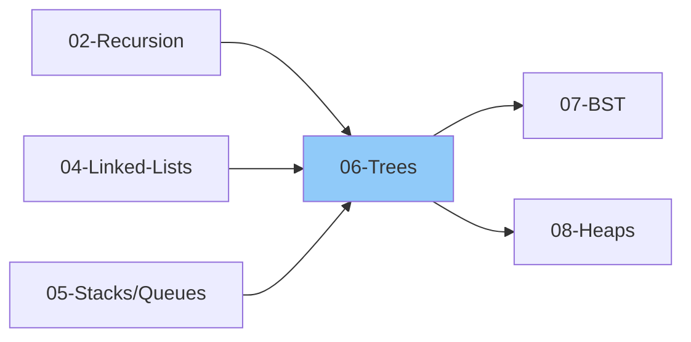

# 06 - Trees

> Hierarchical data structure for organized data representation
>
> ✅ *Includes Grokking Patterns: #7 Tree BFS, #8 Tree DFS, #12 Level Order Traversal*
>
> ⏱️ *Estimated: 2-3 weeks*

---

## 1. Tree Basics

### 1.1 What is a Tree?
- [ ] Tree definition
- [ ] Hierarchical structure
- [ ] Non-linear data structure
- [ ] Tree vs Graph

### 1.2 Tree Terminology
- [ ] Node
- [ ] Root
- [ ] Parent
- [ ] Child
- [ ] Siblings
- [ ] Leaf (external node)
- [ ] Internal node
- [ ] Edge
- [ ] Path
- [ ] Depth of a node
- [ ] Height of a node
- [ ] Height of tree
- [ ] Level
- [ ] Subtree
- [ ] Degree of node
- [ ] Degree of tree
- [ ] Ancestor
- [ ] Descendant

### 1.3 Types of Trees
- [ ] General Tree
- [ ] Binary Tree
- [ ] Binary Search Tree (BST)
- [ ] AVL Tree
- [ ] Red-Black Tree
- [ ] B-Tree / B+ Tree
- [ ] Heap
- [ ] Trie
- [ ] Segment Tree
- [ ] Fenwick Tree

---

## 2. Binary Tree

### 2.1 Binary Tree Basics
- [ ] Definition (max 2 children)
- [ ] Left child, Right child
- [ ] Node structure
- [ ] Maximum nodes at level L = 2^L
- [ ] Maximum nodes in tree of height H = 2^(H+1) - 1

### 2.2 Types of Binary Trees
- [ ] Full Binary Tree (0 or 2 children)
- [ ] Complete Binary Tree (all levels filled except last)
- [ ] Perfect Binary Tree (all internal nodes have 2 children)
- [ ] Balanced Binary Tree (height difference ≤ 1)
- [ ] Degenerate/Skewed Tree (like linked list)

### 2.3 Binary Tree Representation
- [ ] Using Linked Nodes
- [ ] Using Array (for complete trees)
  - Parent: (i-1)/2
  - Left child: 2*i + 1
  - Right child: 2*i + 2

---

## 3. Tree Traversals

### 3.1 Depth-First Traversals

#### Inorder (Left, Root, Right)
- [ ] Recursive implementation
- [ ] Iterative implementation (using stack)
- [ ] Morris Traversal (O(1) space)

#### Preorder (Root, Left, Right)
- [ ] Recursive implementation
- [ ] Iterative implementation
- [ ] Morris Traversal

#### Postorder (Left, Right, Root)
- [ ] Recursive implementation
- [ ] Iterative implementation (using 2 stacks)
- [ ] Iterative implementation (using 1 stack)

### 3.2 Breadth-First Traversal

#### Level Order Traversal
- [ ] Using Queue
- [ ] Level by level (2D array output)
- [ ] Zigzag level order
- [ ] Reverse level order
- [ ] Right/Left side view

### 3.3 Traversal Problems
- [ ] Binary Tree Inorder Traversal
- [ ] Binary Tree Preorder Traversal
- [ ] Binary Tree Postorder Traversal
- [ ] Level Order Traversal
- [ ] Zigzag Level Order Traversal
- [ ] Vertical Order Traversal
- [ ] Boundary Traversal
- [ ] Diagonal Traversal

---

## 4. Binary Tree Properties

### 4.1 Basic Properties
- [ ] Height of tree
- [ ] Depth of node
- [ ] Size (number of nodes)
- [ ] Maximum width
- [ ] Diameter of tree

### 4.2 Property Problems
- [ ] Maximum Depth of Binary Tree
- [ ] Minimum Depth of Binary Tree
- [ ] Diameter of Binary Tree
- [ ] Check if Balanced Tree
- [ ] Count Complete Tree Nodes
- [ ] Maximum Width of Binary Tree
- [ ] Check if Same Tree
- [ ] Check if Symmetric Tree

---

## 5. Binary Tree Problems by Category

### 5.1 Basic Problems
- [ ] Invert Binary Tree
- [ ] Merge Two Binary Trees
- [ ] Maximum Depth
- [ ] Minimum Depth
- [ ] Same Tree
- [ ] Symmetric Tree
- [ ] Subtree of Another Tree

### 5.2 Path Problems
- [ ] Path Sum
- [ ] Path Sum II (all paths)
- [ ] Path Sum III (any start/end)
- [ ] Binary Tree Maximum Path Sum
- [ ] Sum Root to Leaf Numbers
- [ ] All Root to Leaf Paths
- [ ] Longest Univalue Path

### 5.3 View Problems
- [ ] Right Side View
- [ ] Left Side View
- [ ] Top View
- [ ] Bottom View
- [ ] Vertical Order Traversal

### 5.4 Ancestor Problems
- [ ] Lowest Common Ancestor (LCA)
- [ ] LCA of Deepest Leaves
- [ ] Maximum Difference Between Node and Ancestor
- [ ] All Ancestors of a Node

### 5.5 Construction Problems
- [ ] Construct from Preorder & Inorder
- [ ] Construct from Postorder & Inorder
- [ ] Construct from Preorder & Postorder
- [ ] Serialize and Deserialize Binary Tree
- [ ] Flatten Binary Tree to Linked List
- [ ] Convert Sorted Array to BST

### 5.6 Modification Problems
- [ ] Invert Binary Tree
- [ ] Flatten to Linked List
- [ ] Populating Next Right Pointers
- [ ] Delete Nodes and Return Forest
- [ ] Prune Binary Tree

### 5.7 Advanced Problems
- [ ] Count Good Nodes
- [ ] Distribute Coins in Binary Tree
- [ ] Binary Tree Cameras
- [ ] House Robber III
- [ ] Pseudo-Palindromic Paths

---

## 6. N-ary Tree

### 6.1 Basics
- [ ] N-ary tree definition
- [ ] Node structure (data + list of children)
- [ ] Representation

### 6.2 Traversals
- [ ] Preorder traversal
- [ ] Postorder traversal
- [ ] Level order traversal

### 6.3 Problems
- [ ] Maximum Depth of N-ary Tree
- [ ] N-ary Tree Preorder Traversal
- [ ] N-ary Tree Postorder Traversal
- [ ] N-ary Tree Level Order Traversal
- [ ] Encode N-ary Tree to Binary Tree

---

## Tree Traversal Summary

| Traversal | Order | Use Case |
|-----------|-------|----------|
| Inorder | Left, Root, Right | BST sorted order |
| Preorder | Root, Left, Right | Copy tree, prefix expr |
| Postorder | Left, Right, Root | Delete tree, postfix expr |
| Level Order | Level by level | BFS, shortest path |

---

## Thinking Framework

### Tree Problem Patterns
1. **DFS (Recursion)** - Most tree problems
2. **BFS (Queue)** - Level-based problems
3. **Return value + Helper** - Need info from subtrees
4. **Global variable** - Track across recursion
5. **Parent pointer** - Need ancestor info

### Recursive Tree Template
- [ ] Understand the general recursive tree pattern:
  - Base case: if node is null, return base value
  - Recursively solve for left subtree
  - Recursively solve for right subtree
  - Process current node using left and right results
  - Return combined result

---

## 7. Interview Focus

### 7.1 Things to Look Out For
- [ ] Always handle null/empty tree case first
- [ ] Recursion is natural for trees - trust the recursive call
- [ ] Consider both DFS (recursion/stack) and BFS (queue) approaches
- [ ] Many problems need info from both subtrees
- [ ] Return multiple values when needed (tuple or class)

### 7.2 Corner Cases
- [ ] Empty tree (root = null)
- [ ] Single node tree
- [ ] Skewed tree (all left or all right)
- [ ] Complete vs incomplete tree
- [ ] Negative values in nodes

### 7.3 Common Mistakes
- [ ] Forgetting base case (null check)
- [ ] Wrong traversal order
- [ ] Confusing height vs depth
- [ ] Not handling single child nodes
- [ ] Incorrect level order output format

### 7.4 Traversal Selection Guide
| Use Case | Traversal |
|----------|----------|
| Get sorted order (BST) | Inorder |
| Copy/serialize tree | Preorder |
| Delete tree / postfix expr | Postorder |
| Level by level | Level Order (BFS) |
| Find shortest path | BFS |

### 7.5 DFS vs BFS Decision
| DFS (Recursion/Stack) | BFS (Queue) |
|----------------------|-------------|
| Path problems | Level problems |
| Most tree problems | Shortest path |
|" Space: O(h) "| Space: O(w) |
| Go deep first | Go wide first |

---

## 📚 Learning Resources

### Videos
- [NeetCode - Trees Playlist](https://www.youtube.com/@NeetCode) - All tree problems with clear explanations
- [Striver (take U forward) - Binary Tree Series](https://www.youtube.com/@takeUforward) - Complete tree problems for interviews
- [Striver - Tree Traversals (Inorder, Preorder, Postorder)](https://www.youtube.com/@takeUforward) - All traversal techniques
- [Abdul Bari - Tree Fundamentals](https://www.youtube.com/@abdul_bari) - Visual tree concept explanations
- [Abdul Bari - Tree Traversals](https://www.youtube.com/@abdul_bari) - Step-by-step traversal walkthroughs
- [freeCodeCamp - Binary Tree Algorithms](https://www.youtube.com/@freecodecamp) - Full course on trees

### Articles
- [Binary Tree - GeeksforGeeks](https://www.geeksforgeeks.org/binary-tree-data-structure/)
- [Tree Traversals - GeeksforGeeks](https://www.geeksforgeeks.org/tree-traversals-inorder-preorder-and-postorder/)
- [DFS on Trees - Tech Interview Handbook](https://www.techinterviewhandbook.org/algorithms/tree/)
- [BFS Level Order Traversal - GeeksforGeeks](https://www.geeksforgeeks.org/level-order-tree-traversal/)
- [Lowest Common Ancestor - GeeksforGeeks](https://www.geeksforgeeks.org/lowest-common-ancestor-binary-tree-set-1/)
- [Binary Tree Basics - Programiz](https://www.programiz.com/dsa/binary-tree)

---

## 8. Essential Problems

### 8.1 Tree Traversals

| Problem | Platform | Difficulty | Pattern |
|---------|----------|------------|--------|
| [Binary Tree Inorder Traversal](https://leetcode.com/problems/binary-tree-inorder-traversal/) | LeetCode | 🟢 Easy | DFS |
| [Binary Tree Preorder Traversal](https://leetcode.com/problems/binary-tree-preorder-traversal/) | LeetCode | 🟢 Easy | DFS |
| [Binary Tree Postorder Traversal](https://leetcode.com/problems/binary-tree-postorder-traversal/) | LeetCode | 🟢 Easy | DFS |
| [Binary Tree Level Order Traversal](https://leetcode.com/problems/binary-tree-level-order-traversal/) | LeetCode | 🟡 Medium | BFS |
| [Binary Tree Zigzag Level Order Traversal](https://leetcode.com/problems/binary-tree-zigzag-level-order-traversal/) | LeetCode | 🟡 Medium | BFS |
| [Vertical Order Traversal](https://leetcode.com/problems/vertical-order-traversal-of-a-binary-tree/) | LeetCode | 🔴 Hard | BFS + Sorting |

### 8.2 Tree Properties

| Problem | Platform | Difficulty | Pattern |
|---------|----------|------------|--------|
| [Maximum Depth of Binary Tree](https://leetcode.com/problems/maximum-depth-of-binary-tree/) | LeetCode | 🟢 Easy | DFS |
| [Minimum Depth of Binary Tree](https://leetcode.com/problems/minimum-depth-of-binary-tree/) | LeetCode | 🟢 Easy | DFS / BFS |
| [Diameter of Binary Tree](https://leetcode.com/problems/diameter-of-binary-tree/) | LeetCode | 🟢 Easy | DFS |
| [Balanced Binary Tree](https://leetcode.com/problems/balanced-binary-tree/) | LeetCode | 🟢 Easy | DFS |
| [Same Tree](https://leetcode.com/problems/same-tree/) | LeetCode | 🟢 Easy | DFS |
| [Symmetric Tree](https://leetcode.com/problems/symmetric-tree/) | LeetCode | 🟢 Easy | DFS / BFS |

### 8.3 Tree Modifications

| Problem | Platform | Difficulty | Pattern |
|---------|----------|------------|--------|
| [Invert Binary Tree](https://leetcode.com/problems/invert-binary-tree/) | LeetCode | 🟢 Easy | DFS |
| [Subtree of Another Tree](https://leetcode.com/problems/subtree-of-another-tree/) | LeetCode | 🟢 Easy | DFS |
| [Merge Two Binary Trees](https://leetcode.com/problems/merge-two-binary-trees/) | LeetCode | 🟢 Easy | DFS |
| [Flatten Binary Tree to Linked List](https://leetcode.com/problems/flatten-binary-tree-to-linked-list/) | LeetCode | 🟡 Medium | DFS |

### 8.4 Path & Ancestor Problems

| Problem | Platform | Difficulty | Pattern |
|---------|----------|------------|--------|
| [Path Sum](https://leetcode.com/problems/path-sum/) | LeetCode | 🟢 Easy | DFS |
| [Path Sum II](https://leetcode.com/problems/path-sum-ii/) | LeetCode | 🟡 Medium | DFS + Backtracking |
| [Path Sum III](https://leetcode.com/problems/path-sum-iii/) | LeetCode | 🟡 Medium | DFS + Prefix Sum |
| [Binary Tree Maximum Path Sum](https://leetcode.com/problems/binary-tree-maximum-path-sum/) | LeetCode | 🔴 Hard | DFS |
| [Lowest Common Ancestor of a Binary Tree](https://leetcode.com/problems/lowest-common-ancestor-of-a-binary-tree/) | LeetCode | 🟡 Medium | DFS |

### 8.5 Construction & Serialization

| Problem | Platform | Difficulty | Pattern |
|---------|----------|------------|--------|
| [Construct Binary Tree from Preorder and Inorder](https://leetcode.com/problems/construct-binary-tree-from-preorder-and-inorder-traversal/) | LeetCode | 🟡 Medium | Divide & Conquer |
| [Construct Binary Tree from Inorder and Postorder](https://leetcode.com/problems/construct-binary-tree-from-inorder-and-postorder-traversal/) | LeetCode | 🟡 Medium | Divide & Conquer |
| [Serialize and Deserialize Binary Tree](https://leetcode.com/problems/serialize-and-deserialize-binary-tree/) | LeetCode | 🔴 Hard | BFS / DFS |
| [Validate Binary Search Tree](https://leetcode.com/problems/validate-binary-search-tree/) | LeetCode | 🟡 Medium | DFS + Range |
| [Kth Smallest Element in a BST](https://leetcode.com/problems/kth-smallest-element-in-a-bst/) | LeetCode | 🟡 Medium | Inorder DFS |

---

## Checklist Summary

| Topic | Status |
|-------|--------|
| Tree Terminology | ⬜ |
| Binary Tree Basics | ⬜ |
| Types of Binary Trees | ⬜ |
| Inorder Traversal | ⬜ |
| Preorder Traversal | ⬜ |
| Postorder Traversal | ⬜ |
| Level Order Traversal | ⬜ |
| Tree Properties | ⬜ |
| Path Problems | ⬜ |
| View Problems | ⬜ |
| LCA Problems | ⬜ |
| Construction Problems | ⬜ |
| N-ary Trees | ⬜ |
| **Interview Edge Cases** | ⬜ |
| **Essential Problems (10)** | ⬜ |

---

**Previous:** [05-Stacks-Queues.md](./05-Stacks-Queues.md)  
**Next:** [07-Binary-Search-Trees.md](./07-Binary-Search-Trees.md)
