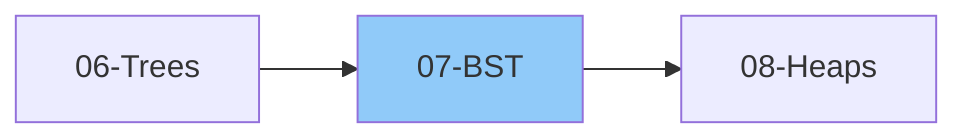

# 07 - Binary Search Trees (BST)

> Ordered binary tree for efficient searching and sorting
>
> 📚 *Part of Tree patterns - BST validation & operations are HIGH frequency*
>
> ⏱️ *Estimated: 1-2 weeks*

---

## 1. BST Basics

### 1.1 What is a BST?
- [ ] Definition
- [ ] BST Property: left < root < right
- [ ] All left subtree values < root
- [ ] All right subtree values > root
- [ ] Why BST is useful

### 1.2 BST Properties
- [ ] Inorder traversal gives sorted order
- [ ] Search, Insert, Delete: O(log n) average
- [ ] Worst case (skewed): O(n)
- [ ] No duplicate values (typically)

### 1.3 BST vs Binary Tree
| Feature | Binary Tree | BST |
|---------|------------|-----|
| Order | No order | Left < Root < Right |
| Search |" O(n) "| O(log n) avg |
| Use case | General | Searching, sorting |

---

## 2. BST Operations

### 2.1 Search
- [ ] Recursive search
- [ ] Iterative search
- [ ] Time: O(h), h = height
- [ ] Space: O(h) recursive, O(1) iterative

### 2.2 Insertion
- [ ] Find correct position
- [ ] Insert as leaf
- [ ] Recursive implementation
- [ ] Iterative implementation
- [ ] Time: O(h)

### 2.3 Deletion
- [ ] Case 1: Node is leaf
- [ ] Case 2: Node has one child
- [ ] Case 3: Node has two children
  - Find inorder successor (or predecessor)
  - Replace and delete
- [ ] Recursive implementation
- [ ] Time: O(h)

### 2.4 Other Operations
- [ ] Find minimum - leftmost node
- [ ] Find maximum - rightmost node
- [ ] Inorder successor
- [ ] Inorder predecessor
- [ ] Floor (largest ≤ key)
- [ ] Ceil (smallest ≥ key)

---

## 3. BST Traversal

### 3.1 Inorder (Sorted Order)
- [ ] Gives ascending sorted order
- [ ] Useful for range queries
- [ ] Kth smallest/largest element

### 3.2 Preorder
- [ ] Useful for serialization
- [ ] Construct BST from preorder

### 3.3 Level Order
- [ ] Level-based operations

---

## 4. BST Problems by Category

### 4.1 Basic Operations
- [ ] Search in BST
- [ ] Insert into BST
- [ ] Delete Node in BST
- [ ] Find Minimum/Maximum
- [ ] Find Inorder Successor
- [ ] Find Inorder Predecessor

### 4.2 Validation
- [ ] Validate Binary Search Tree
- [ ] Check if Two BSTs are Same
- [ ] Check if BST Contains Dead End

### 4.3 Search & Find
- [ ] Search in BST
- [ ] Find Mode in BST
- [ ] Two Sum in BST
- [ ] Find Closest Element
- [ ] Find K Closest Elements
- [ ] Kth Smallest Element in BST
- [ ] Kth Largest Element in BST

### 4.4 Construction
- [ ] Convert Sorted Array to BST
- [ ] Convert Sorted List to BST
- [ ] Construct BST from Preorder
- [ ] Serialize and Deserialize BST
- [ ] Balance a BST

### 4.5 Range Problems
- [ ] Range Sum of BST
- [ ] Count Nodes in Range
- [ ] All Elements in Two BSTs
- [ ] Trim a BST (to given range)

### 4.6 LCA in BST
- [ ] Lowest Common Ancestor of BST
- [ ] (Easier than general BT - use BST property)

### 4.7 Conversion
- [ ] BST to Sorted Doubly Linked List
- [ ] BST to Greater Sum Tree
- [ ] Convert BST to Sorted Array
- [ ] Recover Binary Search Tree (swap fix)

### 4.8 Advanced Problems
- [ ] Unique Binary Search Trees (Catalan)
- [ ] Unique Binary Search Trees II (Generate all)
- [ ] Largest BST in Binary Tree
- [ ] Binary Search Tree Iterator
- [ ] Count BST Nodes in Range

---

## 5. Self-Balancing BSTs (Concept)

### 5.1 Why Balance?
- [ ] Prevent O(n) worst case
- [ ] Maintain O(log n) height
- [ ] Balance factor concept

### 5.2 AVL Tree
- [ ] Balance factor = height(left) - height(right)
- [ ] |Balance factor| ≤ 1 for all nodes
- [ ] Rotations:
  - Left rotation (LL)
  - Right rotation (RR)
  - Left-Right rotation (LR)
  - Right-Left rotation (RL)
- [ ] When to use which rotation

### 5.3 Red-Black Tree
- [ ] Properties (coloring rules)
- [ ] Insertion balancing
- [ ] Deletion balancing
- [ ] Used in: TreeMap, TreeSet (Java)

### 5.4 Comparison
| Tree | Balanced | Insert | Delete | Search | Use Case |
|------|----------|--------|--------|--------|----------|
| BST | No |" O(n) "| O(n) |" O(n) "| Simple cases |
| AVL | Yes |" O(log n) "| O(log n) |" O(log n) "| More reads |
| Red-Black | Yes |" O(log n) "| O(log n) |" O(log n) "| More writes |

---

## 6. BST Applications

### 6.1 Real-World Uses
- [ ] Database indexing
- [ ] File system organization
- [ ] Symbol tables in compilers
- [ ] Priority queues (with modifications)
- [ ] Autocomplete systems

### 6.2 Language Built-ins
- [ ] C++ STL: set, map, multiset, multimap
- [ ] Java: TreeSet, TreeMap
- [ ] Python: No built-in (use `sortedcontainers`)

---

## 📚 Learning Resources

### Videos
- [NeetCode - Binary Search Trees Playlist](https://www.youtube.com/@NeetCode) - BST operations and validation patterns
- [Striver - BST Series](https://www.youtube.com/@takeUforward) - Complete BST concepts and problems
- [Abdul Bari - BST Concepts](https://www.youtube.com/@abdul_bari) - Clear explanations of BST fundamentals

### Articles
- [GeeksforGeeks - Binary Search Tree](https://www.geeksforgeeks.org/binary-search-tree-data-structure/) - BST operations, validation, and in-order properties
- [Tech Interview Handbook - Trees](https://www.techinterviewhandbook.org/algorithms/tree/) - Interview-focused BST patterns

---

## Thinking Framework

### BST Patterns
1. **Use BST Property** - Compare with root to go left/right
2. **Inorder = Sorted** - Use for kth element, range queries
3. **Validate Range** - Pass min/max bounds in recursion
4. **Successor/Predecessor** - Move right once, then all left (or vice versa)

### When to Use BST?
1. Need sorted data with dynamic insert/delete
2. Range queries
3. Finding floor/ceil
4. Kth smallest/largest

---

## 7. Interview Focus

### 7.1 Things to Look Out For
- [ ] BST property: ALL left subtree < root < ALL right subtree
- [ ] Inorder traversal gives SORTED order
- [ ] Use min/max bounds for validation (not just parent comparison)
- [ ] BST allows O(log n) average, but O(n) worst case if skewed
- [ ] Self-balancing trees (AVL, Red-Black) guarantee O(log n)

### 7.2 Corner Cases
- [ ] Empty tree
- [ ] Single node
- [ ] Skewed tree (all left or all right) - worst case O(n)
- [ ] Duplicate values (typically not allowed in BST)
- [ ] Delete node with two children

### 7.3 Common Mistakes
- [ ] Validating BST with only parent-child comparison (wrong!)
- [ ] Forgetting BST can be unbalanced
- [ ] Wrong successor/predecessor logic
- [ ] Not handling delete with two children correctly

### 7.4 BST vs Hash Map
| Use BST when... | Use Hash Map when... |
|-----------------|----------------------|
| Need sorted order |" Just need O(1) lookup "|
| Range queries | Exact match only |
| Floor/ceiling needed | No order needed |
| Min/max frequently | No min/max needed |

---

## 8. Essential Problems

### 8.1 Curated BST Problems

| Problem | Platform | Difficulty | Pattern |
|---------|----------|------------|--------|
| [Validate Binary Search Tree](https://leetcode.com/problems/validate-binary-search-tree/) | LeetCode 98 | 🟡 Medium | BST Validation (min/max bounds) |
| [Kth Smallest Element in a BST](https://leetcode.com/problems/kth-smallest-element-in-a-bst/) | LeetCode 230 | 🟡 Medium | Inorder Traversal |
| [Lowest Common Ancestor of a BST](https://leetcode.com/problems/lowest-common-ancestor-of-a-binary-search-tree/) | LeetCode 235 | 🟡 Medium | BST Property Navigation |
| [Convert Sorted Array to BST](https://leetcode.com/problems/convert-sorted-array-to-binary-search-tree/) | LeetCode 108 | 🟢 Easy | Divide & Conquer |
| [Delete Node in a BST](https://leetcode.com/problems/delete-node-in-a-bst/) | LeetCode 450 | 🟡 Medium | BST Operations |
| [Insert into a BST](https://leetcode.com/problems/insert-into-a-binary-search-tree/) | LeetCode 701 | 🟡 Medium | BST Operations |
| [Search in a BST](https://leetcode.com/problems/search-in-a-binary-search-tree/) | LeetCode 700 | 🟢 Easy | BST Search |
| [Binary Search Tree Iterator](https://leetcode.com/problems/binary-search-tree-iterator/) | LeetCode 173 | 🟡 Medium | Controlled Inorder |
| [Recover Binary Search Tree](https://leetcode.com/problems/recover-binary-search-tree/) | LeetCode 99 | 🟡 Medium | Inorder + Swap Detection |
| [Range Sum of BST](https://leetcode.com/problems/range-sum-of-bst/) | LeetCode 938 | 🟢 Easy | BST Range Query |
| [Two Sum IV - Input is a BST](https://leetcode.com/problems/two-sum-iv-input-is-a-bst/) | LeetCode 653 | 🟢 Easy | BST + Two Pointer/Set |
| [Inorder Successor in BST](https://leetcode.com/problems/inorder-successor-in-bst/) | LeetCode 285 | 🟡 Medium | BST Successor |
| [Convert BST to Greater Tree](https://leetcode.com/problems/convert-bst-to-greater-tree/) | LeetCode 538 | 🟡 Medium | Reverse Inorder |
| [Construct BST from Preorder](https://leetcode.com/problems/construct-binary-search-tree-from-preorder-traversal/) | LeetCode 1008 | 🟡 Medium | BST Construction |
| [Unique Binary Search Trees](https://leetcode.com/problems/unique-binary-search-trees/) | LeetCode 96 | 🟡 Medium | Catalan Numbers / DP |

---

## Checklist Summary

| Topic | Status |
|-------|--------|
| BST Basics | ⬜ |
| BST Property | ⬜ |
| Search Operation | ⬜ |
| Insert Operation | ⬜ |
| Delete Operation | ⬜ |
| Min/Max/Successor/Predecessor | ⬜ |
| Validation Problems | ⬜ |
| Search Problems | ⬜ |
| Construction Problems | ⬜ |
| Range Problems | ⬜ |
| LCA in BST | ⬜ |
| AVL Tree Concept | ⬜ |
| Red-Black Tree Concept | ⬜ |
| **Interview Edge Cases** | ⬜ |
| **Essential Problems (7)** | ⬜ |

---

**Previous:** [06-Trees.md](./06-Trees.md)  
**Next:** [08-Heaps-Priority-Queues.md](./08-Heaps-Priority-Queues.md)
