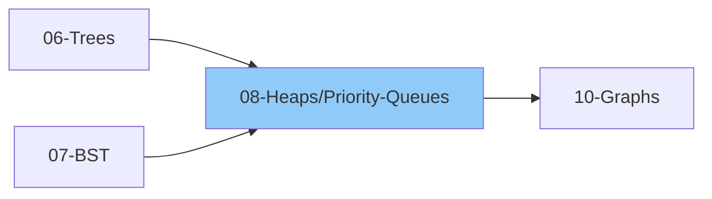

# 08 - Heaps & Priority Queues

> Efficient data structure for finding min/max elements
>
> ✅ *Includes Grokking Pattern #9: Two Heaps, Pattern #13: Top K Elements*
>
> ⏱️ *Estimated: 1-2 weeks*

---

## 1. Heap Basics

### 1.1 What is a Heap?
- [ ] Complete Binary Tree property
- [ ] Heap property (Min-Heap or Max-Heap)
- [ ] Array representation
- [ ] Parent-child relationship in array
  - Parent: (i-1) / 2
  - Left child: 2*i + 1
  - Right child: 2*i + 2

### 1.2 Types of Heaps
- [ ] Min-Heap: parent ≤ children (root is minimum)
- [ ] Max-Heap: parent ≥ children (root is maximum)

### 1.3 Heap Properties
- [ ] Root is always min (min-heap) or max (max-heap)
- [ ] Complete binary tree (filled left to right)
- [ ] Height: O(log n)
- [ ] Not sorted like BST

---

## 2. Heap Operations

### 2.1 Insert (Push)
- [ ] Add at end of array
- [ ] Heapify Up (bubble up)
- [ ] Compare with parent, swap if needed
- [ ] Time: O(log n)

### 2.2 Extract Min/Max (Pop)
- [ ] Remove root
- [ ] Move last element to root
- [ ] Heapify Down (bubble down)
- [ ] Compare with children, swap with smaller/larger
- [ ] Time: O(log n)

### 2.3 Peek
- [ ] Return root element
- [ ] Time: O(1)

### 2.4 Build Heap
- [ ] From array
- [ ] Heapify from last non-leaf to root
- [ ] Time: O(n) - not O(n log n)!

### 2.5 Heapify
- [ ] Heapify Up (for insert)
- [ ] Heapify Down (for extract/build)
- [ ] Iterative implementation
- [ ] Recursive implementation

---

## 3. Heap Implementation

### 3.1 From Scratch
- [ ] Using array
- [ ] Min-Heap implementation
- [ ] Max-Heap implementation

### 3.2 Language Built-ins

#### Python
- [ ] `heapq` module (min-heap only)
- [ ] `heapq.heappush(heap, item)`
- [ ] `heapq.heappop(heap)`
- [ ] `heapq.heapify(list)`
- [ ] `heapq.nlargest(n, iterable)`
- [ ] `heapq.nsmallest(n, iterable)`
- [ ] Max-heap trick: negate values

#### JavaScript
- [ ] No built-in (implement yourself)
- [ ] Or use libraries

---

## 4. Priority Queue

### 4.1 What is Priority Queue?
- [ ] Abstract data type
- [ ] Elements have priority
- [ ] Higher priority served first
- [ ] Heap is common implementation

### 4.2 Priority Queue vs Queue
| Feature | Queue | Priority Queue |
|---------|-------|----------------|
| Order | FIFO | By priority |
| Insert |" O(1) "| O(log n) |
| Extract |" O(1) "| O(log n) |
| Peek |" O(1) "| O(1) |

### 4.3 Custom Priority
- [ ] Using tuples: (priority, value)
- [ ] Using custom comparator
- [ ] Using classes with __lt__

---

## 5. Heap Sort

### 5.1 Algorithm
- [ ] Build max-heap from array
- [ ] Extract max repeatedly
- [ ] Place at end of array
- [ ] Time: O(n log n)
- [ ] Space: O(1) in-place

### 5.2 Implementation
- [ ] Using heapify
- [ ] In-place sorting

---

## 6. Heap Problems by Category

### 6.1 Basic Heap Operations
- [ ] Implement Min-Heap
- [ ] Implement Max-Heap
- [ ] Heap Sort
- [ ] Convert Min-Heap to Max-Heap

### 6.2 Top K Elements (Grokking Pattern #13)

> 💡 *Use when: finding top/bottom K elements, K most frequent, K closest*

- [ ] Kth Largest Element in Array
- [ ] Kth Smallest Element in Array
- [ ] Kth Largest Element in Stream
- [ ] K Closest Points to Origin
- [ ] K Closest Elements to Target
- [ ] Top K Frequent Elements
- [ ] Top K Frequent Words
- [ ] Sort Characters by Frequency

### 6.3 K-way Merge Pattern (Grokking Pattern #14)

> 💡 *Use when: merging multiple sorted lists/arrays, finding kth element across sorted collections*

- [ ] Merge K Sorted Lists
- [ ] Merge K Sorted Arrays
- [ ] Smallest Range Covering Elements from K Lists
- [ ] Find K Pairs with Smallest Sums
- [ ] Kth Smallest Number in M Sorted Lists
- [ ] Kth Smallest Number in Sorted Matrix

### 6.4 Median Problems
- [ ] Find Median from Data Stream
- [ ] Sliding Window Median

### 6.5 Scheduling Problems
- [ ] Task Scheduler
- [ ] Reorganize String
- [ ] Meeting Rooms II (min rooms)
- [ ] Maximum CPU Load
- [ ] Car Pooling

### 6.6 Two Heap Pattern
- [ ] Find Median from Data Stream
- [ ] Sliding Window Median
- [ ] Maximize Capital (IPO)
- [ ] Find Right Interval

### 6.7 Other Heap Problems
- [ ] Last Stone Weight
- [ ] Ugly Number II
- [ ] Super Ugly Number
- [ ] Minimum Cost to Connect Sticks
- [ ] Trapping Rain Water II
- [ ] Swim in Rising Water
- [ ] Cheapest Flights Within K Stops

---

## 7. Two Heap Pattern (Grokking Pattern #9)

> 💡 *Use when: need to find median, middle element, or track two halves*

### 7.1 Concept
- [ ] Maintain two heaps
- [ ] Max-heap for smaller half
- [ ] Min-heap for larger half
- [ ] Balance heaps

### 7.2 Applications
- [ ] Running median
- [ ] Sliding window median
- [ ] Problems needing middle elements

### 7.3 Template
- [ ] Two Heap Pattern Implementation:
  - Maintain `small` (max-heap for smaller half) and `large` (min-heap for larger half)
  - When adding a number:
    - Add to small heap first (negate for max-heap in Python)
    - Ensure small's max ≤ large's min (transfer if violated)
    - Balance sizes (difference ≤ 1)
  - For median:
    - If equal sizes: average of both heap tops
    - If unequal: top of larger heap

---

## 8. Top K Pattern

### 8.1 Using Min-Heap (K size)
- [ ] Maintain heap of size K
- [ ] For Kth largest: use min-heap
- [ ] For Kth smallest: use max-heap
- [ ] Time: O(n log k)

### 8.2 Using Max-Heap
- [ ] Push all elements
- [ ] Pop K times
- [ ] Time: O(n + k log n)

### 8.3 When to use which?
- K is small → Min-heap of size K
- K is close to n → Max-heap, pop n-k

---

## Comparison Table

| Operation | Heap | Sorted Array | BST |
|-----------|------|--------------|-----|
| Find min/max |" O(1) "| O(1) |" O(log n) "|
| Insert |" O(log n) "| O(n) |" O(log n) "|
| Delete min/max |" O(log n) "| O(1) or O(n) |" O(log n) "|
| Search |" O(n) "| O(log n) |" O(log n) "|

---

## 📚 Learning Resources

### Videos
- [NeetCode - Heap/Priority Queue Playlist](https://www.youtube.com/@NeetCode) - Heap operations and Top K pattern problems
- [Striver - Heaps Series](https://www.youtube.com/@takeUforward) - Two Heaps pattern and priority queue concepts
- [Abdul Bari - Heap Data Structure](https://www.youtube.com/@abdul_bari) - Heap fundamentals and heap sort

### Articles
- [GeeksforGeeks - Heap Data Structure](https://www.geeksforgeeks.org/heap-data-structure/) - Heap operations, Two Heaps, and Top K patterns
- [Tech Interview Handbook - Heap](https://www.techinterviewhandbook.org/algorithms/heap/) - Interview-focused heap problems and patterns

---

## Thinking Framework

### When to use Heap?
1. Need min/max element repeatedly
2. Top K problems
3. Stream of data
4. Scheduling/greedy problems
5. Merge K sorted structures

### Heap vs Sorting
- Need all sorted → Sort O(n log n)
- Need only K elements → Heap O(n log k)
- Streaming data → Heap

---

## 9. Interview Focus

### 9.1 Things to Look Out For
- [ ] Python heapq is MIN-heap only - negate values for max-heap
- [ ] For Kth LARGEST use min-heap of size K
- [ ] For Kth SMALLEST use max-heap of size K
- [ ] Heapify is O(n), not O(n log n)
- [ ] For custom objects, use tuples (priority, object)

### 9.2 Corner Cases
- [ ] Empty heap
- [ ] K = 0 or K > n
- [ ] All elements same
- [ ] Single element
- [ ] Negative numbers (watch for negation trick)

### 9.3 Common Mistakes
- [ ] Using wrong heap type (max vs min) for the problem
- [ ] Forgetting to negate for max-heap in Python
- [ ] Not handling K > n case
- [ ] Confusing heap size K vs pop K times

### 9.4 Heap Pattern Selection
| Problem Type | Approach |
|-------------|----------|
| Kth largest | Min-heap of size K |
| Kth smallest | Max-heap of size K |
| Top K frequent | Heap + frequency map |
| Median stream | Two heaps (max + min) |
| Merge K sorted | Min-heap of K elements |

### 9.5 Heap vs Other Approaches
| Need | Best Approach |
|------|---------------|
| Full sorted array |" Sorting O(n log n) "|
| Only K elements |" Heap O(n log k) "|
| Stream of data | Heap |
| Single min/max |" Linear scan O(n) "|

---

## 10. Essential Problems

### 10.1 Curated Heap/Priority Queue Problems

| Problem | Platform | Difficulty | Pattern |
|---------|----------|------------|--------|
| [Kth Largest Element in an Array](https://leetcode.com/problems/kth-largest-element-in-an-array/) | LeetCode 215 | 🟡 Medium | Top K (Min-Heap of size K) |
| [Kth Largest Element in a Stream](https://leetcode.com/problems/kth-largest-element-in-a-stream/) | LeetCode 703 | 🟢 Easy | Streaming + Min-Heap |
| [Top K Frequent Elements](https://leetcode.com/problems/top-k-frequent-elements/) | LeetCode 347 | 🟡 Medium | Frequency Map + Heap |
| [Top K Frequent Words](https://leetcode.com/problems/top-k-frequent-words/) | LeetCode 692 | 🟡 Medium | Frequency Map + Custom Heap |
| [Find Median from Data Stream](https://leetcode.com/problems/find-median-from-data-stream/) | LeetCode 295 | 🔴 Hard | Two Heaps Pattern |
| [Sliding Window Median](https://leetcode.com/problems/sliding-window-median/) | LeetCode 480 | 🔴 Hard | Two Heaps + Lazy Deletion |
| [Merge K Sorted Lists](https://leetcode.com/problems/merge-k-sorted-lists/) | LeetCode 23 | 🔴 Hard | K-way Merge (Min-Heap) |
| [K Closest Points to Origin](https://leetcode.com/problems/k-closest-points-to-origin/) | LeetCode 973 | 🟡 Medium | Top K (Max-Heap of size K) |
| [Find K Closest Elements](https://leetcode.com/problems/find-k-closest-elements/) | LeetCode 658 | 🟡 Medium | Binary Search / Heap |
| [Task Scheduler](https://leetcode.com/problems/task-scheduler/) | LeetCode 621 | 🟡 Medium | Greedy + Max-Heap |
| [Reorganize String](https://leetcode.com/problems/reorganize-string/) | LeetCode 767 | 🟡 Medium | Greedy + Max-Heap |
| [Meeting Rooms II](https://leetcode.com/problems/meeting-rooms-ii/) | LeetCode 253 | 🟡 Medium | Min-Heap for end times |
| [Last Stone Weight](https://leetcode.com/problems/last-stone-weight/) | LeetCode 1046 | 🟢 Easy | Max-Heap Simulation |
| [Sort Characters By Frequency](https://leetcode.com/problems/sort-characters-by-frequency/) | LeetCode 451 | 🟡 Medium | Frequency + Heap |
| [Find K Pairs with Smallest Sums](https://leetcode.com/problems/find-k-pairs-with-smallest-sums/) | LeetCode 373 | 🟡 Medium | K-way Merge |
| [Kth Smallest Element in Sorted Matrix](https://leetcode.com/problems/kth-smallest-element-in-a-sorted-matrix/) | LeetCode 378 | 🟡 Medium | K-way Merge / Binary Search |
| [IPO](https://leetcode.com/problems/ipo/) | LeetCode 502 | 🔴 Hard | Two Heaps Pattern |
| [Ugly Number II](https://leetcode.com/problems/ugly-number-ii/) | LeetCode 264 | 🟡 Medium | Min-Heap / DP |

---

## Checklist Summary

| Topic | Status |
|-------|--------|
| Heap Basics | ⬜ |
| Min-Heap | ⬜ |
| Max-Heap | ⬜ |
| Insert/Extract Operations | ⬜ |
| Heapify | ⬜ |
| Build Heap | ⬜ |
| Priority Queue | ⬜ |
| Heap Sort | ⬜ |
| Kth Element Problems | ⬜ |
| Merge K Problems | ⬜ |
| Two Heap Pattern | ⬜ |
| Top K Pattern | ⬜ |
| **Interview Edge Cases** | ⬜ |
| **Essential Problems (8)** | ⬜ |

---

**Previous:** [07-Binary-Search-Trees](../07-Binary-Search-Trees.md)  
**Next:** [09-Hashing](.../09-Hashing/09-Hashing.md)
