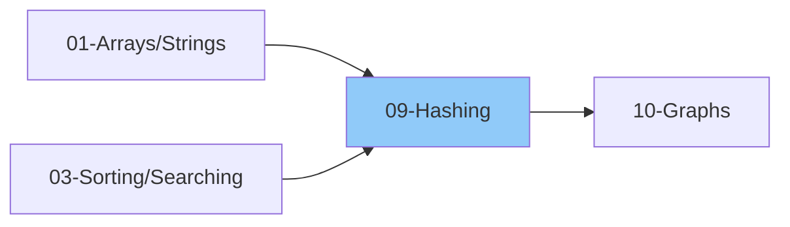

# 09 - Hashing

> O(1) average time for insert, delete, and search
>
> 📚 *Includes Grokking Pattern #10: Hash Maps*
>
> ⚠️ *AlgoMonster Note: VERY HIGH ROI - fundamental for most problems*
>
> ⏱️ *Estimated: 1-2 weeks*

---

## 1. Hashing Basics

### 1.1 What is Hashing?
- [ ] Mapping data to fixed-size values
- [ ] Hash function concept
- [ ] Hash code vs Index
- [ ] Why O(1) average?

### 1.2 Hash Function
- [ ] What makes a good hash function?
- [ ] Deterministic
- [ ] Uniform distribution
- [ ] Fast to compute
- [ ] Minimizes collisions

### 1.3 Common Hash Functions
- [ ] Division method: h(k) = k mod m
- [ ] Multiplication method
- [ ] Universal hashing
- [ ] String hashing (polynomial rolling hash)

---

## 2. Hash Table / Hash Map

### 2.1 Structure
- [ ] Array of buckets
- [ ] Hash function maps key to index
- [ ] Store key-value pairs

### 2.2 Operations
- [ ] Insert / Put - O(1) average
- [ ] Search / Get - O(1) average
- [ ] Delete / Remove - O(1) average
- [ ] Contains - O(1) average

### 2.3 Collision Handling

#### Chaining (Open Hashing)
- [ ] Each bucket is a linked list
- [ ] Multiple keys in same bucket
- [ ] Simple implementation
- [ ] Worst case: O(n) if all collide

#### Open Addressing (Closed Hashing)
- [ ] All elements stored in table
- [ ] Probe for next empty slot
- [ ] Linear Probing: h(k, i) = (h(k) + i) mod m
- [ ] Quadratic Probing: h(k, i) = (h(k) + i²) mod m
- [ ] Double Hashing: h(k, i) = (h₁(k) + i*h₂(k)) mod m

### 2.4 Load Factor
- [ ] α = n / m (items / buckets)
- [ ] When to resize (typically α > 0.75)
- [ ] Rehashing process

---

## 3. Hash Set

### 3.1 What is Hash Set?
- [ ] Stores unique elements only
- [ ] No key-value, just keys
- [ ] Fast membership testing

### 3.2 Operations
- [ ] add(element) - O(1)
- [ ] remove(element) - O(1)
- [ ] contains(element) - O(1)
- [ ] size() - O(1)

---

## 4. Language Implementations

### 4.1 Python
- [ ] **Dictionary (dict)**: Key-value hash map
  - Create: `{}` or `dict()`
  - Set: `d['key'] = 'value'`
  - Get with default: `d.get('key', default)`
  - Check: `'key' in d`
  - Delete: `del d['key']`
- [ ] **Set**: Unique elements only
  - Create: `set()`
  - Add/Remove: `s.add(1)`, `s.remove(1)`, `s.discard(1)`
  - Check: `1 in s`
- [ ] **Counter**: Frequency counting
  - `from collections import Counter`
  - `Counter([1,1,2,3]).most_common(k)`
- [ ] **defaultdict**: Auto-initialize missing keys
  - `defaultdict(list)`, `defaultdict(int)`, `defaultdict(set)`

### 4.2 JavaScript
- [ ] **Object**: Basic hash map (string keys only)
  - Create: `{}`
  - Set/Get: `obj['key'] = 'value'`
  - Check: `'key' in obj`
  - Delete: `delete obj['key']`
- [ ] **Map**: True hash map (any key type)
  - Create: `new Map()`
  - Methods: `set()`, `get()`, `has()`, `delete()`, `size`
- [ ] **Set**: Unique values
  - Create: `new Set()`
  - Methods: `add()`, `has()`, `delete()`, `size`

---

## 5. Hashing Patterns

### 5.1 Frequency Counting
- [ ] Count occurrences
- [ ] Find most/least frequent
- [ ] Check anagram
- [ ] First unique character

### 5.2 Two Sum Pattern
- [ ] Store complement in map
- [ ] O(n) time with O(n) space
- [ ] Extensions: 3Sum, 4Sum

### 5.3 Subarray Sum
- [ ] Prefix sum with hash map
- [ ] Subarray sum equals K
- [ ] Count subarrays with sum K

### 5.4 Grouping
- [ ] Group by some property
- [ ] Group anagrams
- [ ] Group by frequency

### 5.5 Caching / Memoization
- [ ] Store computed results
- [ ] Avoid recomputation
- [ ] LRU Cache

---

## 6. Hashing Problems by Category

### 6.1 Basic Hash Map Problems
- [ ] Two Sum
- [ ] Valid Anagram
- [ ] Contains Duplicate
- [ ] Contains Duplicate II
- [ ] First Unique Character
- [ ] Intersection of Two Arrays
- [ ] Intersection of Two Arrays II

### 6.2 Frequency Problems
- [ ] Top K Frequent Elements
- [ ] Top K Frequent Words
- [ ] Sort Characters by Frequency
- [ ] First Unique Character in String
- [ ] Find All Duplicates
- [ ] Single Number
- [ ] Majority Element
- [ ] Degree of an Array

### 6.3 Subarray Sum Problems
- [ ] Subarray Sum Equals K
- [ ] Continuous Subarray Sum
- [ ] Maximum Size Subarray Sum Equals k
- [ ] Number of Subarrays with Bounded Maximum
- [ ] Count Number of Nice Subarrays

### 6.4 Grouping Problems
- [ ] Group Anagrams
- [ ] Find All Anagrams in String
- [ ] Isomorphic Strings
- [ ] Word Pattern
- [ ] Sentence Similarity

### 6.5 Two Pointer + Hash
- [ ] Longest Substring Without Repeating Characters
- [ ] Minimum Window Substring
- [ ] Longest Substring with At Most K Distinct Characters
- [ ] Permutation in String
- [ ] Find All Anagrams in a String

### 6.6 Design Problems
- [ ] Design HashMap
- [ ] Design HashSet
- [ ] LRU Cache
- [ ] LFU Cache
- [ ] Insert Delete GetRandom O(1)
- [ ] Time Based Key-Value Store
- [ ] Design Twitter

### 6.7 String Hashing
- [ ] Repeated DNA Sequences
- [ ] Longest Duplicate Substring (Rolling Hash)
- [ ] Distinct Echo Substrings

---

## 7. String Hashing (Rolling Hash)

### 7.1 Polynomial Hash
- [ ] h(s) = s[0]*p^(n-1) + s[1]*p^(n-2) + ... + s[n-1]
- [ ] Use modulo to prevent overflow
- [ ] Rabin-Karp algorithm

### 7.2 Rolling Hash
- [ ] Efficiently compute hash of sliding window
- [ ] Remove leftmost, add rightmost
- [ ] Pattern matching applications

### 7.3 Problems
- [ ] Rabin-Karp Pattern Matching
- [ ] Longest Duplicate Substring
- [ ] Repeated String Match
- [ ] Shortest Palindrome

---

## 8. Advanced Hashing

### 8.1 Bloom Filter
- [ ] Probabilistic data structure
- [ ] Space-efficient
- [ ] False positives possible
- [ ] No false negatives
- [ ] Use case: membership testing

### 8.2 Consistent Hashing
- [ ] Distributed systems
- [ ] Minimize rehashing on resize
- [ ] Load balancing

---

## Comparison Table

| Operation | Hash Table | Array | BST |
|-----------|------------|-------|-----|
| Search |" O(1) avg "| O(n) |" O(log n) "|
| Insert |" O(1) avg "| O(1) end |" O(log n) "|
| Delete |" O(1) avg "| O(n) |" O(log n) "|
| Ordered | No | By index | Yes |
| Min/Max |" O(n) "| O(n) |" O(log n) "|

---

## 📚 Learning Resources

### Videos
- [NeetCode - Hash Map Problems](https://www.youtube.com/@NeetCode) - Hash table patterns and problem walkthroughs
- [Striver - Hashing Series](https://www.youtube.com/@takeUforward) - Hash map patterns and techniques
- [Abdul Bari - Hashing Concepts](https://www.youtube.com/@abdul_bari) - Hash table internals and collision handling

### Articles
- [GeeksforGeeks - Hashing](https://www.geeksforgeeks.org/hashing-data-structure/) - Hash table internals, hash functions, and collision resolution
- [Tech Interview Handbook - Hash Table](https://www.techinterviewhandbook.org/algorithms/hash-table/) - Hash Map patterns and interview techniques

---

## Thinking Framework

### When to Use Hash Map?
1. Need O(1) lookup
2. Counting frequencies
3. Finding pairs (two sum pattern)
4. Caching/memoization
5. Grouping by property

### When to Use Hash Set?
1. Check uniqueness
2. Fast membership testing
3. Remove duplicates
4. Set operations (union, intersection)

### Hash Map vs Array?
- Known, small range → Array
- Unknown/large range → Hash Map
- Need order → Array or sorted structure

---

## 9. Interview Focus

### 9.1 Things to Look Out For
- [ ] Hash map gives O(1) average lookup - use for fast search
- [ ] Python dict is insertion-ordered (3.7+)
- [ ] Use defaultdict or Counter for cleaner counting
- [ ] Consider space vs time tradeoff (hash map uses O(n) space)

### 9.2 Corner Cases
- [ ] Empty input
- [ ] All elements same
- [ ] Negative numbers
- [ ] Key not found (use .get() with default)
- [ ] Case sensitivity in string keys

### 9.3 Common Mistakes
- [ ] Modifying dict while iterating (use list(d.keys()) first)
- [ ] Confusing `in d` (checks keys) vs value lookup
- [ ] Using mutable objects as keys (lists can't be keys)
- [ ] Forgetting to handle key not found

### 9.4 Hash Map Pattern Recognition
| If you see... | Think about... |
|--------------|----------------|
|" O(1) lookup needed "| Hash map |
| Count frequencies | Counter / defaultdict |
| Find pairs with sum | Two Sum pattern |
| Subarray sum = K | Prefix sum + hash map |
| Group by property | Hash map with list values |
| Check duplicates | Hash set |

### 9.5 When NOT to Use Hash Map
- [ ] Need sorted order → use BST or sorted array
- [ ] Need min/max repeatedly → use heap
- [ ] Memory is very limited
- [ ] Range or ordered queries needed

---

## 10. Essential Problems

### 10.1 Curated Hashing Problems

| Problem | Platform | Difficulty | Pattern |
|---------|----------|------------|--------|
| [Two Sum](https://leetcode.com/problems/two-sum/) | LeetCode 1 | 🟢 Easy | Complement Lookup |
| [Valid Anagram](https://leetcode.com/problems/valid-anagram/) | LeetCode 242 | 🟢 Easy | Frequency Counting |
| [Contains Duplicate](https://leetcode.com/problems/contains-duplicate/) | LeetCode 217 | 🟢 Easy | Hash Set |
| [Contains Duplicate II](https://leetcode.com/problems/contains-duplicate-ii/) | LeetCode 219 | 🟢 Easy | Hash Map + Sliding Window |
| [Group Anagrams](https://leetcode.com/problems/group-anagrams/) | LeetCode 49 | 🟡 Medium | Grouping by Sorted Key |
| [Longest Consecutive Sequence](https://leetcode.com/problems/longest-consecutive-sequence/) | LeetCode 128 | 🟡 Medium | Hash Set + Sequence Start |
| [Subarray Sum Equals K](https://leetcode.com/problems/subarray-sum-equals-k/) | LeetCode 560 | 🟡 Medium | Prefix Sum + Hash Map |
| [Continuous Subarray Sum](https://leetcode.com/problems/continuous-subarray-sum/) | LeetCode 523 | 🟡 Medium | Prefix Sum Modulo |
| [LRU Cache](https://leetcode.com/problems/lru-cache/) | LeetCode 146 | 🟡 Medium | Hash Map + Doubly Linked List |
| [Design HashMap](https://leetcode.com/problems/design-hashmap/) | LeetCode 706 | 🟢 Easy | Hash Function + Chaining |
| [Design HashSet](https://leetcode.com/problems/design-hashset/) | LeetCode 705 | 🟢 Easy | Hash Function + Buckets |
|" ["Insert Delete GetRandom O(1)"](https://leetcode.com/problems/insert-delete-getrandom-o1/) "| LeetCode 380 | 🟡 Medium | Hash Map + Array |
| [Isomorphic Strings](https://leetcode.com/problems/isomorphic-strings/) | LeetCode 205 | 🟢 Easy | Character Mapping |
| [Word Pattern](https://leetcode.com/problems/word-pattern/) | LeetCode 290 | 🟢 Easy | Bijection Mapping |
| [First Unique Character in String](https://leetcode.com/problems/first-unique-character-in-a-string/) | LeetCode 387 | 🟢 Easy | Frequency Count |
| [Longest Substring Without Repeating Characters](https://leetcode.com/problems/longest-substring-without-repeating-characters/) | LeetCode 3 | 🟡 Medium | Sliding Window + Hash Set |
| [Find All Anagrams in a String](https://leetcode.com/problems/find-all-anagrams-in-a-string/) | LeetCode 438 | 🟡 Medium | Sliding Window + Frequency |
| [Top K Frequent Elements](https://leetcode.com/problems/top-k-frequent-elements/) | LeetCode 347 | 🟡 Medium | Frequency Map + Bucket Sort/Heap |

---

## Checklist Summary

| Topic | Status |
|-------|--------|
| Hashing Basics | ⬜ |
| Hash Function | ⬜ |
| Hash Table/Map | ⬜ |
| Collision Handling | ⬜ |
| Hash Set | ⬜ |
| Python dict/set/Counter | ⬜ |
| JavaScript Map/Set | ⬜ |
| Frequency Counting | ⬜ |
| Two Sum Pattern | ⬜ |
| Subarray Sum Pattern | ⬜ |
| Grouping Pattern | ⬜ |
| Design Problems | ⬜ |
| String Hashing | ⬜ |
| **Interview Edge Cases** | ⬜ |
| **Essential Problems (10)** | ⬜ |

---

**Previous:** [08-Heaps-Priority-Queues.md](./08-Heaps-Priority-Queues.md)  
**Next:** [10-Graphs.md](../10-Graphs/10-Graphs.md)
