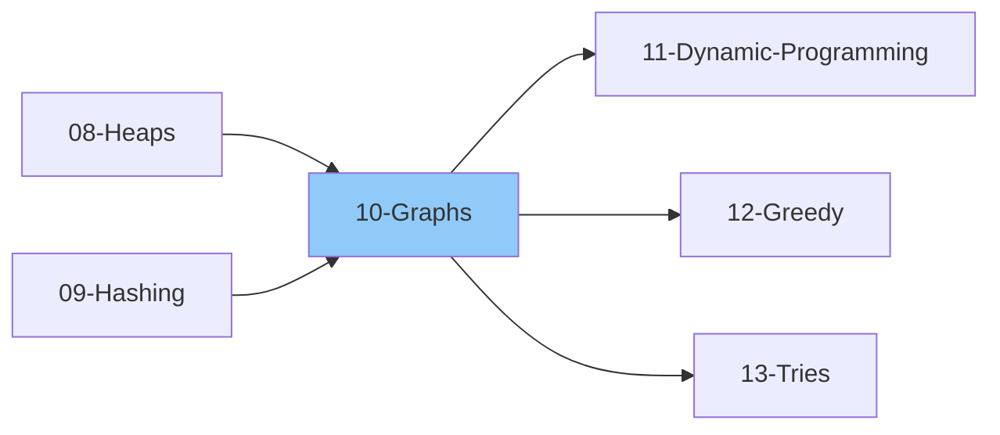

# 10 - Graphs

> Non-linear data structure for representing relationships
>
> ✅ *Topics verified against: NeetCode Roadmap, Striver A2Z (54 problems), GeeksforGeeks*
>
> 📚 *Includes Grokking Patterns: #15 Graph BFS/DFS, #16 Island Pattern, #29 Topological Sort, #30 Union-Find*
>
> ⏱️ *Estimated: 3-4 weeks*

---

## 1. Graph Basics

### 1.1 What is a Graph?
- [ ] Definition: G = (V, E)
- [ ] Vertices (nodes)
- [ ] Edges (connections)
- [ ] Graph vs Tree (tree is a connected acyclic graph)

### 1.2 Graph Terminology
- [ ] Vertex / Node
- [ ] Edge
- [ ] Adjacent vertices
- [ ] Degree of vertex
- [ ] In-degree (directed)
- [ ] Out-degree (directed)
- [ ] Path
- [ ] Cycle
- [ ] Connected graph
- [ ] Component
- [ ] Strongly connected (directed)
- [ ] Weakly connected (directed)

### 1.3 Types of Graphs
- [ ] Directed Graph (Digraph)
- [ ] Undirected Graph
- [ ] Weighted Graph
- [ ] Unweighted Graph
- [ ] Cyclic Graph
- [ ] Acyclic Graph
- [ ] DAG (Directed Acyclic Graph)
- [ ] Connected Graph
- [ ] Disconnected Graph
- [ ] Complete Graph
- [ ] Bipartite Graph
- [ ] Sparse vs Dense Graph

---

## 2. Graph Representation

### 2.1 Adjacency Matrix
- [ ] 2D array of size V*V
- [ ] matrix[i][j] = 1 if edge exists
- [ ] Space: O(V²)
- [ ] Check edge: O(1)
- [ ] Find neighbors: O(V)
- [ ] Good for dense graphs

### 2.2 Adjacency List
- [ ] Array of lists
- [ ] Each vertex has list of neighbors
- [ ] Space: O(V + E)
- [ ] Check edge: O(degree)
- [ ] Find neighbors: O(1)
- [ ] Good for sparse graphs

### 2.3 Edge List
- [ ] List of all edges
- [ ] Each edge: (u, v, weight)
- [ ] Space: O(E)
- [ ] Used in some algorithms (Kruskal's)

### 2.4 Implementation
- [ ] **Adjacency List** (most common):
  - Unweighted: `graph[u].append(v)`
  - Weighted: `graph[u].append((v, weight))`
  - Use `defaultdict(list)` for easy initialization

---

## 3. Graph Traversals

### 3.1 Breadth-First Search (BFS)
- [ ] Level-by-level exploration
- [ ] Uses Queue
- [ ] Finds shortest path (unweighted)
- [ ] Time: O(V + E)
- [ ] Space: O(V)

#### BFS Template
- [ ] BFS Pattern:
  - Initialize visited set with start node
  - Initialize queue with start node
  - While queue not empty:
    - Dequeue front node
    - Process the node
    - For each unvisited neighbor:
      - Mark as visited
      - Enqueue the neighbor

### 3.2 Depth-First Search (DFS)
- [ ] Go deep before wide
- [ ] Uses Stack (or recursion)
- [ ] Time: O(V + E)
- [ ] Space: O(V)

#### DFS Template (Recursive)
- [ ] DFS Recursive Pattern:
  - Mark current node as visited
  - Process the node
  - For each unvisited neighbor:
    - Recursively call DFS on neighbor

#### DFS Template (Iterative)
- [ ] DFS Iterative Pattern:
  - Initialize visited set (empty)
  - Initialize stack with start node
  - While stack not empty:
    - Pop top node
    - If already visited, skip
    - Mark as visited and process
    - Push unvisited neighbors to stack

### 3.3 BFS vs DFS
| Feature | BFS | DFS |
|---------|-----|-----|
| Data Structure | Queue | Stack/Recursion |
| Shortest Path | Yes (unweighted) | No |
| Memory |" O(width) "| O(height) |
| Complete | Yes | Yes |
| Use Case | Shortest path, level order | Cycle detection, path finding |

---

## 4. Graph Problems by Category

### 4.1 Island Pattern / Matrix Traversal (Grokking Pattern #16)

> 💡 *Use when: grid problems, connected components, flood fill, counting regions*

- [ ] Number of Islands
- [ ] Number of Provinces (Connected Components)
- [ ] Flood Fill
- [ ] Clone Graph
- [ ] Pacific Atlantic Water Flow
- [ ] Surrounded Regions
- [ ] Max Area of Island
- [ ] Count Sub Islands
- [ ] Number of Closed Islands
- [ ] Number of Distinct Islands

### 4.2 Shortest Path (Unweighted)
- [ ] Shortest Path in Binary Matrix
- [ ] Word Ladder
- [ ] Minimum Knight Moves
- [ ] Rotting Oranges
- [ ] Walls and Gates
- [ ] Nearest Exit from Entrance

### 4.3 Cycle Detection
- [ ] Detect Cycle in Undirected Graph
- [ ] Detect Cycle in Directed Graph
- [ ] Course Schedule (cycle in prerequisites)
- [ ] Course Schedule II

### 4.4 Topological Sort - DAG (Grokking Pattern #29)

> 💡 *Use when: task scheduling, dependency resolution, course prerequisites*

- [ ] What is Topological Sort?
- [ ] Kahn's Algorithm (BFS)
- [ ] DFS-based approach
- [ ] Course Schedule
- [ ] Course Schedule II
- [ ] Alien Dictionary
- [ ] Sequence Reconstruction
- [ ] Minimum Height Trees

### 4.5 Union-Find / Disjoint Set (Grokking Pattern #30)

> 💡 *Use when: grouping elements, detecting cycles in undirected graph, connected components*

- [ ] Union-Find data structure
- [ ] Find with Path Compression
- [ ] Union by Rank/Size
- [ ] Number of Connected Components
- [ ] Redundant Connection
- [ ] Accounts Merge
- [ ] Smallest String With Swaps
- [ ] Number of Operations to Make Network Connected
- [ ] Is Graph Bipartite? (can use Union-Find)

### 4.6 Bipartite Graph
- [ ] Check if Bipartite (2-colorable)
- [ ] Is Graph Bipartite?
- [ ] Possible Bipartition

---

## 5. Shortest Path Algorithms

### 5.1 BFS (Unweighted)
- [ ] Shortest path in unweighted graph
- [ ] Time: O(V + E)

### 5.2 Dijkstra's Algorithm
- [ ] Shortest path from single source
- [ ] Non-negative weights only
- [ ] Uses Priority Queue (Min-Heap)
- [ ] Time: O((V + E) log V)
- [ ] Greedy approach

#### Dijkstra Template
- [ ] Dijkstra Pattern:
  - Initialize distances to infinity, start = 0
  - Use min-heap priority queue with (distance, node)
  - While queue not empty:
    - Pop minimum distance node
    - Skip if already processed (distance > stored)
    - For each neighbor:
      - Calculate new distance via current node
      - If shorter, update distance and push to queue
  - Return distances dictionary

### 5.3 Bellman-Ford Algorithm
- [ ] Single source shortest path
- [ ] Handles negative weights
- [ ] Detects negative cycles
- [ ] Time: O(V * E)

### 5.4 Floyd-Warshall Algorithm
- [ ] All pairs shortest path
- [ ] Handles negative weights
- [ ] Time: O(V³)
- [ ] Space: O(V²)
- [ ] Dynamic Programming approach

### 5.5 Comparison
| Algorithm | Use Case | Negative Weights | Time |
|-----------|----------|------------------|------|
| BFS | Unweighted | N/A |" O(V+E) "|
| Dijkstra | Non-negative | No |" O((V+E)logV) "|
| Bellman-Ford | Any | Yes |" O(VE) "|
| Floyd-Warshall | All pairs | Yes |" O(V³) "|

### 5.6 Shortest Path Problems
- [ ] Network Delay Time
- [ ] Cheapest Flights Within K Stops
- [ ] Path with Minimum Effort
- [ ] Swim in Rising Water
- [ ] Path with Maximum Probability
- [ ] Find the City With Smallest Number of Neighbors

---

## 6. Minimum Spanning Tree (MST)

### 6.1 What is MST?
- [ ] Spanning tree with minimum total edge weight
- [ ] Connects all vertices
- [ ] No cycles
- [ ] V-1 edges for V vertices

### 6.2 Kruskal's Algorithm
- [ ] Sort edges by weight
- [ ] Add edges if no cycle (Union-Find)
- [ ] Time: O(E log E)
- [ ] Greedy approach

### 6.3 Prim's Algorithm
- [ ] Start from any vertex
- [ ] Add minimum edge to MST
- [ ] Uses Priority Queue
- [ ] Time: O((V + E) log V)
- [ ] Similar to Dijkstra

### 6.4 MST Problems
- [ ] Min Cost to Connect All Points
- [ ] Connecting Cities With Minimum Cost
- [ ] Optimize Water Distribution in a Village

---

## 7. Advanced Graph Topics

### 7.1 Strongly Connected Components
- [ ] Kosaraju's Algorithm
- [ ] Tarjan's Algorithm
- [ ] Critical Connections in a Network

### 7.2 Articulation Points & Bridges
- [ ] Finding cut vertices
- [ ] Finding bridge edges
- [ ] Tarjan's approach

### 7.3 Eulerian Path/Circuit
- [ ] Visit every edge exactly once
- [ ] Hierholzer's Algorithm
- [ ] Reconstruct Itinerary

### 7.4 Hamiltonian Path
- [ ] Visit every vertex exactly once
- [ ] NP-complete problem
- [ ] Backtracking approach

### 7.5 Graph Coloring
- [ ] M-coloring problem
- [ ] Chromatic number

---

## 8. Grid as Graph

### 8.1 Grid Traversal
- [ ] 4-directional movement
- [ ] 8-directional movement
- [ ] Valid cell checking
- [ ] Using directions array: `[(0,1), (0,-1), (1,0), (-1,0)]` for 4-dir
- [ ] Pattern: For each direction, check bounds before processing

### 8.2 Grid Problems
- [ ] Number of Islands
- [ ] Max Area of Island
- [ ] Flood Fill
- [ ] Rotting Oranges
- [ ] Shortest Path in Binary Matrix
- [ ] Word Search
- [ ] Pacific Atlantic Water Flow

---

## 📚 Learning Resources

### Videos
- [NeetCode - Graphs Playlist](https://www.youtube.com/@NeetCode) - BFS, DFS, Dijkstra, and Topological Sort explained
- [Striver - Graph Series](https://www.youtube.com/@takeUforward) - Complete graph algorithms including Union-Find
- [Abdul Bari - Graph Algorithms](https://www.youtube.com/@abdul_bari) - In-depth BFS, DFS, Dijkstra, and MST explanations

### Articles
- [GeeksforGeeks - Graph Algorithms](https://www.geeksforgeeks.org/graph-data-structure-and-algorithms/) - BFS/DFS, Dijkstra, Topological Sort, Union-Find
- [Tech Interview Handbook - Graph](https://www.techinterviewhandbook.org/algorithms/graph/) - Graph traversal patterns and interview problems

---

## Thinking Framework

### When to use BFS?
1. Shortest path (unweighted)
2. Level-order processing
3. Finding nearest/minimum steps

### When to use DFS?
1. Explore all paths
2. Cycle detection
3. Connected components
4. Backtracking on graph

### When to use Dijkstra?
1. Shortest path with positive weights
2. Single source to all destinations

### When to use Union-Find?
1. Dynamic connectivity
2. Cycle detection in undirected
3. MST (Kruskal's)
4. Grouping/clustering

---

## 9. Interview Focus

### 9.1 Things to Look Out For
- [ ] Clarify: directed vs undirected, weighted vs unweighted
- [ ] Choose right representation (adjacency list usually better)
- [ ] BFS for shortest path in unweighted, Dijkstra for weighted
- [ ] Watch for disconnected components
- [ ] Topological sort only works on DAGs

### 9.2 Corner Cases
- [ ] Empty graph (no nodes)
- [ ] Single node
- [ ] Disconnected graph
- [ ] Graph with cycles
- [ ] Self-loops
- [ ] Multiple edges between same nodes

### 9.3 Common Mistakes
- [ ] Forgetting to mark nodes as visited
- [ ] Infinite loops in graphs with cycles
- [ ] Wrong graph representation choice
- [ ] Not handling disconnected components
- [ ] Using DFS when BFS needed (shortest path)

### 9.4 Algorithm Selection Guide
| Problem Type | Algorithm |
|-------------|----------|
| Shortest path (unweighted) | BFS |
| Shortest path (weighted, positive) | Dijkstra |
| Shortest path (negative weights) | Bellman-Ford |
| All pairs shortest path | Floyd-Warshall |
| Cycle detection (directed) | DFS with colors |
| Cycle detection (undirected) | Union-Find or DFS |
| Connected components | BFS/DFS or Union-Find |
| Task ordering | Topological Sort |
| Minimum Spanning Tree | Kruskal or Prim |

### 9.5 BFS vs DFS Selection
| Use BFS when... | Use DFS when... |
|-----------------|----------------|
| Shortest path needed | Exploring all paths |
| Level-by-level processing | Cycle detection |
| Nearest neighbor | Topological sort |
| Finding connected components | Backtracking problems |

---

## 10. Essential Problems

### 10.1 Curated Graph Problems

#### BFS/DFS Fundamentals
| Problem | Platform | Difficulty | Pattern |
|---------|----------|------------|--------|
| [Number of Islands](https://leetcode.com/problems/number-of-islands/) | LeetCode 200 | 🟡 Medium | Grid DFS/BFS |
| [Clone Graph](https://leetcode.com/problems/clone-graph/) | LeetCode 133 | 🟡 Medium | BFS/DFS + Hash Map |
| [Flood Fill](https://leetcode.com/problems/flood-fill/) | LeetCode 733 | 🟢 Easy | Grid DFS/BFS |
| [Max Area of Island](https://leetcode.com/problems/max-area-of-island/) | LeetCode 695 | 🟡 Medium | Grid DFS |
| [Pacific Atlantic Water Flow](https://leetcode.com/problems/pacific-atlantic-water-flow/) | LeetCode 417 | 🟡 Medium | Multi-source BFS/DFS |
| [Surrounded Regions](https://leetcode.com/problems/surrounded-regions/) | LeetCode 130 | 🟡 Medium | Boundary DFS |
| [Rotting Oranges](https://leetcode.com/problems/rotting-oranges/) | LeetCode 994 | 🟡 Medium | Multi-source BFS |
| [Word Search](https://leetcode.com/problems/word-search/) | LeetCode 79 | 🟡 Medium | DFS Backtracking |

#### Topological Sort
| Problem | Platform | Difficulty | Pattern |
|---------|----------|------------|--------|
| [Course Schedule](https://leetcode.com/problems/course-schedule/) | LeetCode 207 | 🟡 Medium | Cycle Detection (Kahn's/DFS) |
| [Course Schedule II](https://leetcode.com/problems/course-schedule-ii/) | LeetCode 210 | 🟡 Medium | Topological Sort |
| [Alien Dictionary](https://leetcode.com/problems/alien-dictionary/) | LeetCode 269 | 🔴 Hard | Build Graph + Topo Sort |
| [Minimum Height Trees](https://leetcode.com/problems/minimum-height-trees/) | LeetCode 310 | 🟡 Medium | Topological Peeling |

#### Shortest Path
| Problem | Platform | Difficulty | Pattern |
|---------|----------|------------|--------|
| [Shortest Path in Binary Matrix](https://leetcode.com/problems/shortest-path-in-binary-matrix/) | LeetCode 1091 | 🟡 Medium | BFS (Unweighted) |
| [Word Ladder](https://leetcode.com/problems/word-ladder/) | LeetCode 127 | 🔴 Hard | BFS + Pattern Matching |
| [Network Delay Time](https://leetcode.com/problems/network-delay-time/) | LeetCode 743 | 🟡 Medium | Dijkstra's Algorithm |
| [Cheapest Flights Within K Stops](https://leetcode.com/problems/cheapest-flights-within-k-stops/) | LeetCode 787 | 🟡 Medium | Bellman-Ford / Modified Dijkstra |
| [Path with Minimum Effort](https://leetcode.com/problems/path-with-minimum-effort/) | LeetCode 1631 | 🟡 Medium | Dijkstra / Binary Search |
| [Swim in Rising Water](https://leetcode.com/problems/swim-in-rising-water/) | LeetCode 778 | 🔴 Hard | Dijkstra / Binary Search + BFS |

#### Union-Find
| Problem | Platform | Difficulty | Pattern |
|---------|----------|------------|--------|
| [Number of Connected Components](https://leetcode.com/problems/number-of-connected-components-in-an-undirected-graph/) | LeetCode 323 | 🟡 Medium | Union-Find / DFS |
| [Redundant Connection](https://leetcode.com/problems/redundant-connection/) | LeetCode 684 | 🟡 Medium | Union-Find Cycle Detection |
| [Graph Valid Tree](https://leetcode.com/problems/graph-valid-tree/) | LeetCode 261 | 🟡 Medium | Union-Find (V-1 edges, no cycle) |
| [Accounts Merge](https://leetcode.com/problems/accounts-merge/) | LeetCode 721 | 🟡 Medium | Union-Find Grouping |
| [Smallest String With Swaps](https://leetcode.com/problems/smallest-string-with-swaps/) | LeetCode 1202 | 🟡 Medium | Union-Find + Sort |

#### Advanced Graph
| Problem | Platform | Difficulty | Pattern |
|---------|----------|------------|--------|
| [Is Graph Bipartite?](https://leetcode.com/problems/is-graph-bipartite/) | LeetCode 785 | 🟡 Medium | BFS/DFS 2-Coloring |
| [Possible Bipartition](https://leetcode.com/problems/possible-bipartition/) | LeetCode 886 | 🟡 Medium | Bipartite Check |
| [Find the City With Smallest Number of Neighbors](https://leetcode.com/problems/find-the-city-with-the-smallest-number-of-neighbors-at-a-threshold-distance/) | LeetCode 1334 | 🟡 Medium | Floyd-Warshall / Dijkstra |
| [Min Cost to Connect All Points](https://leetcode.com/problems/min-cost-to-connect-all-points/) | LeetCode 1584 | 🟡 Medium | MST (Prim's/Kruskal's) |
| [Critical Connections in a Network](https://leetcode.com/problems/critical-connections-in-a-network/) | LeetCode 1192 | 🔴 Hard | Tarjan's (Bridges) |
| [Reconstruct Itinerary](https://leetcode.com/problems/reconstruct-itinerary/) | LeetCode 332 | 🔴 Hard | Eulerian Path (Hierholzer) |

---

## Checklist Summary

| Topic | Status |
|-------|--------|
| Graph Basics & Terminology | ⬜ |
| Adjacency Matrix | ⬜ |
| Adjacency List | ⬜ |
| BFS | ⬜ |
| DFS | ⬜ |
| Cycle Detection | ⬜ |
| Topological Sort | ⬜ |
| Union-Find | ⬜ |
| Dijkstra's Algorithm | ⬜ |
| Bellman-Ford | ⬜ |
| Floyd-Warshall | ⬜ |
| Kruskal's Algorithm | ⬜ |
| Prim's Algorithm | ⬜ |
| Bipartite Graph | ⬜ |
| Grid Traversal | ⬜ |
| **Interview Edge Cases** | ⬜ |
| **Essential Problems (11)** | ⬜ |

---

**Previous:** [09-Hashing.md](../09-Hashing/09-Hashing.md)  
**Next:** [11-Dynamic-Programming.md](../11-Dynamic-Programming/11-Dynamic-Programming.md)
