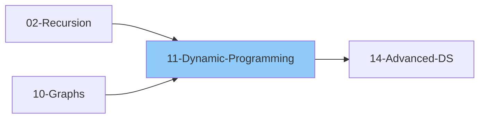

# 11 - Dynamic Programming

> Optimization technique using memoization and tabulation
>
> ✅ *Topics verified against: NeetCode (1D/2D DP), Striver A2Z (56 problems), LeetCode Patterns*
>
> 📚 *Grokking DP Patterns: #24 0/1 Knapsack, #25 Fibonacci Numbers, #26 Palindromic Subsequence*
>
> ⚠️ *AlgoMonster Note: High at Google, lower at Amazon/Meta. DFS + memoization = same result*
>
> ⏱️ *Estimated: 4-6 weeks*

---

## 1. DP Basics

### 1.1 What is Dynamic Programming?
- [ ] Breaking problem into overlapping subproblems
- [ ] Storing solutions to avoid recomputation
- [ ] Optimal substructure property
- [ ] Overlapping subproblems property

### 1.2 When to Use DP?
- [ ] Optimal substructure: optimal solution contains optimal solutions to subproblems
- [ ] Overlapping subproblems: same subproblems solved multiple times
- [ ] Problems asking for:
  - Count ways
  - Minimum/Maximum
  - True/False possibility
  - Longest/Shortest

### 1.3 DP vs Other Techniques
| Technique | When to Use |
|-----------|-------------|
| Greedy | Local optimal = Global optimal |
| Divide & Conquer | Non-overlapping subproblems |
| DP | Overlapping subproblems, optimal substructure |
| Recursion | Base for DP, without optimization |

---

## 2. DP Approaches

### 2.1 Top-Down (Memoization)
- [ ] Start from main problem
- [ ] Recurse to smaller problems
- [ ] Store results in memo table
- [ ] Return cached result if exists
- [ ] Pattern: Check memo → Base case → Compute → Store → Return

### 2.2 Bottom-Up (Tabulation)
- [ ] Start from smallest subproblems
- [ ] Build up to main problem
- [ ] Iterative approach
- [ ] Fill table systematically
- [ ] Pattern: Initialize dp array → Set base cases → Fill dp table → Return answer

### 2.3 Space Optimization
- [ ] Often only need last few states
- [ ] Reduce O(n) space to O(1)
- [ ] Pattern: Use 2-3 variables instead of array
- [ ] Example: Fibonacci needs only prev1, prev2 → O(1) space

---

## 3. DP Problem-Solving Framework

### 3.1 Steps to Solve DP Problems
1. **Identify** if it's a DP problem
2. **Define state** - what parameters define subproblem?
3. **Define recurrence** - how to relate to smaller problems?
4. **Define base case** - smallest subproblem solution
5. **Decide approach** - top-down or bottom-up
6. **Optimize space** if possible

### 3.2 State Definition Tips
- What changes in each subproblem?
- What do we need to make a decision?
- Common states: index, remaining capacity, count

---

## 4. 1D DP Problems

### 4.1 Fibonacci Pattern
- [ ] Fibonacci Number
- [ ] Climbing Stairs
- [ ] Min Cost Climbing Stairs
- [ ] House Robber
- [ ] House Robber II (circular)
- [ ] Decode Ways
- [ ] N-th Tribonacci Number

### 4.2 Linear DP
- [ ] Maximum Subarray (Kadane's)
- [ ] Maximum Product Subarray
- [ ] Longest Increasing Subsequence (LIS)
- [ ] Number of LIS
- [ ] Longest Turbulent Subarray
- [ ] Best Time to Buy and Sell Stock
- [ ] Best Time to Buy and Sell Stock with Cooldown
- [ ] Best Time to Buy and Sell Stock with Transaction Fee

### 4.3 Jump Game Pattern
- [ ] Jump Game
- [ ] Jump Game II
- [ ] Frog Jump
- [ ] Minimum Jumps to Reach End

---

## 5. 2D DP Problems

### 5.1 Grid DP
- [ ] Unique Paths
- [ ] Unique Paths II (obstacles)
- [ ] Minimum Path Sum
- [ ] Triangle
- [ ] Dungeon Game
- [ ] Cherry Pickup
- [ ] Maximal Square
- [ ] Maximal Rectangle

### 5.2 Two Sequence DP
- [ ] Longest Common Subsequence (LCS)
- [ ] Longest Common Substring
- [ ] Edit Distance
- [ ] Shortest Common Supersequence
- [ ] Interleaving String
- [ ] Distinct Subsequences
- [ ] Minimum ASCII Delete Sum

### 5.3 Palindrome DP
- [ ] Longest Palindromic Substring
- [ ] Longest Palindromic Subsequence
- [ ] Palindrome Partitioning II
- [ ] Count Palindromic Substrings
- [ ] Minimum Insertions to Make Palindrome

---

## 6. Classic DP Patterns

### 6.1 0/1 Knapsack
- [ ] Given items with weight & value
- [ ] Maximize value within capacity
- [ ] Each item used at most once
- [ ] Recurrence: `dp[i][w] = max(dp[i-1][w], dp[i-1][w-weight[i]] + value[i])`
  - Don't take item i OR take item i (if capacity allows)

#### Problems
- [ ] 0/1 Knapsack
- [ ] Subset Sum
- [ ] Partition Equal Subset Sum
- [ ] Target Sum
- [ ] Last Stone Weight II
- [ ] Count of Subset Sum

### 6.2 Unbounded Knapsack
- [ ] Each item can be used unlimited times
- [ ] Recurrence: `dp[i][w] = max(dp[i-1][w], dp[i][w-weight[i]] + value[i])`
  - Note: `dp[i]` not `dp[i-1]` for taking item (can reuse)

#### Problems
- [ ] Unbounded Knapsack
- [ ] Coin Change (min coins)
- [ ] Coin Change II (count ways)
- [ ] Rod Cutting
- [ ] Integer Break
- [ ] Perfect Squares
- [ ] Minimum Cost for Tickets

### 6.3 Longest Common Subsequence (LCS)
- [ ] Recurrence:
  - If `s1[i-1] == s2[j-1]`: `dp[i][j] = dp[i-1][j-1] + 1`
  - Else: `dp[i][j] = max(dp[i-1][j], dp[i][j-1])`

#### Problems
- [ ] Longest Common Subsequence
- [ ] Longest Common Substring
- [ ] Edit Distance
- [ ] Shortest Common Supersequence
- [ ] Minimum Deletions to Make Palindrome
- [ ] Print LCS

### 6.4 Longest Increasing Subsequence (LIS)
- [ ] O(n²) approach: `dp[i] = max(dp[j] + 1)` for all j < i where `nums[j] < nums[i]`
- [ ] O(n log n) approach: Use binary search with patience sorting

#### Problems
- [ ] Longest Increasing Subsequence
- [ ] Number of LIS
- [ ] Russian Doll Envelopes
- [ ] Longest String Chain
- [ ] Largest Divisible Subset
- [ ] Maximum Length of Pair Chain

### 6.5 Matrix Chain Multiplication (Interval DP)
- [ ] Partition problem
- [ ] Try all possible splits
- [ ] Pattern: For each length → For each start i → For each split k
- [ ] Recurrence: `dp[i][j] = min(dp[i][k] + dp[k+1][j] + cost(i,k,j))` for all k in [i,j)

#### Problems
- [ ] Matrix Chain Multiplication
- [ ] Minimum Score Triangulation
- [ ] Burst Balloons
- [ ] Minimum Cost to Merge Stones
- [ ] Palindrome Partitioning II

---

## 7. DP on Strings

### 7.1 Problems
- [ ] Longest Palindromic Substring
- [ ] Longest Palindromic Subsequence
- [ ] Edit Distance
- [ ] Regular Expression Matching
- [ ] Wildcard Matching
- [ ] Word Break
- [ ] Word Break II
- [ ] Distinct Subsequences
- [ ] Scramble String

---

## 8. DP on Trees

### 8.1 Concept
- [ ] DP state at each node
- [ ] Combine results from children
- [ ] Usually DFS + memoization

### 8.2 Problems
- [ ] House Robber III
- [ ] Binary Tree Maximum Path Sum
- [ ] Diameter of Binary Tree
- [ ] Longest ZigZag Path
- [ ] Maximum Product of Splitted Binary Tree

---

## 9. State Machine DP

### 9.1 Concept
- [ ] Multiple states at each step
- [ ] Transitions between states
- [ ] Stock problems are classic examples

### 9.2 Stock Problems
- [ ] Best Time to Buy and Sell Stock
- [ ] Best Time to Buy and Sell Stock II
- [ ] Best Time to Buy and Sell Stock III
- [ ] Best Time to Buy and Sell Stock IV
- [ ] Best Time with Cooldown
- [ ] Best Time with Transaction Fee

---

## 10. Bitmask DP

### 10.1 Concept
- [ ] Use bitmask to represent set state
- [ ] 2^n possible states for n elements
- [ ] Useful for small n (≤ 20)

### 10.2 Problems
- [ ] Traveling Salesman Problem
- [ ] Shortest Path Visiting All Nodes
- [ ] Minimum Cost to Visit Every Node
- [ ] Partition to K Equal Sum Subsets
- [ ] Find the Shortest Superstring

---

## 11. Digit DP

### 11.1 Concept
- [ ] Counting numbers with properties
- [ ] Process digit by digit
- [ ] Track constraints (tight bound)

### 11.2 Problems
- [ ] Count Numbers with Unique Digits
- [ ] Numbers At Most N Given Digit Set
- [ ] Count Stepping Numbers

---

## DP Pattern Recognition

| Keywords | Pattern |
|----------|---------|
| "count ways" | Count DP |
| "min/max" | Optimization DP |
| "is possible" | Boolean DP |
| "subsequence" | LCS/LIS pattern |
| "partition" | Knapsack/Interval |
| "string matching" | String DP |
| "all subsets" | Bitmask DP |

---

## 📚 Learning Resources

### Videos
- [NeetCode - Dynamic Programming Playlist](https://www.youtube.com/@NeetCode) - DP fundamentals, memoization vs tabulation, all DP patterns
- [Striver - DP Series](https://www.youtube.com/@takeUforward) - Complete DP patterns with optimal approaches
- [Abdul Bari - Dynamic Programming](https://www.youtube.com/@abdul_bari) - Classic DP problems explained step-by-step

### Articles
- [GeeksforGeeks - Dynamic Programming](https://www.geeksforgeeks.org/dynamic-programming/) - DP fundamentals, memoization vs tabulation, classic patterns
- [Tech Interview Handbook - Dynamic Programming](https://www.techinterviewhandbook.org/algorithms/dynamic-programming/) - Interview-focused DP patterns and techniques

---

## 12. Interview Focus

### 12.1 5-Step DP Problem-Solving Framework
- [ ] **Step 1:** Define the state - What variables define a subproblem?
- [ ] **Step 2:** Define the recurrence relation - How to combine smaller solutions?
- [ ] **Step 3:** Define base cases - What are the smallest subproblems?
- [ ] **Step 4:** Determine computation order - Top-down or bottom-up?
- [ ] **Step 5:** Optimize space if possible

### 12.2 Things to Look Out For
- [ ] Identify overlapping subproblems
- [ ] Look for optimal substructure property
- [ ] Consider if greedy works (simpler than DP)
- [ ] Think about state dimensions carefully
- [ ] Look for space optimization opportunities

### 12.3 Corner Cases
- [ ] Empty input (n=0)
- [ ] Single element (n=1)
- [ ] All elements same
- [ ] Negative numbers in input
- [ ] Very large n (space optimization needed)

### 12.4 Common Mistakes
- [ ] Wrong base case
- [ ] Wrong recurrence relation
- [ ] Off-by-one in indices
- [ ] Not handling negative values
- [ ] Forgetting to initialize memo/table
- [ ] Wrong dimension of DP table

### 12.5 DP vs Greedy Decision
| Use DP when... | Use Greedy when... |
|---------------|--------------------|
| Need to try all possibilities | Local optimal = global optimal |
| Overlapping subproblems exist | No overlapping subproblems |
| "Count all ways" problems | "Find one way" problems |
| Can't undo choices | Can make irrevocable choices |

---

## 13. Essential Problems

### 13.1 Curated Dynamic Programming Problems

#### 1D DP - Fibonacci/Linear Pattern
| Problem | Platform | Difficulty | Pattern |
|---------|----------|------------|--------|
| [Climbing Stairs](https://leetcode.com/problems/climbing-stairs/) | LeetCode 70 | 🟢 Easy | Fibonacci Pattern |
| [Min Cost Climbing Stairs](https://leetcode.com/problems/min-cost-climbing-stairs/) | LeetCode 746 | 🟢 Easy | Fibonacci + Min |
| [House Robber](https://leetcode.com/problems/house-robber/) | LeetCode 198 | 🟡 Medium | Take/Skip Pattern |
| [House Robber II](https://leetcode.com/problems/house-robber-ii/) | LeetCode 213 | 🟡 Medium | Circular Array |
| [Decode Ways](https://leetcode.com/problems/decode-ways/) | LeetCode 91 | 🟡 Medium | Count Ways |
| [Maximum Subarray](https://leetcode.com/problems/maximum-subarray/) | LeetCode 53 | 🟡 Medium | Kadane's Algorithm |
| [Maximum Product Subarray](https://leetcode.com/problems/maximum-product-subarray/) | LeetCode 152 | 🟡 Medium | Track Min & Max |
| [Coin Change](https://leetcode.com/problems/coin-change/) | LeetCode 322 | 🟡 Medium | Unbounded Knapsack |
| [Coin Change II](https://leetcode.com/problems/coin-change-ii/) | LeetCode 518 | 🟡 Medium | Count Ways (Unbounded) |
| [Word Break](https://leetcode.com/problems/word-break/) | LeetCode 139 | 🟡 Medium | Boolean DP + Set |
| [Longest Increasing Subsequence](https://leetcode.com/problems/longest-increasing-subsequence/) | LeetCode 300 | 🟡 Medium | LIS Pattern |

#### 2D DP - Grid Problems
| Problem | Platform | Difficulty | Pattern |
|---------|----------|------------|--------|
| [Unique Paths](https://leetcode.com/problems/unique-paths/) | LeetCode 62 | 🟡 Medium | Grid DP |
| [Unique Paths II](https://leetcode.com/problems/unique-paths-ii/) | LeetCode 63 | 🟡 Medium | Grid DP + Obstacles |
| [Minimum Path Sum](https://leetcode.com/problems/minimum-path-sum/) | LeetCode 64 | 🟡 Medium | Grid DP |
| [Triangle](https://leetcode.com/problems/triangle/) | LeetCode 120 | 🟡 Medium | Bottom-Up Grid |
| [Maximal Square](https://leetcode.com/problems/maximal-square/) | LeetCode 221 | 🟡 Medium | Grid DP (min of neighbors) |

#### Two Sequence DP
| Problem | Platform | Difficulty | Pattern |
|---------|----------|------------|--------|
| [Longest Common Subsequence](https://leetcode.com/problems/longest-common-subsequence/) | LeetCode 1143 | 🟡 Medium | LCS Pattern |
| [Edit Distance](https://leetcode.com/problems/edit-distance/) | LeetCode 72 | 🟡 Medium | LCS Variant |
| [Distinct Subsequences](https://leetcode.com/problems/distinct-subsequences/) | LeetCode 115 | 🔴 Hard | Count Matching |
| [Interleaving String](https://leetcode.com/problems/interleaving-string/) | LeetCode 97 | 🟡 Medium | Two Sequence Match |

#### Knapsack Variants
| Problem | Platform | Difficulty | Pattern |
|---------|----------|------------|--------|
| [Partition Equal Subset Sum](https://leetcode.com/problems/partition-equal-subset-sum/) | LeetCode 416 | 🟡 Medium | 0/1 Knapsack (Subset Sum) |
| [Target Sum](https://leetcode.com/problems/target-sum/) | LeetCode 494 | 🟡 Medium | 0/1 Knapsack (Count) |
| [Last Stone Weight II](https://leetcode.com/problems/last-stone-weight-ii/) | LeetCode 1049 | 🟡 Medium | 0/1 Knapsack (Min Diff) |
| [Perfect Squares](https://leetcode.com/problems/perfect-squares/) | LeetCode 279 | 🟡 Medium | Unbounded Knapsack |

#### String/Palindrome DP
| Problem | Platform | Difficulty | Pattern |
|---------|----------|------------|--------|
| [Longest Palindromic Substring](https://leetcode.com/problems/longest-palindromic-substring/) | LeetCode 5 | 🟡 Medium | Expand Around Center / DP |
| [Palindromic Substrings](https://leetcode.com/problems/palindromic-substrings/) | LeetCode 647 | 🟡 Medium | Count Palindromes |
| [Longest Palindromic Subsequence](https://leetcode.com/problems/longest-palindromic-subsequence/) | LeetCode 516 | 🟡 Medium | LCS with Reverse |

#### Interval DP
| Problem | Platform | Difficulty | Pattern |
|---------|----------|------------|--------|
| [Burst Balloons](https://leetcode.com/problems/burst-balloons/) | LeetCode 312 | 🔴 Hard | Interval DP (Last Burst) |
| [Minimum Cost Tree From Leaf Values](https://leetcode.com/problems/minimum-cost-tree-from-leaf-values/) | LeetCode 1130 | 🟡 Medium | Interval DP |
| [Palindrome Partitioning II](https://leetcode.com/problems/palindrome-partitioning-ii/) | LeetCode 132 | 🔴 Hard | Interval DP (Min Cuts) |

#### State Machine DP
| Problem | Platform | Difficulty | Pattern |
|---------|----------|------------|--------|
| [Best Time to Buy and Sell Stock](https://leetcode.com/problems/best-time-to-buy-and-sell-stock/) | LeetCode 121 | 🟢 Easy | Single Transaction |
| [Best Time to Buy and Sell Stock with Cooldown](https://leetcode.com/problems/best-time-to-buy-and-sell-stock-with-cooldown/) | LeetCode 309 | 🟡 Medium | State Machine |
| [Best Time to Buy and Sell Stock with Transaction Fee](https://leetcode.com/problems/best-time-to-buy-and-sell-stock-with-transaction-fee/) | LeetCode 714 | 🟡 Medium | State Machine |

---

## Checklist Summary

| Topic | Status |
|-------|--------|
| DP Basics | ⬜ |
| Memoization (Top-Down) | ⬜ |
| Tabulation (Bottom-Up) | ⬜ |
| Space Optimization | ⬜ |
| Fibonacci Pattern | ⬜ |
| Grid DP | ⬜ |
| 0/1 Knapsack | ⬜ |
| Unbounded Knapsack | ⬜ |
| LCS Pattern | ⬜ |
| LIS Pattern | ⬜ |
| Interval DP | ⬜ |
| String DP | ⬜ |
| Tree DP | ⬜ |
| State Machine DP | ⬜ |
| Bitmask DP | ⬜ |
| **5-Step Framework** | ⬜ |
| **Interview Edge Cases** | ⬜ |
| **Essential Problems (16)** | ⬜ |

---

**Previous:** [10-Graphs.md](.../10-Graphs/10-Graphs.md)  
**Next:** [12-Greedy-Algorithms.md](../12-Greedy-Algorithms.md)
