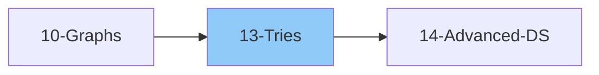

# 13 - Tries (Prefix Trees)

> Efficient data structure for string operations
>
> 📚 *Includes Grokking Pattern #28: Trie*
>
> ⚠️ *AlgoMonster Note: Rare but appears at unicorn startups (Uber, Airbnb, Dropbox)*
>
> ⏱️ *Estimated: 1 week*

---

## 1. Trie Basics

### 1.1 What is a Trie?
- [ ] Tree-like data structure
- [ ] Stores strings character by character
- [ ] Each node represents a character
- [ ] Path from root = prefix
- [ ] Also called Prefix Tree or Digital Tree

### 1.2 Why Use Trie?
- [ ] Fast prefix-based searches: O(m) where m = word length
- [ ] Autocomplete functionality
- [ ] Spell checking
- [ ] IP routing (longest prefix matching)
- [ ] Word games (Scrabble, Boggle)

### 1.3 Trie vs Other Structures
| Operation | Trie | Hash Set | BST |
|-----------|------|----------|-----|
| Insert |" O(m) "| O(m) |" O(m log n) "|
| Search |" O(m) "| O(m) |" O(m log n) "|
| Prefix Search |" O(m) "| O(n*m) |" O(m log n) "|
| Space | High | Low | Medium |

---

## 2. Trie Structure

### 2.1 Node Structure
- [ ] **TrieNode** contains:
  - `children`: HashMap or Array[26] for child nodes
  - `is_end`: Boolean marking end of a word
  - Optional: `count` (prefix count), `word` (store complete word)

### 2.2 Trie Class
- [ ] **Trie** contains:
  - `root`: Empty TrieNode as starting point
  - Methods: insert, search, startsWith, delete

### 2.3 Representation
- [ ] Using HashMap (flexible, any character)
- [ ] Using Array of size 26 (lowercase letters only)
- [ ] Trade-off: space vs access speed

---

## 3. Trie Operations

### 3.1 Insert Word
- [ ] Pattern:
  - Start at root
  - For each character in word:
    - If child doesn't exist, create new node
    - Move to child node
  - Mark current node as end of word
- Time: O(m) | Space: O(m) worst case

### 3.2 Search Word
- [ ] Pattern:
  - Start at root
  - For each character in word:
    - If child doesn't exist, return False
    - Move to child node
  - Return True only if is_end is True
- Time: O(m)

### 3.3 Starts With (Prefix Search)
- [ ] Pattern:
  - Same as search, but return True if node exists (don't check is_end)
- Time: O(m)

### 3.4 Delete Word
- [ ] Pattern (recursive):
  - Base: At word end, unmark is_end, return if node has no children
  - Recurse: Move to next character's child
  - Cleanup: If child should be deleted, remove from children map
- Tricky: Only delete nodes if they have no other children/words

---

## 4. Complete Trie Features

### 4.1 Core Methods
- [ ] `insert(word)` - Add word to trie, increment prefix counts
- [ ] `search(word)` - Check if exact word exists (is_end = True)
- [ ] `startsWith(prefix)` - Check if any word starts with prefix
- [ ] `countPrefix(prefix)` - Count words with given prefix
- [ ] `_find_node(prefix)` - Helper to navigate to prefix node

### 4.2 Extended Methods
- [ ] `get_all_words(prefix)` - Get all words starting with prefix using DFS
- [ ] `delete(word)` - Remove word (careful with shared prefixes)
- [ ] `countWords()` - Total words in trie

---

## 5. Trie Problems by Category

### 5.1 Basic Trie Problems
- [ ] Implement Trie (Prefix Tree)
- [ ] Design Add and Search Words Data Structure
- [ ] Replace Words
- [ ] Longest Word in Dictionary
- [ ] Map Sum Pairs

### 5.2 Word Search Problems
- [ ] Word Search II
- [ ] Stream of Characters
- [ ] Prefix and Suffix Search

### 5.3 Autocomplete Problems
- [ ] Search Suggestions System
- [ ] Design Search Autocomplete System
- [ ] Top K Frequent Words (with Trie)

### 5.4 XOR Problems (Bit Trie)
- [ ] Maximum XOR of Two Numbers in an Array
- [ ] Maximum XOR With an Element From Array
- [ ] Count Pairs With XOR in a Range

### 5.5 Advanced Problems
- [ ] Palindrome Pairs
- [ ] Word Squares
- [ ] Concatenated Words
- [ ] Short Encoding of Words

---

## 6. Trie Variations

### 6.1 Compressed Trie (Radix Tree)
- [ ] Merge single-child nodes
- [ ] Store string instead of character
- [ ] Better space efficiency
- [ ] Used in: routing tables, text indexing

### 6.2 Suffix Trie
- [ ] Insert all suffixes of a string
- [ ] Pattern matching
- [ ] Substring search

### 6.3 Bit Trie (Binary Trie)
- [ ] Each node has 0/1 children (array of size 2)
- [ ] Store binary representation of numbers
- [ ] Insert: Traverse from MSB to LSB (bit 31 to 0), create nodes
- [ ] Max XOR: Try to go opposite direction at each bit for maximum XOR
- [ ] Applications: XOR problems, range XOR queries

### 6.4 Ternary Search Tree
- [ ] Three children: less, equal, greater
- [ ] More space-efficient than Trie
- [ ] Slower than Trie

---

## 7. Trie Applications

### 7.1 Autocomplete System
- [ ] Store sentences in Trie with frequency counts
- [ ] On input: Get all words with current prefix
- [ ] Sort by frequency (desc), then alphabetically
- [ ] Return top K suggestions
- [ ] On '#': Complete input, update frequency

### 7.2 Spell Checker
- [ ] Store dictionary in Trie
- [ ] Find words within edit distance
- [ ] Suggest corrections

### 7.3 Word Games
- [ ] Boggle solver
- [ ] Scrabble word finder
- [ ] Crossword helper

### 7.4 IP Routing
- [ ] Longest prefix matching
- [ ] Route lookup tables

---

## 8. Common Patterns

### 8.1 DFS on Trie
- [ ] Get all words with prefix
- [ ] Word search in grid
- [ ] Enumerate all stored words

### 8.2 Trie + Backtracking
- [ ] Word Search II
- [ ] Optimize early termination
- [ ] Prune invalid paths

### 8.3 Trie + Dynamic Programming
- [ ] Word Break problems
- [ ] Concatenated words

---

## 📚 Learning Resources

### Videos
- [NeetCode - Trie Playlist](https://www.youtube.com/@NeetCode) - Trie implementation & LeetCode problems
- [Striver - Trie Series](https://www.youtube.com/@takeUforward) - Comprehensive trie concepts
- [Abdul Bari - Trie Data Structure](https://www.youtube.com/@abdul_bari) - Clear visual explanations

### Articles
- [GeeksforGeeks - Trie Data Structure](https://www.geeksforgeeks.org/trie-insert-and-search/) - Implementation guide
- [GeeksforGeeks - Auto-complete with Trie](https://www.geeksforgeeks.org/auto-complete-feature-using-trie/) - Autocomplete tutorial
- [GeeksforGeeks - Word Search using Trie](https://www.geeksforgeeks.org/word-search-in-2d-board-using-trie/) - Word search patterns

---

## Thinking Framework

### When to Use Trie?
1. Many string prefix operations
2. Autocomplete/search suggestions
3. Dictionary word lookups
4. Prefix matching
5. XOR problems (Bit Trie)

### Trie vs HashMap
- **Trie**: Better for prefix queries, ordered iteration
- **HashMap**: Better for exact match, simpler

### Space Optimization
1. Use array only if limited charset
2. Compressed Trie for long strings
3. Consider memory vs speed trade-off

---

## 9. Interview Focus

### 9.1 Things to Look Out For
- [ ] Use dict for flexible charset, array[26] for lowercase only
- [ ] Always mark is_end for complete words
- [ ] Distinguish search (full word) vs startsWith (prefix)
- [ ] Consider space tradeoff (Trie uses more memory than hash map)

### 9.2 Corner Cases
- [ ] Empty string insert/search
- [ ] Prefix is another word (e.g., "app" and "apple")
- [ ] Single character words
- [ ] Non-alphabetic characters

### 9.3 Common Mistakes
- [ ] Forgetting to mark is_end on insert
- [ ] Confusing search vs startsWith
- [ ] Not handling deletion properly (orphan nodes)
- [ ] Wrong charset assumption

### 9.4 When to Use Trie
| Use Trie when... | Use HashMap when... |
|-----------------|--------------------|
| Prefix queries needed | Only exact match needed |
| Autocomplete feature | Simple word lookup |
| Word suggestions | No prefix operations |
| XOR problems (Bit Trie) | Memory is limited |

---

## 10. Essential LeetCode Problems

### 10.1 Core Trie Implementation

| Problem | Platform | Difficulty | Pattern |
|---------|----------|------------|--------|
| [Implement Trie (Prefix Tree)](https://leetcode.com/problems/implement-trie-prefix-tree/) | LeetCode #208 | 🟡 Medium | Basic trie with insert/search/startsWith |
| [Design Add and Search Words Data Structure](https://leetcode.com/problems/design-add-and-search-words-data-structure/) | LeetCode #211 | 🟡 Medium | Trie + DFS for '.' wildcard |
| [Map Sum Pairs](https://leetcode.com/problems/map-sum-pairs/) | LeetCode #677 | 🟡 Medium | Trie with sum at nodes |

### 10.2 Word Search & Dictionary Problems

| Problem | Platform | Difficulty | Pattern |
|---------|----------|------------|--------|
| [Word Search II](https://leetcode.com/problems/word-search-ii/) | LeetCode #212 | 🔴 Hard | Trie + backtracking on grid |
| [Replace Words](https://leetcode.com/problems/replace-words/) | LeetCode #648 | 🟡 Medium | Find shortest prefix in trie |
| [Longest Word in Dictionary](https://leetcode.com/problems/longest-word-in-dictionary/) | LeetCode #720 | 🟡 Medium | Trie + DFS for buildable words |
| [Concatenated Words](https://leetcode.com/problems/concatenated-words/) | LeetCode #472 | 🔴 Hard | Trie + DP/DFS |

### 10.3 Autocomplete & Search Systems

| Problem | Platform | Difficulty | Pattern |
|---------|----------|------------|--------|
| [Search Suggestions System](https://leetcode.com/problems/search-suggestions-system/) | LeetCode #1268 | 🟡 Medium | Trie + DFS for top 3 |
| [Design Search Autocomplete System](https://leetcode.com/problems/design-search-autocomplete-system/) | LeetCode #642 | 🔴 Hard | Trie with frequency counts |

### 10.4 XOR Problems (Bit Trie)

| Problem | Platform | Difficulty | Pattern |
|---------|----------|------------|--------|
| [Maximum XOR of Two Numbers in an Array](https://leetcode.com/problems/maximum-xor-of-two-numbers-in-an-array/) | LeetCode #421 | 🟡 Medium | Bit trie, go opposite at each bit |
| [Maximum XOR With an Element From Array](https://leetcode.com/problems/maximum-xor-with-an-element-from-array/) | LeetCode #1707 | 🔴 Hard | Bit trie with limit constraint |
| [Count Pairs With XOR in a Range](https://leetcode.com/problems/count-pairs-with-xor-in-a-range/) | LeetCode #1803 | 🔴 Hard | Bit trie with count tracking |

---

## Checklist Summary

| Topic | Status |
|-------|--------|
| Trie Basics | ⬜ |
| TrieNode Structure | ⬜ |
| Insert Operation | ⬜ |
| Search Operation | ⬜ |
| Prefix Search | ⬜ |
| Delete Operation | ⬜ |
| Basic Trie Problems | ⬜ |
| Word Search Problems | ⬜ |
| Autocomplete | ⬜ |
| Bit Trie (XOR) | ⬜ |
| Trie + Backtracking | ⬜ |
| **Interview Edge Cases** | ⬜ |
| **Essential Problems (6)** | ⬜ |

---

**Previous:** [12-Greedy-Algorithms.md](../12-Greedy-Algorithms.md)  
**Next:** [14-Advanced-Data-Structures.md](../14-Advanced-Data-Structures.md)
