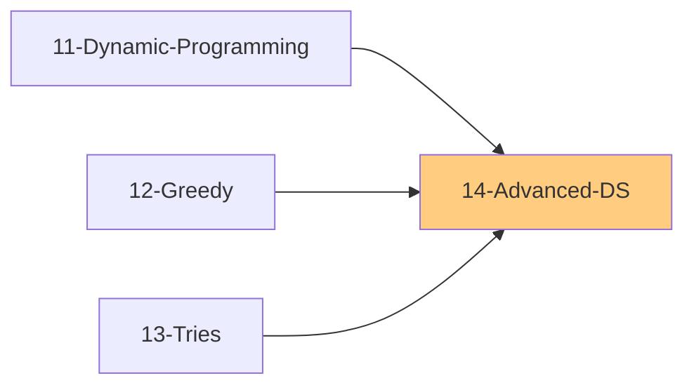

# 14 - Advanced Data Structures

> Specialized structures for complex operations
>
> 📚 *Includes Grokking Pattern #31: Ordered Set*
>
> ⚠️ *AlgoMonster Note: Low priority - focus on Union-Find first, then Segment Tree*
>
> ⏱️ *Estimated: 2-3 weeks*

---

## 1. Segment Tree

### 1.1 What is Segment Tree?
- [ ] Binary tree for range queries
- [ ] Each node stores aggregate of a range
- [ ] Supports: sum, min, max, GCD, etc.
- [ ] Range query: O(log n)
- [ ] Point update: O(log n)
- [ ] Space: O(4n) ≈ O(n)

### 1.2 When to Use?
- [ ] Range queries with updates
- [ ] Sum of range
- [ ] Minimum/Maximum in range
- [ ] GCD of range

### 1.3 Structure
- [ ] Binary tree structure where:
  - Root stores aggregate of entire array
  - Each node stores aggregate of its range
  - Leaves store individual elements
  - Size: 4n nodes (to be safe)

### 1.4 Operations
- [ ] **Build**: Recursively build from leaves to root - O(n)
- [ ] **Update**: Update leaf, propagate up to root - O(log n)
- [ ] **Query**: Recursively combine overlapping ranges - O(log n)
- [ ] Key insight: Check if range is outside, fully inside, or partial overlap

### 1.5 Lazy Propagation
- [ ] For range updates
- [ ] Defer updates until needed
- [ ] Update range in O(log n)

### 1.6 Segment Tree Problems
- [ ] Range Sum Query - Mutable
- [ ] Range Minimum Query
- [ ] Count of Smaller Numbers After Self
- [ ] Count of Range Sum
- [ ] Falling Squares
- [ ] My Calendar I, II, III
- [ ] Rectangle Area II

---

## 2. Fenwick Tree (Binary Indexed Tree)

### 2.1 What is BIT?
- [ ] Space-efficient alternative to Segment Tree
- [ ] Prefix sum queries: O(log n)
- [ ] Point updates: O(log n)
- [ ] Space: O(n)
- [ ] Simpler than Segment Tree

### 2.2 Key Insight
- [ ] Uses binary representation
- [ ] tree[i] stores sum of elements in range
- [ ] Range determined by lowest set bit

### 2.3 Operations
- [ ] **Update(i, delta)**: Add delta to index i
  - While i ≤ n: add delta to tree[i], i += (i & -i)
  - Uses lowest set bit to find next index
- [ ] **Prefix_sum(i)**: Sum from 1 to i
  - While i > 0: add tree[i] to total, i -= (i & -i)
  - Removes lowest set bit to find previous index
- [ ] **Range_sum(l, r)**: prefix_sum(r) - prefix_sum(l-1)
- Note: 1-indexed for correct bit manipulation

### 2.4 BIT vs Segment Tree
| Feature | BIT | Segment Tree |
|---------|-----|--------------|
| Space |" O(n) "| O(4n) |
| Range Query |" O(log n) "| O(log n) |
| Point Update |" O(log n) "| O(log n) |
| Range Update | Complex | With lazy prop |
| Complexity | Simpler | More versatile |

### 2.5 BIT Problems
- [ ] Range Sum Query - Mutable
- [ ] Count of Smaller Numbers After Self
- [ ] Reverse Pairs
- [ ] Count Inversions

---

## 3. Union-Find (Disjoint Set Union)

### 3.1 What is Union-Find?
- [ ] Track disjoint sets
- [ ] Two operations: union, find
- [ ] Near O(1) with optimizations

### 3.2 Operations
- [ ] **Find**: Which set does element belong to?
- [ ] **Union**: Merge two sets

### 3.3 Optimizations
- [ ] **Path Compression**: Flatten tree during find
- [ ] **Union by Rank/Size**: Attach smaller to larger

### 3.4 Operations
- [ ] **Find(x)**: Find root of x's set
  - With path compression: recursively set parent to root
  - Nearly O(1) amortized
- [ ] **Union(x, y)**: Merge sets containing x and y
  - Find roots of both
  - Attach smaller rank tree under larger rank tree
  - If equal rank, increment rank of new root
- [ ] **Connected(x, y)**: Check if find(x) == find(y)
- [ ] Track component count: decrement on successful union

### 3.5 Union-Find Problems
- [ ] Number of Connected Components
- [ ] Number of Provinces
- [ ] Redundant Connection
- [ ] Accounts Merge
- [ ] Smallest String With Swaps
- [ ] Number of Islands II
- [ ] Satisfiability of Equality Equations
- [ ] Most Stones Removed

---

## 4. Sparse Table

### 4.1 What is Sparse Table?
- [ ] Preprocess for range queries
- [ ] O(1) query after O(n log n) preprocessing
- [ ] Works for idempotent operations (min, max, GCD)
- [ ] No updates allowed (static)

### 4.2 Operations
- [ ] **Build**: O(n log n) preprocessing
  - Precompute log values
  - Initialize table[i][0] = arr[i] for all i
  - For each length 2^j: table[i][j] = min(table[i][j-1], table[i + 2^(j-1)][j-1])
- [ ] **Query(l, r)**: O(1)
  - Find k = log2(r - l + 1)
  - Return min(table[l][k], table[r - 2^k + 1][k])
  - Works because min is idempotent (overlapping is OK)

---

## 5. Skip List

### 5.1 What is Skip List?
- [ ] Probabilistic data structure
- [ ] Alternative to balanced BST
- [ ] O(log n) average for search, insert, delete
- [ ] Multiple levels of linked lists

### 5.2 Structure
- [ ] Multiple levels of linked lists
- [ ] Bottom level: all elements in sorted order
- [ ] Higher levels: "express lanes" skipping elements
- [ ] Each element randomly promoted to higher levels
- [ ] Search: Start from top-left, go right or down

### 5.3 Applications
- [ ] Redis sorted sets
- [ ] LevelDB, RocksDB
- [ ] Concurrent data structures

---

## 6. LRU Cache

### 6.1 What is LRU?
- [ ] Least Recently Used eviction
- [ ] Fixed capacity cache
- [ ] O(1) get and put

### 6.2 Implementation Pattern (HashMap + Doubly Linked List)
- [ ] **Data Structures**:
  - HashMap: key → Node (O(1) lookup)
  - Doubly Linked List: ordered by recency
  - Dummy head/tail for easy edge case handling
- [ ] **Operations**:
  - `_add(node)`: Add node right after head (most recent)
  - `_remove(node)`: Remove node from list (O(1) with prev/next pointers)
  - `get(key)`: If exists, move to front, return value
  - `put(key, value)`: If exists, remove old. Add new at front. If over capacity, remove from tail (LRU)
- [ ] Key insight: Store key in node to delete from HashMap when evicting

---

## 7. Monotonic Stack/Deque (Review)

### 7.1 Monotonic Stack
- [ ] Stack maintaining sorted order
- [ ] Next/Previous Greater/Smaller Element
- [ ] O(n) for all elements

### 7.2 Monotonic Deque
- [ ] Sliding window min/max
- [ ] O(n) for all windows

---

## 8. Ordered Set / Multiset

### 8.1 Python Options
- [ ] `sortedcontainers.SortedList`
- [ ] `sortedcontainers.SortedSet`
- [ ] O(log n) insert, delete, search

### 8.2 Use Cases
- [ ] Maintain sorted order with updates
- [ ] Range queries with dynamic data
- [ ] Median maintenance

---

## 9. Bloom Filter

### 9.1 What is Bloom Filter?
- [ ] Probabilistic set membership
- [ ] Space-efficient
- [ ] False positives possible
- [ ] No false negatives

### 9.2 Use Cases
- [ ] Database lookups
- [ ] Web caching
- [ ] Spell checkers

---

## 10. Other Advanced Structures

### 10.1 Treap
- [ ] Tree + Heap combination
- [ ] Random priorities for balance
- [ ] Expected O(log n) operations

### 10.2 Splay Tree
- [ ] Self-adjusting BST
- [ ] Recently accessed at root
- [ ] Amortized O(log n)

### 10.3 B-Tree / B+ Tree
- [ ] Disk-optimized trees
- [ ] Used in databases
- [ ] Multiple keys per node

### 10.4 K-D Tree
- [ ] K-dimensional search
- [ ] Nearest neighbor queries
- [ ] Range searches in 2D/3D

### 10.5 Suffix Array & Suffix Tree
- [ ] String pattern matching
- [ ] Longest repeated substring
- [ ] O(n) construction possible

---

## 11. Interview Focus

### 11.1 Things to Look Out For
- [ ] Union-Find is MOST common in interviews (connected components)
- [ ] LRU Cache is a classic design question
- [ ] Segment Tree/BIT rarely asked - know concepts only
- [ ] Path compression + union by rank = near O(1)

### 11.2 Corner Cases
- [ ] Empty graph (no edges in Union-Find)
- [ ] Self-loops
- [ ] Cache capacity = 0 or 1
- [ ] Single element range queries

### 11.3 Common Mistakes
- [ ] Forgetting path compression in Union-Find
- [ ] Not handling LRU eviction properly
- [ ] Wrong update order in doubly linked list
- [ ] 1-indexed vs 0-indexed confusion in BIT

### 11.4 Most Important for Interviews
| Structure | Priority | Common Problems |
|-----------|----------|----------------|
| Union-Find | HIGH | Connected components, redundant connection |
| LRU Cache | HIGH | Design problems |
| Segment Tree | MEDIUM | Range sum with updates |
| BIT | LOW | Rarely asked directly |
| Sparse Table | LOW | Static RMQ |

---

## 📚 Learning Resources

### Videos
- [NeetCode - Advanced Data Structures](https://www.youtube.com/@NeetCode) - Union-Find & Segment Tree problems
- [Striver - Disjoint Set Union (DSU)](https://www.youtube.com/@takeUforward) - Union-Find deep dive
- [Abdul Bari - Segment Trees](https://www.youtube.com/@abdul_bari) - Visual segment tree explanation

### Articles
- [CP-Algorithms - Segment Tree](https://cp-algorithms.com/data_structures/segment_tree.html) - Comprehensive guide with lazy propagation
- [CP-Algorithms - Fenwick Tree (BIT)](https://cp-algorithms.com/data_structures/fenwick.html) - Binary Indexed Tree tutorial
- [CP-Algorithms - Disjoint Set Union](https://cp-algorithms.com/data_structures/disjoint_set_union.html) - Union-Find with optimizations
- [GeeksforGeeks - Union-Find Algorithm](https://www.geeksforgeeks.org/union-find-algorithm-union-by-rank-and-path-compression/) - Implementation patterns

---

## 12. Essential LeetCode Problems

### 12.1 Union-Find Problems

| Problem | Platform | Difficulty | Pattern |
|---------|----------|------------|--------|
| [Number of Provinces](https://leetcode.com/problems/number-of-provinces/) | LeetCode #547 | 🟡 Medium | Basic Union-Find, count components |
| [Redundant Connection](https://leetcode.com/problems/redundant-connection/) | LeetCode #684 | 🟡 Medium | Union-Find, detect cycle |
| [Number of Connected Components in Undirected Graph](https://leetcode.com/problems/number-of-connected-components-in-an-undirected-graph/) | LeetCode #323 | 🟡 Medium | Union-Find, count roots |
| [Accounts Merge](https://leetcode.com/problems/accounts-merge/) | LeetCode #721 | 🟡 Medium | Union-Find on emails |
| [Satisfiability of Equality Equations](https://leetcode.com/problems/satisfiability-of-equality-equations/) | LeetCode #990 | 🟡 Medium | Union == first, check != |
| [Most Stones Removed](https://leetcode.com/problems/most-stones-removed-with-same-row-or-column/) | LeetCode #947 | 🟡 Medium | Union by row/col |
| [Number of Islands II](https://leetcode.com/problems/number-of-islands-ii/) | LeetCode #305 | 🔴 Hard | Dynamic Union-Find |

### 12.2 Cache Design Problems

| Problem | Platform | Difficulty | Pattern |
|---------|----------|------------|--------|
| [LRU Cache](https://leetcode.com/problems/lru-cache/) | LeetCode #146 | 🟡 Medium | HashMap + Doubly Linked List |
| [LFU Cache](https://leetcode.com/problems/lfu-cache/) | LeetCode #460 | 🔴 Hard | HashMap + Freq buckets + DLL |
| [Design HashMap](https://leetcode.com/problems/design-hashmap/) | LeetCode #706 | 🟢 Easy | Array of buckets with chaining |

### 12.3 Segment Tree & BIT Problems

| Problem | Platform | Difficulty | Pattern |
|---------|----------|------------|--------|
| [Range Sum Query - Mutable](https://leetcode.com/problems/range-sum-query-mutable/) | LeetCode #307 | 🟡 Medium | Segment Tree or BIT |
| [Count of Smaller Numbers After Self](https://leetcode.com/problems/count-of-smaller-numbers-after-self/) | LeetCode #315 | 🔴 Hard | BIT / Merge Sort |
| [Count of Range Sum](https://leetcode.com/problems/count-of-range-sum/) | LeetCode #327 | 🔴 Hard | Segment Tree / Merge Sort |
| [My Calendar I](https://leetcode.com/problems/my-calendar-i/) | LeetCode #729 | 🟡 Medium | Segment Tree / TreeMap |
| [My Calendar II](https://leetcode.com/problems/my-calendar-ii/) | LeetCode #731 | 🟡 Medium | Segment Tree with overlap count |

---

## Comparison Table

| Structure | Query | Update | Space | Use Case |
|-----------|-------|--------|-------|----------|
| Segment Tree |" O(log n) "| O(log n) |" O(4n) "| Range queries |
| BIT |" O(log n) "| O(log n) |" O(n) "| Prefix sums |
| Sparse Table |" O(1) "| N/A |" O(n log n) "| Static RMQ |
| Union-Find |" O(α(n)) "| O(α(n)) |" O(n) "| Disjoint sets |
| LRU Cache |" O(1) "| O(1) |" O(n) "| Caching |

---

## Checklist Summary

| Topic | Status |
|-------|--------|
| Segment Tree Basics | ⬜ |
| Segment Tree Implementation | ⬜ |
| Lazy Propagation | ⬜ |
| Fenwick Tree | ⬜ |
| Union-Find | ⬜ |
| Union-Find Optimizations | ⬜ |
| Sparse Table | ⬜ |
| LRU Cache | ⬜ |
| Skip List Concept | ⬜ |
| Bloom Filter Concept | ⬜ |
| **Interview Edge Cases** | ⬜ |
| **Essential Problems (6)** | ⬜ |

---

**Previous:** [13-Tries.md](./13-Tries.md)  
**Next:** [15-Bit-Manipulation.md](./15-Bit-Manipulation.md)
