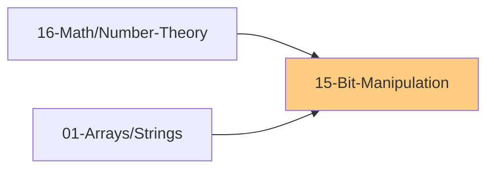

# 15 - Bit Manipulation

> Efficient operations using binary representation
>
> ✅ *Topics verified against: NeetCode, Striver A2Z (18 problems), Tech Interview Handbook*
>
> 📚 *Includes Grokking Pattern #20: Bitwise XOR*
>
> ⚠️ *AlgoMonster Note: Low ROI - but XOR problems (Single Number variants) are common*
>
> ⏱️ *Estimated: 1-2 weeks*

---

## 1. Binary Basics

### 1.1 Number Systems
- [ ] Binary (base 2): 0, 1
- [ ] Decimal (base 10): 0-9
- [ ] Hexadecimal (base 16): 0-9, A-F
- [ ] Conversion between systems

### 1.2 Binary Representation
- [ ] Positive integers in binary
- [ ] Two's complement (negative numbers)
- [ ] Sign bit (MSB)
- [ ] Integer sizes (32-bit, 64-bit)
- [ ] Example: Decimal 5 = Binary 00000101, Decimal -5 = Binary 11111011 (8-bit two's complement)

### 1.3 Bit Positions
- [ ] LSB (Least Significant Bit) = rightmost = position 0
- [ ] MSB (Most Significant Bit) = leftmost
- [ ] Bit at position i represents 2^i

---

## 2. Bitwise Operators

### 2.1 AND (&)
- [ ] Example: `5 & 3 = 1` (0101 & 0011 = 0001)
- [ ] Both bits must be 1
- [ ] Use: Check if bit is set, clear bits

### 2.2 OR (|)
- [ ] Example: `5 | 3 = 7` (0101 | 0011 = 0111)
- [ ] At least one bit must be 1
- [ ] Use: Set bits

### 2.3 XOR (^)
- [ ] Example: `5 ^ 3 = 6` (0101 ^ 0011 = 0110)
- [ ] Different bits = 1, same bits = 0
- [ ] Use: Toggle bits, find unique element

### 2.4 NOT (~)
- [ ] Example: `~5 = -6` (in two's complement)
- [ ] Flip all bits
- [ ] ~x = -(x+1)

### 2.5 Left Shift (<<)
- [ ] Example: `5 << 1 = 10` (0101 << 1 = 1010)
- [ ] Shift bits left, fill with 0
- [ ] x << n = x * 2^n
- [ ] Use: Multiply by power of 2

### 2.6 Right Shift (>>)
- [ ] Example: `5 >> 1 = 2` (0101 >> 1 = 0010)
- [ ] Shift bits right
- [ ] x >> n = x ÷ 2^n (floor)
- [ ] Arithmetic vs Logical shift

---

## 3. Common Bit Tricks

### 3.1 Check if Bit is Set
- [ ] Formula: `(n & (1 << i)) != 0`

### 3.2 Set a Bit
- [ ] Formula: `n | (1 << i)`

### 3.3 Clear a Bit
- [ ] Formula: `n & ~(1 << i)`

### 3.4 Toggle a Bit
- [ ] Formula: `n ^ (1 << i)`

### 3.5 Check if Power of 2
- [ ] Formula: `n > 0 and (n & (n - 1)) == 0`
- [ ] Power of 2 has exactly one bit set
- [ ] n & (n-1) removes rightmost set bit

### 3.6 Count Set Bits (Population Count)
- [ ] Basic: Loop through bits, count `n & 1`, right shift
- [ ] Brian Kernighan's Algorithm: `n &= (n-1)` clears rightmost set bit - O(set bits)
- [ ] Built-in: `bin(n).count('1')` or `Integer.bitCount(n)`

### 3.7 Get/Clear Rightmost Set Bit
- [ ] Get rightmost set bit: `n & (-n)`
- [ ] Clear rightmost set bit: `n & (n - 1)`

### 3.8 Check if Even/Odd
- [ ] Even: `(n & 1) == 0`
- [ ] Odd: `(n & 1) == 1`

### 3.9 Swap Without Temp
- [ ] Pattern: `a ^= b; b ^= a; a ^= b`

### 3.10 Get Absolute Value
- [ ] For 32-bit: `mask = n >> 31; abs = (n ^ mask) - mask`

---

## 4. XOR Properties

### 4.1 Key Properties
- [ ] a ^ a = 0 (same numbers cancel)
- [ ] a ^ 0 = a (identity)
- [ ] a ^ b = b ^ a (commutative)
- [ ] (a ^ b) ^ c = a ^ (b ^ c) (associative)

### 4.2 Applications
- [ ] Find single number in array (all others appear twice)
- [ ] Find two single numbers
- [ ] Missing number in sequence
- [ ] Swap variables

---

## 5. Bit Manipulation Problems

### 5.1 Basic Problems
- [ ] Single Number
- [ ] Single Number II (appears once, others 3 times)
- [ ] Single Number III (two numbers appear once)
- [ ] Number of 1 Bits (Hamming Weight)
- [ ] Counting Bits
- [ ] Reverse Bits
- [ ] Power of Two
- [ ] Power of Four
- [ ] Hamming Distance

### 5.2 Bit Tricks Problems
- [ ] Missing Number
- [ ] Sum of Two Integers (without +/-)
- [ ] Divide Two Integers (without /)
- [ ] UTF-8 Validation
- [ ] Binary Number with Alternating Bits

### 5.3 Subset Generation
- [ ] Subsets (using bitmask)
- [ ] Subsets II (with duplicates)
- [ ] Combinations using bits
- [ ] All subsets of size K
- [ ] Pattern: For mask 0 to 2^n - 1, if bit i is set, include nums[i]

### 5.4 Bitmask DP Problems
- [ ] Traveling Salesman Problem
- [ ] Shortest Path Visiting All Nodes
- [ ] Partition to K Equal Sum Subsets
- [ ] Find the Shortest Superstring
- [ ] Maximum AND Sum of Array

### 5.5 Advanced Problems
- [ ] Maximum XOR of Two Numbers
- [ ] Maximum XOR With an Element
- [ ] Count Pairs With XOR in Range
- [ ] Minimum XOR Sum of Two Arrays
- [ ] Bitwise AND of Numbers Range
- [ ] Total Hamming Distance

---

## 6. Bit Manipulation Patterns

### 6.1 Iterate Through Set Bits
- [ ] Pattern: While n > 0, get lowest bit with `n & (-n)`, clear with `n &= (n-1)`

### 6.2 Iterate Through All Subsets of a Mask
- [ ] Pattern: `subset = mask; while subset: process(subset); subset = (subset-1) & mask`

### 6.3 Bitmask for State
- [ ] Track visited nodes: `visited |= (1 << node)` to mark, `visited & (1 << node)` to check
- [ ] Used in TSP, bitmask DP problems

---

## 7. Two's Complement

### 7.1 Understanding
- [ ] Representation of negative numbers
- [ ] For n-bit: range is -2^(n-1) to 2^(n-1) - 1
- [ ] To negate: flip all bits, add 1

### 7.2 Why It Works
- [ ] Adding a number and its negation gives 0 (with overflow ignored)
- [ ] Example: 5 + (-5) = 00000101 + 11111011 = (1)00000000 = 0

---

## 8. Common Formulas

### 8.1 Bit Operations Cheat Sheet
| Operation | Formula |
|-----------|---------|
| Set bit i | `n \| (1 << i)` |
| Clear bit i | `n & ~(1 << i)` |
| Toggle bit i | `n ^ (1 << i)` |
| Check bit i | `(n >> i) & 1` |
| Clear rightmost 1 | `n & (n - 1)` |
| Get rightmost 1 | `n & (-n)` |
| Set rightmost 0 | `n \| (n + 1)` |
| Is power of 2 | `n & (n - 1) == 0` |

### 8.2 Math with Bits
| Operation | Bit Equivalent |
|-----------|----------------|
| n * 2 | `n << 1` |
| n ÷ 2 | `n >> 1` |
| n * 2^k | `n << k` |
| n ÷ 2^k | `n >> k` |
| n % 2^k | `n & ((1 << k) - 1)` |
| Check even | `(n & 1) == 0` |

---

## 9. Language-Specific

### 9.1 Python
- [ ] `bin(n)` - convert to binary string
- [ ] `int('1010', 2)` - binary string to int
- [ ] `n.bit_length()` - number of bits needed
- [ ] `n.bit_count()` - count of 1 bits (Python 3.10+)
- [ ] Python integers have arbitrary precision

### 9.2 JavaScript
- [ ] `n.toString(2)` - convert to binary string
- [ ] `parseInt('1010', 2)` - binary string to int
- [ ] `>>>` - unsigned right shift
- [ ] Uses 32-bit integers for bitwise operations

---

## 📚 Learning Resources

### Videos
- [NeetCode - Bit Manipulation Playlist](https://www.youtube.com/@NeetCode) - LeetCode bit problems explained
- [Striver - Bit Manipulation Series](https://www.youtube.com/@takeUforward) - XOR tricks & bitmask DP
- [Abdul Bari - Bitwise Operators](https://www.youtube.com/@abdul_bari) - Fundamentals of bit operations

### Articles
- [GeeksforGeeks - Bit Manipulation](https://www.geeksforgeeks.org/bits-manipulation-important-tactics/) - Essential bit tricks
- [GeeksforGeeks - Bitmasking & DP](https://www.geeksforgeeks.org/bitmasking-and-dynamic-programming-set-1-count-ways-to-assign-unique-cap-to-every-person/) - Bitmask DP tutorial
- [CP-Algorithms - Bit Manipulation](https://cp-algorithms.com/algebra/bit-manipulation.html) - Advanced bit techniques

---

## Thinking Framework

### When to Use Bit Manipulation?
1. Problems involving binary/bits directly
2. Subset generation
3. Finding unique elements (XOR)
4. State compression (visited, DP states)
5. Optimization (power of 2 checks)

### Common Patterns
1. **XOR for finding unique**: pairs cancel out
2. **Bitmask for subsets**: 2^n states
3. **Bit tricks for efficiency**: replace arithmetic
4. **State compression**: small set → integer

---

## 10. Interview Focus

### 10.1 Things to Look Out For
- [ ] XOR is your friend for finding unique elements
- [ ] Know the difference between logical and arithmetic shifts
- [ ] Python integers have arbitrary precision (no overflow)
- [ ] Use bitmask for state compression in DP
- [ ] Remember: n & (n-1) clears rightmost set bit

### 10.2 Corner Cases
- [ ] Zero (edge case for many bit operations)
- [ ] Negative numbers (two's complement)
- [ ] Single bit numbers (1, 2, 4, 8...)
- [ ] All 1s or all 0s
- [ ] Integer overflow (in other languages)

### 10.3 Common Mistakes
- [ ] Forgetting operator precedence (use parentheses!)
- [ ] Off-by-one in bit positions
- [ ] Not handling negative numbers correctly
- [ ] Confusing >> (arithmetic) vs >>> (logical) shift

### 10.4 Key Bit Tricks to Know
| Operation | Formula |
|-----------|--------|
| Check if bit i is set | (n >> i) & 1 |
| Set bit i | n \| (1 << i) |
| Clear bit i | n & ~(1 << i) |
| Toggle bit i | n ^ (1 << i) |
| Check if power of 2 | n & (n-1) == 0 |
| Clear rightmost 1 | n & (n-1) |
| Get rightmost 1 | n & (-n) |

### 10.5 XOR Properties to Remember
- [ ] a ^ a = 0 (same numbers cancel)
- [ ] a ^ 0 = a (identity)
- [ ] a ^ b = b ^ a (commutative)
- [ ] (a ^ b) ^ c = a ^ (b ^ c) (associative)

---

## 11. Essential LeetCode Problems

### 11.1 Single Number Variants (XOR)

| Problem | Platform | Difficulty | Pattern |
|---------|----------|------------|--------|
| [Single Number](https://leetcode.com/problems/single-number/) | LeetCode #136 | 🟢 Easy | XOR all elements |
| [Single Number II](https://leetcode.com/problems/single-number-ii/) | LeetCode #137 | 🟡 Medium | Bit count mod 3 / state machine |
| [Single Number III](https://leetcode.com/problems/single-number-iii/) | LeetCode #260 | 🟡 Medium | XOR + rightmost different bit |

### 11.2 Bit Counting & Manipulation

| Problem | Platform | Difficulty | Pattern |
|---------|----------|------------|--------|
| [Number of 1 Bits](https://leetcode.com/problems/number-of-1-bits/) | LeetCode #191 | 🟢 Easy | n & (n-1) or count loop |
| [Counting Bits](https://leetcode.com/problems/counting-bits/) | LeetCode #338 | 🟢 Easy | DP: dp[i] = dp[i >> 1] + (i & 1) |
| [Reverse Bits](https://leetcode.com/problems/reverse-bits/) | LeetCode #190 | 🟢 Easy | Bit by bit reversal |
| [Hamming Distance](https://leetcode.com/problems/hamming-distance/) | LeetCode #461 | 🟢 Easy | XOR + count bits |
| [Total Hamming Distance](https://leetcode.com/problems/total-hamming-distance/) | LeetCode #477 | 🟡 Medium | Count 1s at each bit position |

### 11.3 Power & Number Properties

| Problem | Platform | Difficulty | Pattern |
|---------|----------|------------|--------|
| [Power of Two](https://leetcode.com/problems/power-of-two/) | LeetCode #231 | 🟢 Easy | n > 0 && (n & (n-1)) == 0 |
| [Power of Four](https://leetcode.com/problems/power-of-four/) | LeetCode #342 | 🟢 Easy | Power of 2 + bit position check |
| [Missing Number](https://leetcode.com/problems/missing-number/) | LeetCode #268 | 🟢 Easy | XOR with indices |
| [Bitwise AND of Numbers Range](https://leetcode.com/problems/bitwise-and-of-numbers-range/) | LeetCode #201 | 🟡 Medium | Find common prefix bits |

### 11.4 Arithmetic with Bits

| Problem | Platform | Difficulty | Pattern |
|---------|----------|------------|--------|
| [Sum of Two Integers](https://leetcode.com/problems/sum-of-two-integers/) | LeetCode #371 | 🟡 Medium | XOR for sum, AND<<1 for carry |
| [Divide Two Integers](https://leetcode.com/problems/divide-two-integers/) | LeetCode #29 | 🟡 Medium | Bit shifting for division |
| [UTF-8 Validation](https://leetcode.com/problems/utf-8-validation/) | LeetCode #393 | 🟡 Medium | Bit masking for header validation |

### 11.5 Subset Generation & Bitmask

| Problem | Platform | Difficulty | Pattern |
|---------|----------|------------|--------|
| [Subsets](https://leetcode.com/problems/subsets/) | LeetCode #78 | 🟡 Medium | Iterate 0 to 2^n - 1 |
| [Subsets II](https://leetcode.com/problems/subsets-ii/) | LeetCode #90 | 🟡 Medium | Handle duplicates |
| [Maximum XOR of Two Numbers in Array](https://leetcode.com/problems/maximum-xor-of-two-numbers-in-an-array/) | LeetCode #421 | 🟡 Medium | Bit trie or prefix set |

---

## Checklist Summary

| Topic | Status |
|-------|--------|
| Binary Representation | ⬜ |
| Bitwise AND, OR, XOR | ⬜ |
| Left/Right Shift | ⬜ |
| Common Bit Tricks | ⬜ |
| XOR Properties | ⬜ |
| Count Set Bits | ⬜ |
| Power of Two | ⬜ |
| Subset Generation | ⬜ |
| Bitmask DP | ⬜ |
| Two's Complement | ⬜ |
| **Interview Edge Cases** | ⬜ |
| **Essential Problems (7)** | ⬜ |

---

**Previous:** [14-Advanced-Data-Structures.md](./14-Advanced-Data-Structures.md)  
**Next:** [16-Math-Number-Theory.md](./16-Math-Number-Theory.md)
