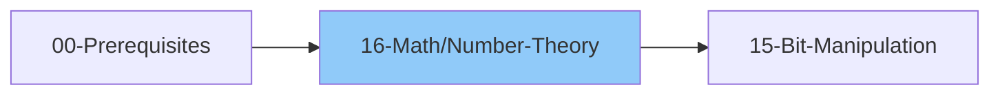

# 16 - Math & Number Theory

> Essential mathematical concepts for DSA
>
> ⚠️ *AlgoMonster Note: LOW ROI - But basics (GCD, modulo, prime check) are essential*
>
> 💡 *Google asks Math problems more frequently than other companies*
>
> ⏱️ *Estimated: 1-2 weeks*

---

## 1. Basic Math

### 1.1 Arithmetic Operations
- [ ] Addition, Subtraction
- [ ] Multiplication, Division
- [ ] Modulo operator (%)
- [ ] Floor division (//)
- [ ] Integer overflow awareness

### 1.2 Modular Arithmetic
- [ ] (a + b) mod m = ((a mod m) + (b mod m)) mod m
- [ ] (a - b) mod m = ((a mod m) - (b mod m) + m) mod m
- [ ] (a * b) mod m = ((a mod m) * (b mod m)) mod m
- [ ] Division requires modular inverse
- [ ] Common mod: 10^9 + 7

### 1.3 Power Function
- [ ] O(log n) - Exponentiation by squaring
- [ ] Pattern: While exp > 0:
  - If exp is odd: multiply result by base
  - Square the base, halve exp
- [ ] With mod: Apply mod after each operation
- [ ] Built-in: `pow(base, exp, mod)` in Python

---

## 2. GCD and LCM

### 2.1 GCD (Greatest Common Divisor)
- [ ] Euclidean Algorithm - O(log(min(a,b)))
- [ ] Iterative: `while b: a, b = b, a % b; return a`
- [ ] Recursive: `gcd(b, a % b)` with base case `b == 0`
- [ ] Built-in: `math.gcd(a, b)`

### 2.2 LCM (Least Common Multiple)
- [ ] Formula: `lcm(a, b) = a * b // gcd(a, b)`
- [ ] Built-in: `math.lcm(a, b)` (Python 3.9+)

### 2.3 Extended Euclidean Algorithm
- [ ] Find x, y such that: ax + by = gcd(a, b)
- [ ] Used for modular inverse
- [ ] Pattern: Recursive, track coefficients through recursion

---

## 3. Prime Numbers

### 3.1 Check if Prime
- [ ] Base cases: n < 2 → False, n == 2 → True, even → False
- [ ] Check divisors from 3 to √n, skip evens
- [ ] Time: O(√n)

### 3.2 Sieve of Eratosthenes
- [ ] Find all primes up to n
- [ ] Pattern: Mark all multiples of each prime starting from i²
- [ ] Time: O(n log log n) | Space: O(n)

### 3.3 Prime Factorization
- [ ] Pattern: Divide by 2, then odd numbers up to √n
- [ ] If n > 1 after loop, n itself is prime factor

### 3.4 Count Divisors
- [ ] Pattern: For i from 1 to √n, if i divides n, count += 2 (unless i = √n)

---

## 4. Combinatorics

### 4.1 Factorial
- [ ] n! = 1 * 2 * 3 * ... * n
- [ ] With mod: Apply mod after each multiplication
- [ ] Built-in: `math.factorial(n)`

### 4.2 Permutations
- [ ] nPr = n! / (n-r)!
- [ ] Number of ways to arrange r items from n
- [ ] Compute: n * (n-1) * ... * (n-r+1)

### 4.3 Combinations (nCr)
- [ ] nCr = n! / (r! * (n-r)!)
- [ ] Pascal's Triangle property: C(n,r) = C(n-1,r-1) + C(n-1,r)
- [ ] Optimize: Use smaller of r and n-r
- [ ] With mod: Use modular inverse for division

### 4.4 Pascal's Triangle
- [ ] Each row: start/end with 1, middle = sum of two above
- [ ] Row n gives all C(n, k) values

### 4.5 Catalan Numbers
- [ ] C(n) = C(2n, n) / (n + 1)
- [ ] Applications: valid parentheses, BST count, polygon triangulation
- [ ] First few: 1, 1, 2, 5, 14, 42, 132...

---

## 5. Modular Inverse

### 5.1 What is Modular Inverse?
- [ ] a^(-1) mod m such that: a * a^(-1) ≡ 1 (mod m)
- [ ] Exists only if gcd(a, m) = 1

### 5.2 Using Fermat's Little Theorem
- [ ] If m is prime: a^(-1) ≡ a^(m-2) (mod m)
- [ ] Use: `pow(a, mod - 2, mod)`

### 5.3 Using Extended Euclidean
- [ ] Works for any coprime a and m
- [ ] Get x from extended_gcd, handle negative result

---

## 6. Number Theory Problems

### 6.1 Basic Problems
- [ ] Fizz Buzz
- [ ] Count Primes
- [ ] Ugly Number
- [ ] Ugly Number II
- [ ] Happy Number
- [ ] Perfect Number
- [ ] Power of Three

### 6.2 GCD/LCM Problems
- [ ] GCD of Array
- [ ] LCM of Array
- [ ] X of a Kind in a Deck of Cards
- [ ] Greatest Common Divisor of Strings

### 6.3 Factorial/Combinatorics
- [ ] Factorial Trailing Zeroes
- [ ] Unique Paths
- [ ] Pascal's Triangle
- [ ] Pascal's Triangle II
- [ ] Unique Binary Search Trees (Catalan)

### 6.4 Modular Arithmetic
- [ ] Pow(x, n)
- [ ] Super Pow
- [ ] Count Good Numbers

---

## 7. Geometry Basics

### 7.1 Distance Formulas
- [ ] **Euclidean Distance**: √((x₂-x₁)² + (y₂-y₁)²)
- [ ] **Manhattan Distance**: |x₂-x₁| + |y₂-y₁|
- [ ] **Chebyshev Distance**: max(|x₂-x₁|, |y₂-y₁|)

### 7.2 Line and Points
- [ ] Slope formula
- [ ] Collinear points check
- [ ] Line intersection

### 7.3 Area Formulas
- [ ] **Shoelace Formula** (Triangle): ½|x₁(y₂-y₃) + x₂(y₃-y₁) + x₃(y₁-y₂)|
- [ ] **Polygon Area**: Apply Shoelace to all vertices
- [ ] **Rectangle Area**: width * height

### 7.4 Geometry Problems
- [ ] Valid Square
- [ ] Max Points on a Line
- [ ] Rectangle Overlap
- [ ] Minimum Area Rectangle
- [ ] Convex Hull

---

## 8. Matrix Math

### 8.1 Matrix Operations
- [ ] Addition
- [ ] Multiplication
- [ ] Transpose
- [ ] Identity matrix

### 8.2 Matrix Exponentiation
- [ ] Efficient Fibonacci using matrix: F(n) via [[1,1],[1,0]]ⁿ
- [ ] Solve linear recurrences in O(k³ log n)
- [ ] **Key Idea**: Convert recurrence to matrix form, use binary exponentiation
- [ ] **Time Complexity**: O(k³ log n) where k = matrix size

---

## 9. Probability Basics

### 9.1 Basic Probability
- [ ] P(A) = favorable outcomes / total outcomes
- [ ] P(A ∪ B) = P(A) + P(B) - P(A ∩ B)
- [ ] P(A ∩ B) = P(A) * P(B) (independent events)

### 9.2 Expected Value
- [ ] E[X] = Σ (x * P(x))
- [ ] Linearity: E[X + Y] = E[X] + E[Y]

### 9.3 Probability Problems
- [ ] Soup Servings
- [ ] New 21 Game
- [ ] Random Pick with Weight

---

## 10. Common Math Tricks

### 10.1 Sum Formulas
- [ ] Sum of 1 to n: n * (n+1) / 2
- [ ] Sum of squares: n * (n+1) * (2n+1) / 6
- [ ] Sum of cubes: (n * (n+1) / 2)²
- [ ] Sum of GP: a * (r^n - 1) / (r - 1)

### 10.2 Digit Manipulation
- [ ] **Sum of Digits**: Iterate digits via n % 10 and n // 10
- [ ] **Reverse Number**: Build reversed number digit by digit
- [ ] **Count Digits**: ⌊log₁₀(n)⌋ + 1 or iterate until n = 0
- [ ] **Extract k-th Digit**: (n // 10^k) % 10

### 10.3 Ceiling Division
- [ ] **Ceiling(a/b)**: Use (a + b - 1) / b to avoid floating point
- [ ] **Floor(a/b)**: Standard integer division

---

## Important Constants

- [ ] **MOD** = 10⁹ + 7 (common prime modulo for competitive programming)
- [ ] **INF** = Use language's max int or 10⁹ for graph problems
- [ ] **PI** = 3.14159265... (use math.pi or Math.PI)
- [ ] **E** = 2.71828182... (Euler's number)

---

## 📚 Learning Resources

### Videos
- [NeetCode - Math & Number Theory](https://www.youtube.com/@NeetCode) - LeetCode math problems
- [Striver - Mathematics for DSA](https://www.youtube.com/@takeUforward) - GCD, primes, modular arithmetic
- [Abdul Bari - Number Theory](https://www.youtube.com/@abdul_bari) - GCD/LCM & prime algorithms

### Articles
- [GeeksforGeeks - Number Theory](https://www.geeksforgeeks.org/number-theory-competitive-programming/) - Comprehensive math guide
- [GeeksforGeeks - Sieve of Eratosthenes](https://www.geeksforgeeks.org/sieve-of-eratosthenes/) - Prime number generation
- [CP-Algorithms - Number Theory](https://cp-algorithms.com/algebra/) - GCD, modular inverse, Euler's function
- [CP-Algorithms - Modular Arithmetic](https://cp-algorithms.com/algebra/module-inverse.html) - Modular inverse techniques

---

## Thinking Framework

### When to Use Number Theory?
1. Problems involving divisibility
2. Counting problems (combinatorics)
3. Large numbers with modulo
4. Prime number operations
5. Mathematical sequences

### Common Patterns
1. **Use modulo**: Prevent overflow in large computations
2. **Precompute**: Sieve for primes, factorial table
3. **Fast power**: O(log n) exponentiation
4. **GCD for simplification**: Reduce fractions

---

## 11. Interview Focus

### 11.1 Things to Look Out For
- [ ] Always use MOD = 10^9 + 7 for large numbers
- [ ] Know GCD (Euclidean algorithm) and fast power
- [ ] Use Sieve for multiple prime queries (precompute)
- [ ] Division with mod requires modular inverse
- [ ] Python has arbitrary precision - still use mod for consistency

### 11.2 Corner Cases
- [ ] n = 0 (factorial, combinations)
- [ ] Negative numbers (modular arithmetic)
- [ ] Very large numbers (need mod)
- [ ] Division by zero
- [ ] Overflow in intermediate calculations

### 11.3 Common Mistakes
- [ ] Forgetting to take mod at each step (overflow)
- [ ] Wrong order of operations with mod
- [ ] Using division directly (need modular inverse)
- [ ] Off-by-one in combinatorics
- [ ] Not handling n=0 or n=1 base cases

### 11.4 Essential Formulas
| Formula | Use Case |
|---------|----------|
| Sum 1 to n | n * (n+1) / 2 |
| nCr = n! / (r! * (n-r)!) | Combinations |
| Fast power |" a^b in O(log b) "|
| GCD(a,b) = GCD(b, a%b) | Euclidean algorithm |
| LCM(a,b) = a*b / GCD(a,b) | Least common multiple |
| Modular inverse (prime p) | a^(p-2) mod p |

### 11.5 When Math is Needed
- [ ] Counting problems (combinatorics)
- [ ] Large number handling (mod arithmetic)
- [ ] Optimization with mathematical insight
- [ ] Pattern recognition (Fibonacci, Catalan)

---

## 12. Essential LeetCode Problems

### 12.1 Power & Factorial Problems

| Problem | Platform | Difficulty | Pattern |
|---------|----------|------------|--------|
| [Pow(x, n)](https://leetcode.com/problems/powx-n/) | LeetCode #50 | 🟡 Medium | Binary exponentiation |
| [Sqrt(x)](https://leetcode.com/problems/sqrtx/) | LeetCode #69 | 🟢 Easy | Binary search / Newton's method |
| [Factorial Trailing Zeroes](https://leetcode.com/problems/factorial-trailing-zeroes/) | LeetCode #172 | 🟡 Medium | Count factors of 5 |
| [Super Pow](https://leetcode.com/problems/super-pow/) | LeetCode #372 | 🟡 Medium | Modular exponentiation |

### 12.2 Prime Number Problems

| Problem | Platform | Difficulty | Pattern |
|---------|----------|------------|--------|
| [Count Primes](https://leetcode.com/problems/count-primes/) | LeetCode #204 | 🟡 Medium | Sieve of Eratosthenes |
| [Ugly Number](https://leetcode.com/problems/ugly-number/) | LeetCode #263 | 🟢 Easy | Divide by 2, 3, 5 |
| [Ugly Number II](https://leetcode.com/problems/ugly-number-ii/) | LeetCode #264 | 🟡 Medium | Three pointers / min-heap |
| [Perfect Number](https://leetcode.com/problems/perfect-number/) | LeetCode #507 | 🟢 Easy | Sum of divisors |

### 12.3 GCD/LCM Problems

| Problem | Platform | Difficulty | Pattern |
|---------|----------|------------|--------|
| [Greatest Common Divisor of Strings](https://leetcode.com/problems/greatest-common-divisor-of-strings/) | LeetCode #1071 | 🟢 Easy | GCD on string lengths |
| [X of a Kind in a Deck of Cards](https://leetcode.com/problems/x-of-a-kind-in-a-deck-of-cards/) | LeetCode #914 | 🟢 Easy | GCD of all counts |

### 12.4 Integer Manipulation

| Problem | Platform | Difficulty | Pattern |
|---------|----------|------------|--------|
| [Reverse Integer](https://leetcode.com/problems/reverse-integer/) | LeetCode #7 | 🟡 Medium | Digit extraction, overflow check |
| [Palindrome Number](https://leetcode.com/problems/palindrome-number/) | LeetCode #9 | 🟢 Easy | Reverse half and compare |
| [Happy Number](https://leetcode.com/problems/happy-number/) | LeetCode #202 | 🟢 Easy | Floyd's cycle detection |
| [Add Digits](https://leetcode.com/problems/add-digits/) | LeetCode #258 | 🟢 Easy | Digital root formula |

### 12.5 Combinatorics & Sequences

| Problem | Platform | Difficulty | Pattern |
|---------|----------|------------|--------|
| [Pascal's Triangle](https://leetcode.com/problems/pascals-triangle/) | LeetCode #118 | 🟢 Easy | Build row by row |
| [Pascal's Triangle II](https://leetcode.com/problems/pascals-triangle-ii/) | LeetCode #119 | 🟢 Easy |" Single row, O(k) space "|
| [Unique Paths](https://leetcode.com/problems/unique-paths/) | LeetCode #62 | 🟡 Medium | C(m+n-2, m-1) or DP |
| [Unique Binary Search Trees](https://leetcode.com/problems/unique-binary-search-trees/) | LeetCode #96 | 🟡 Medium | Catalan numbers |

### 12.6 Geometry Problems

| Problem | Platform | Difficulty | Pattern |
|---------|----------|------------|--------|
| [Valid Square](https://leetcode.com/problems/valid-square/) | LeetCode #593 | 🟡 Medium | Check 4 equal sides + 2 diagonals |
| [Max Points on a Line](https://leetcode.com/problems/max-points-on-a-line/) | LeetCode #149 | 🔴 Hard | Count slopes with GCD |
| [Rectangle Overlap](https://leetcode.com/problems/rectangle-overlap/) | LeetCode #836 | 🟢 Easy | Check non-overlap conditions |

---

## Checklist Summary

| Topic | Status |
|-------|--------|
| Modular Arithmetic | ⬜ |
| GCD & LCM | ⬜ |
| Prime Numbers | ⬜ |
| Sieve of Eratosthenes | ⬜ |
| Prime Factorization | ⬜ |
| Factorial | ⬜ |
| Permutations & Combinations | ⬜ |
| Modular Inverse | ⬜ |
| Pascal's Triangle | ⬜ |
| Catalan Numbers | ⬜ |
| Matrix Exponentiation | ⬜ |
| Basic Geometry | ⬜ |
| **Interview Edge Cases** | ⬜ |
| **Essential Problems (7)** | ⬜ |

---

**Previous:** [15-Bit-Manipulation.md](./15-Bit-Manipulation.md)  
**Next:** [17-Roadmap-Summary.md](./17-Roadmap-Summary.md)
