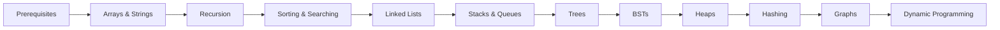

# DSA Mastery

> Master Data Structures & Algorithms for Technical Interviews

<a class="button button--primary button--lg" href="/dsa-mastery/01-Arrays-Strings">🚀 Start Learning - Arrays & Strings</a>

---

## 🗺️ Learning Path

```mermaid
flowchart LR
    A[Prerequisites] --> B[Arrays & Strings]
    B --> C[Recursion]
    C --> D[Sorting & Searching]
    D --> E[Linked Lists]
    E --> F[Stacks & Queues]
    F --> G[Trees]
    G --> H[BSTs]
    H --> I[Heaps]
    I --> J[Hashing]
    J --> K[Graphs]
    K --> L[Dynamic Programming]
```

## 📚 Topics

| # | Topic | Status |
|---|-------|--------|
| 01 | [Arrays & Strings](/dsa-mastery/01-Arrays-Strings) | ✅ Expanded |
| 02 | [Recursion & Backtracking](/dsa-mastery/02-Recursion-Backtracking) | ✅ Expanded |
| 03 | [Sorting & Searching](/dsa-mastery/03-Sorting-Searching) | ✅ Expanded |
| 04 | [Linked Lists](/dsa-mastery/04-Linked-Lists) | ✅ Expanded |
| 05 | [Stacks & Queues](/dsa-mastery/05-Stacks-Queues) | ✅ Expanded |
| 06 | [Trees](/dsa-mastery/06-Trees) | ✅ Expanded |
| 07 | [Binary Search Trees](/dsa-mastery/07-Binary-Search-Trees) | ✅ Expanded |
| 08 | [Heaps & Priority Queues](/dsa-mastery/08-Heaps-Priority-Queues) | ✅ Expanded |

## 🎯 Features

- ✅ Pattern-based learning (Grokking style)
- ✅ Python + JavaScript code examples
- ✅ Mermaid diagrams
- ✅ LeetCode problem links
- ✅ Interview preparation tips
- ✅ Works offline (PWA)
